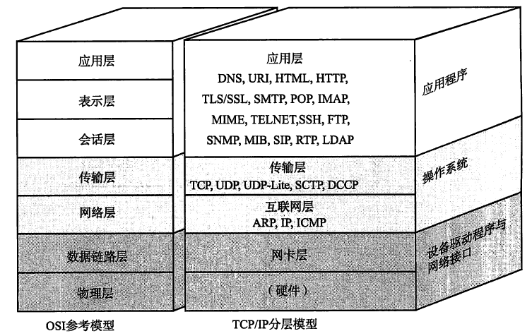
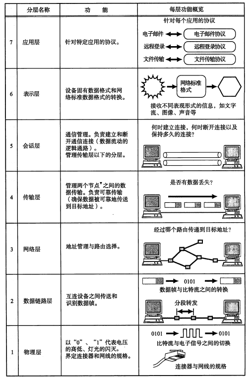
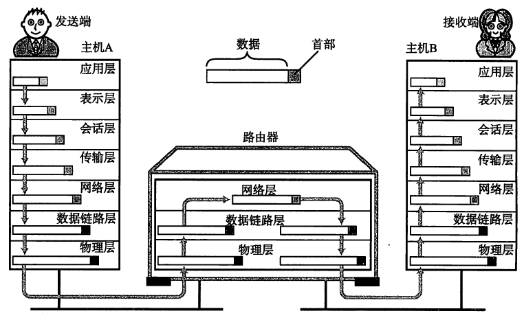
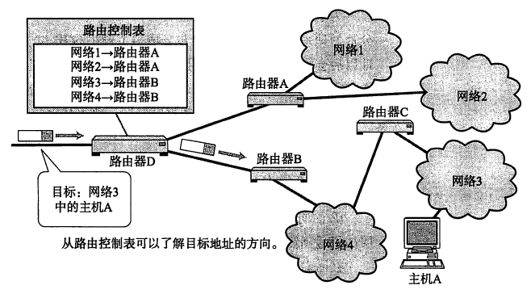
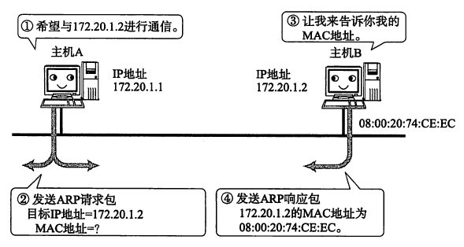
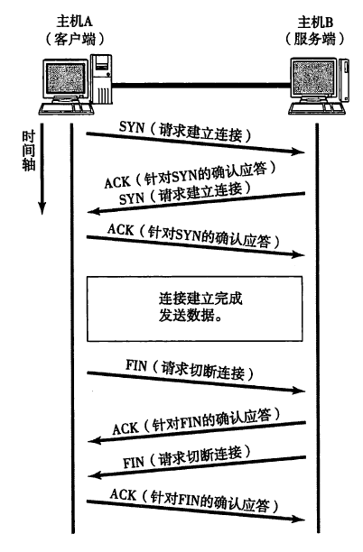
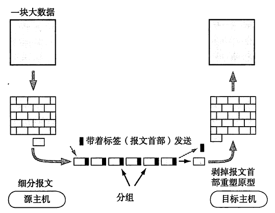
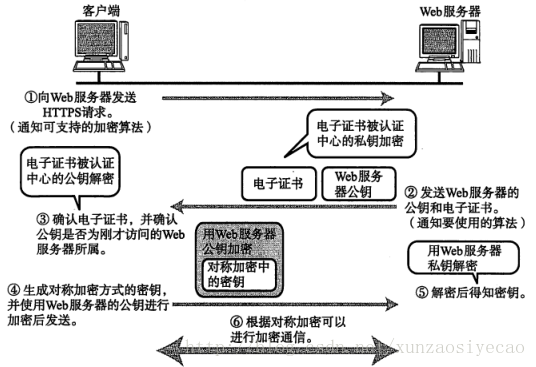

# 图解 TCP/IP

继看完[《网络是怎么连接的》](./网络是怎么连接的.md) 之后，又花一周时间看完了《图解 TCP/IP》并做这篇读书笔记。和上一本书一样，这本书也有很多内容看不懂，大概浏览完，把和自己工作学习联系比较密切的部分记录下来。因此，本文内容并不系统，会比较零散。

我们日常用手机、电脑在一秒即可完成的网络连接、收发数据，看似非常简单，其实非常复杂。以至于它成为计算机领域一个单独的专业 —— 计算机网络，很多大学都有这个专业。这种复杂性在 TCP/IP 中就可以体现出来，如其中包含的子协议、复杂的 7 层模型。只有理解了网络链接的复杂性，才能明白这些内容存在的意义。

## 概述

[《网络是怎么连接的》](./网络是怎么连接的.md) 主要介绍了网络链接的主要过程，以及其中涉及到的硬件、设备、各个标准和协议。而本书主要从 TCP/IP 协议角度来讲解网络是如何连接并通讯的，TCP/IP 是如今互联网最重要的协议，作为程序员必须有所了解。

TCP/IP 并不是单个的协议，而是一个协议族，其中包含了我们常见的很多协议，如 HTTP 协议。网络连接非常复杂，需要众多子协议协同分工才能完成。

TCP/IP 协议是有 IETF（国际互联网工程任务组 The Internet Engineering Task Force）讨论制定的，它的标准被列入到 RFC（Request For Comment），每个标准都有特定的标号，可参考书籍 57 页。

## 7 层模型

试想一下，对于程序猿来说，发送网络请求可能就是几行代码，而其背后原理是什么？第一，代码需要调用操作系统能力，再调用硬件来发送数据；第二，最终其实还是以电信号的形式通过光纤甚至卫星传输到目的地。因此，从程序应用到底层实现，需要多个层次的信息传递，才能实现数据的收发，同时能通过程序或者代码使用。

TCP/IP 共分为 7 层模型，如上图的左侧所示。如果再简化理解，可以分为“应用层”、“传输层”和“链接层”，它们分别对应到应用程序、操作系统和硬件三个级别，如上图右侧所示。

上图是 7 层模型每层功能的简述，如果用简单的三层方式来理解的话，我总结为：

- 应用层：应用程序（即代码）按照既定的子协议（如 http）发送或接受内容
- 传输层：操作系统将数据打包，并找到目标机器（使用 IP 地址），调动硬件能力收发数据
- 链接层：从物理层次实现数据的收发（使用 MAC 地址），如将 `0` `1` 代码转换为电信号的强弱

通过 7 层模型收发数据的过程如上图所示。数据发送时，从高级的应用层一直到底层的物理层；再到网络中，会经过很多路由器转发；最终数据达到目标机器，先由物理层接收，最终流到应用层。

要理解 7 层模型（或者简化的三层模型）还是要先理解网络连接的复杂性，以及应用程序、操作系统和硬件在其中扮演的角色。乍一看 7 层模型可能会觉得非常复杂，但这是处理网络请求最简单的方式，每层都相互独立，只需要和相邻层级对接即可。试想一下，如果我们只用一个协议、一层来完成如此复杂的网络连接，那该是多么庞大、复杂的协议，谁都知道这并不符合设计原则。

## IP 协议

网络是分层的，现代互联网是由很多个分层的局域网构成，其中有数不尽的路由器作为中转站，就像书中所说的古代驿站。为了能在如此复杂、分层的网络中找到一个目标机器，就需要 IP 协议。IP 是分层的，而且 IP 是唯一的，例如 `182.61.200.7` 就能对应到某台百度机房的服务器。

为了将数据包发送给目标主机，所有主机都维护者一张路由控制表（Routing Table），该表记录 IP 数据在下一步应该发给哪一个路由器。IP 包将根据这个路由表在各个数据链路上传输，即从一个层级跳转到另一个层级，最终到达目的地。

## IP 和 MAC 地址

IP 是分层和唯一的，能根据这些特性找到目标机器。找到之后，如何与目标机器进行通讯呢？或者到底这两个机器之间能否直接通讯呢？—— 答案是 NO ！

网络是分层的，由若干个局域网组成，发起请求的机器和目标机器可能相隔万里，并不在一个局域网中，中间隔着数不尽的路由器，它们两者无法直接进行通讯。因此，IP 协议的作用就是为了能一层一层、一步一步的找到目标机器，而通讯通过以太网协议，而且是在局域网内或者相邻路由器之间。

以太网通讯需要使用 MAC 地址。MAC 地址是计算机网卡在工厂制作时直接烧制进去的，能通过一些手段保证每一个网卡的 MAC 地址是唯一的。但是 MAC 地址不是分层的，即只能局域网内两台机器通讯，或者两个相邻的路由器通讯。根据 IP 地址可以获取到 MAC 地址，这就是 ARP 协议，如下图。

在网络通讯过程中，需要经历很多局域网后者路由器之间的通讯，IP 地址负责中途的层层跳转最终找到目的地，MAC 地址负责以太网通讯，即网络数据的传递。

另外，IP 处于网络层，操作系统层面，mac 处于链接层，硬件层面。

## TCP 协议

上图即我们熟知的 TCP 连接的三次握手。其实算上断开操作，一次数据通讯至少来回发送 7 个数据包才能完成。

另外，数据其实是分包进行发送的，而且还要考虑丢包的情况。在应用层，数据就是我们代码中写的各种数据结构；而到了传输层，就变成了二进制的数据包；最后到了链路层，就变成了电信号。

## 附：https

7 层协议模型中，http 协议是应用层，其本身没有对传输的数据进行加密，而往下的传输层、网络层和连接层都没有加密的环节。因此，http 协议传输的内容是完全透明的，数据要经过那么多层级、设备、路由器的传输，任何一个地方都可以截获或者篡改数据，因此数据是不安全的。从 TCP/IP 的角度来理解这个问题，就变得简单了，否则你可能不知道 http 协议为何不安全。

不安全就需要加密，https 使用 TLS/SSL 协议，即 http + TLS/SSL = https 。7 层模型中，http 处于应用层，TLS/SSL 处于表示层，即应用的相邻下一层。简单理解的话，两者都属于应用程序范畴（操作系统不关心），都可以理解为应用层。

既然说到加密，就需要提前了解一下两种加密方式：

- 对称加密：加密和解密使用相同的钥匙。
- 非对称加密：加密和解密使用不同的钥匙，分别称为公钥和私钥。如公钥加密，私钥解密。

https 中数据传输采用的是对称加密，而在发送器公钥时采用的非对称加密。如下图。

解释一下这幅图。既然 https 数据传输是对称加密，即服务器端加密数据和浏览器解密数据（或者反过来），使用同样的钥匙。那这个钥匙如何安全的传递到浏览器呢？—— 这就是最关键的问题。

其实无论是对称加密还是非对称加密，最关键的就是钥匙的安全传递。如果只有客户端和服务端双方，从原理上来将根本无法做到安全传递，因此就得需要一个第三方。就像淘宝商家和买家需要一个第三方支付宝，这样就安全了。这个第三方就是认证中心。

- 针对一个域名，可以去认证中心申请证书，放在服务端，而浏览器会直接和认证中心沟通，来确定从服务端拿到的认证整数是否是该域名申请的。
- 如果证书合法，那说明服务端公钥可用（即上图第三步），然后浏览器即用公钥加密钥匙，传给服务端，服务端用私钥解密，这样两者就都有钥匙了，而且绝对安全。
- 接下来可以进行对称加密的数据传输了。
