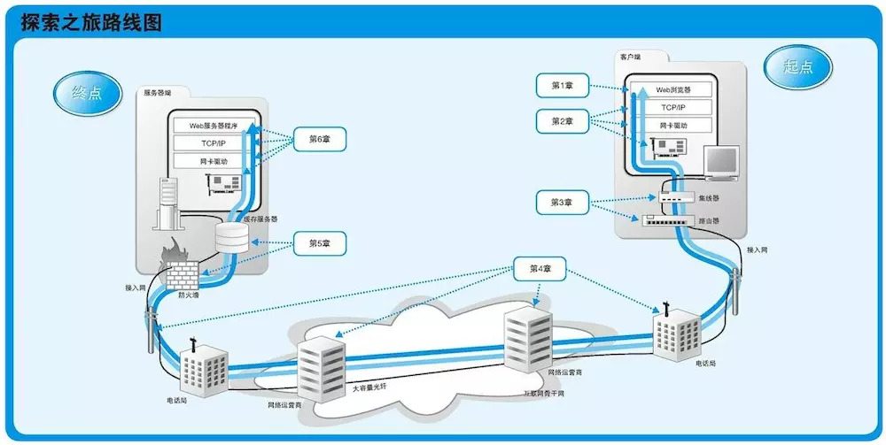
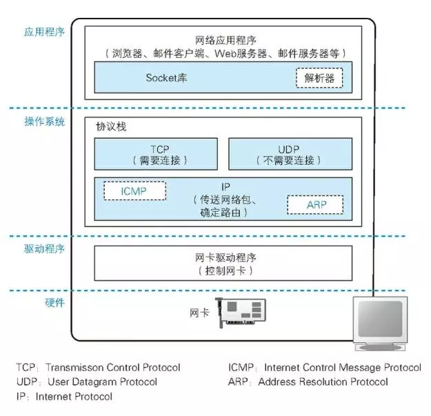
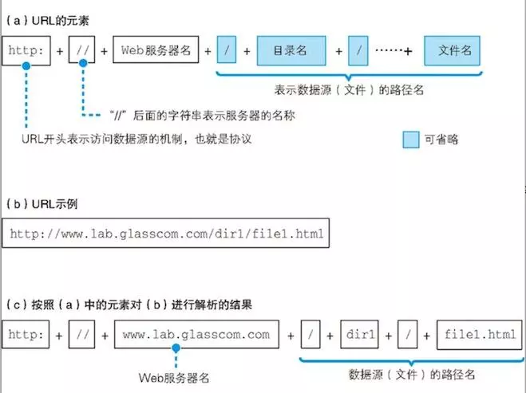
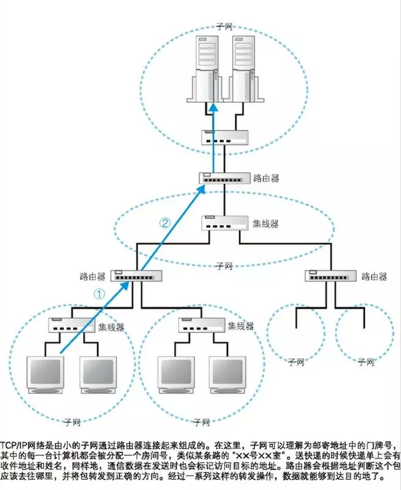
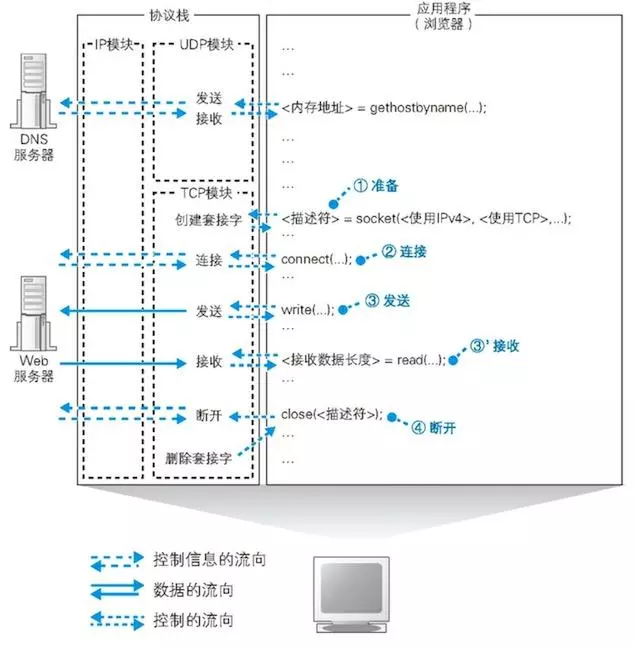
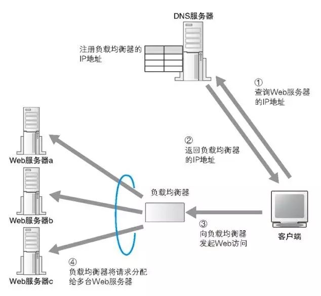
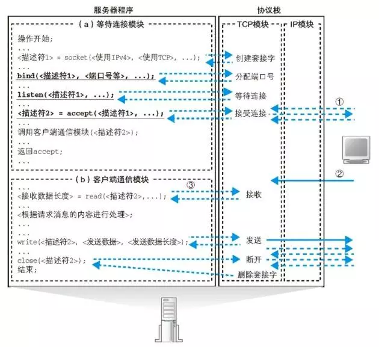
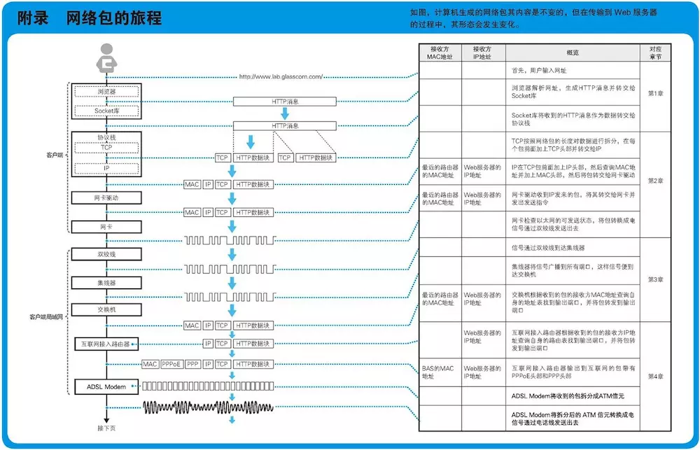
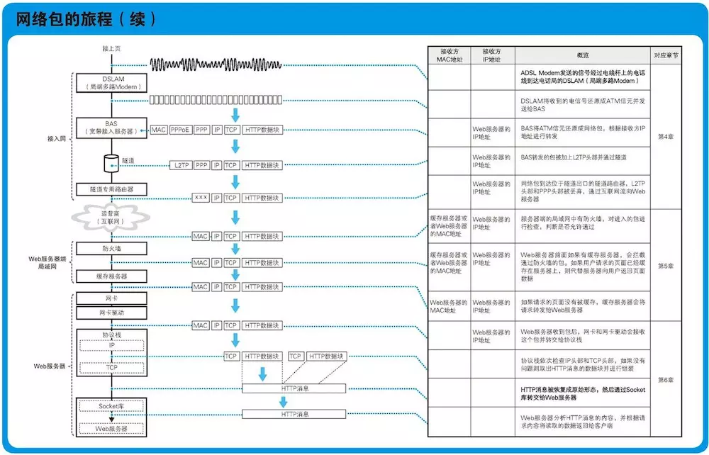

# 网络是怎么连接的

作为前端人员，面试时经常会被问到“描述从浏览器输入 url 到显示出网页的整体过程”，这个问题很大，主要包括两部分。第一部分是如何通过网络获取到资源，第二部分是获取到资源之后浏览器解析 JS 并渲染页面，本书就是第一部分的最好答案。

前段时间去听了 W3C 核心成员 [philippe](https://www.w3.org/blog/author/plehegar/) 的一个关于前端未来发展趋势的演讲，当他提到 web 是什么时，他回答：**web 就是一个由 html http url 三个协议组成的共同体** （发展到现在，ECMAScript 肯定也是重要内容之一）。其中，http 和 url 协议在本书中都有重点介绍。

本书讲解的内容体量非常大，从网络请求发出一直到接收并返回，涉及到的知识面非常广，虽然每一部分都不太深。作为前端开发的笔者，无法全部详细看完，只能挑重点看。看完本书，详细看过的占 1/3 左右。

------

## 目录

本书从客户端发起网路请求，到服务端最终返回数据，按照整个过程分以下部分讲解。

- **客户端**，即浏览器。从输入网址到发送请求，浏览器分析请求，生成消息，调用操作系统的网络能力来发送消息。
- **协议栈和网卡**。协议栈收到浏览器封装的数据，将数据封装为包，并将包交给网卡，网卡将包转换为电信号发送到网络。这是一个从软件到硬件的过程。
- **集线器、交换器、路由器**。以何种方式接入互联网。
- **接入网、网络运营商**。从局域网到互联网。
- **防火墙，缓存服务器**。网络包达到了 web 服务器的局域网，要经过防火墙安全检查，还可能会被缓存服务器判断是否命中缓存。
- **web 服务器**。网络包到达 web 服务器，真正的 IP 地址对应的目的地。web 服务器接收、分析请求，经过处理和计算，返回数据给浏览器。

以上内容笔者无法全部深入细节，只是看了和自己工作学习比较相关的部分 —— 浏览器发送请求和服务端接收并返回请求。中间的内容应该是网络工程师的技能，笔者并不擅长，也不打算深入研究，因此这里也不记录了。

------

## 网络请求的层次结构

以上是网络请求所经历的分层结构。应用程序（如浏览器）生成发送消息，委托给操作系统来发送，操作系统会调用网卡连接互联网发送信息。

------

## 浏览器发送请求

从输入 url 到将数据发送到互联网。

### 分析 url

浏览器接收一个输入的 url ，肯定要先解析 url ，包括下文的 web 服务器再接收到请求的时候也需要解析 url 。url 有一套标准规范，这是 web 的基础协议之一。

### 生成 http 请求消息

web 的另个基础协议就是 http 协议。浏览器要按照 http 协议的规范，生成 http 请求消息，即开发中常说的 `request` 或者 `req` 。当然，最后 web 服务器端返回消息时也需要遵循 http 协议返回规范格式的内容。

http 协议的基础内容本书中做了介绍，但是仅限于一些特别常见的内容，并不全面。要想详细了解 http 协议还是去看专门讲解 http 的书籍，如《图解 HTTP》。这本书笔者已经做过一次读书笔记[《图解 HTTP 读书笔记》](./图解http.md)，这里不再重复。

### DNS 查询

url 中的服务器名往往都是域名，但要想在网络上找到一台确定的机器并与之连接，得需要 IP 地址。互联网和公司内部的局域网都是基于 TCP/IP 的思路来设计的，TCP/IP 的结构就是由一些小的子网，通过路由器连接起来组成一个大的网络，这里的子网可以理解为用集线器连接起来的几台计算机，笔者们将它看成一个单位，称为子网，将子网通过路由器连接起来，就形成一个网络。而 IP 地址就是从这些子网中一层一层找到某台机器的有效方式。

为何 url 中要用域名，而不直接用 IP 地址呢？原因书中没有终点提到，不过笔者总结如下：

- IP 地址不好记，域名比较容易记录，如 `www.baidu.com`
- 时间、地域不同，IP 可能不一样，例如在北京访问百度，和在广州访问百度，对应的 IP 地址不一定一样。但是域名不需要变。
- 一个域名可以对应多个 IP 地址，这是实现负载均衡的一种思路。

因此，得需要通过 DNS 查询来得到该域名对应的 IP 地址，可分三个层次的查询：

- 通过浏览器查询，浏览器会缓存常用域名的 IP 地址。早期的 chrome 就用预加载网页所有域名 IP 的方式来优化网页打开速度。
- 通过操作系统查询，操作系统也会缓存常用域名的 IP 地址。也允许自定义，如修改 host 文件。
- 以上两个都找不到，就需要去网络运营商或全球 DNS 服务器去查询，那样可能会耗时较慢。

### 委托协议栈发送消息

生成了 http 消息，知道了 IP 之后，就可以委托**操作系统**的**协议栈**向这个目标 IP 地址发送消息，并等待回复。注意，浏览器不会自己发送消息，因为这是一个很复杂的过程（如需考虑分包、丢失等问题），会交给操作系统来做。而协议栈就是操作系统查询、发送、接收网络请求的软件模块，它的下层就是计算机的硬件，即网卡。

共分为四个阶段：

- **创建套接字**。调用 `socket()` 方法，会返回一个描述符，即该请求的 `id`。因为操作系统里有很多应用程序每时每刻都可能发送很多请求，需要对每个请求做标记。
- **建立连接**。调用 `connect()` 方法，需传入当前请求的描述符，目标 IP 地址和端口号。建立连接之后才能发送数据。
- **收发数据**。调用 `write()` 方法，传入描述符、发送数据和数据长度，数据过长时可能需要多次发送。数据返回之后通过 `read()` 方法可获取数据和数据长度。
- **断开连接**。收发数据结束，调用 `close()` 方法断开本次连接。

每一次网络请求，协议栈都要经历以上四个步骤，过多的网络请求会影响性能。因此一个网页中尽量合并网络请求，如雪碧图、合并 js 和 css 文件、小图片用 base64 格式等。

### 分包发送

应用程序委托操作系统发送网络请求，操作系统需要将发送信息拆分为多个网络包，每个包体积大约几十个字节。然后将网络包一次发送出去，web 服务器也会分包接收信息，然后拼接起来。

包的发送过程中可能会丢失，操作系统还要使用一些机制来检查是否丢失，如果丢失了要重新发送，重新发送多次依然丢失则会报错。另外，**将数据拆分为多个包也会提高传输性能，这一点和使用 stream 处理 I/O 是一个道理**。

拆包、合并、检查丢失等操作都是操作系统来处理，应用程序不用关心，这就大大提高了网络编程的便利性，操作系统封装了这些复杂的情况。

------

## 服务端接收请求

数据从客户端发出，经过局域网、互联网，最终到达服务端。

### 负载均衡

稍大一点的 web server 都需要多台服务器，甚至多集群、多机房，大公司会有专门的部门、工程师负责这些服务器的采购、架设和更换。当服务器变多，就需要负载均衡策略。

负载均衡一种简单粗暴的方式，就是对域名的 DNS 绑定多个 IP 地址，这样客户端在执行 DNS 查询时会挨个、顺序返回每个 IP 地址。但这种方式的缺点是，万一某一个机器宕机，DNS 服务器是不知道的，照样会返回这个机器的 IP 地址。

现在比较常用的负载均衡方式是使用负载均衡器，将 DNS 服务中域名指定的 IP 地址统一指向负载均衡器的 IP ，然后由负载均衡器统一处理。

### 缓存服务器

在请求真正进入目标服务器之前，可能会进入缓存服务器，由缓存服务器判断是否该请求会命中缓存。当然，缓存也可能不是一台机器，而是一个软件，缓存知识一种提高效率的机制。

在 http 协议中，比较重要的是浏览器的缓存策略，这部分知识对于前端开发人员也相当重要。具体可查询相关资料，这里不做讲述。

### CDN

CDN 即内容分发网络，主要用于静态资源服务，它会提高网络请求的效率，主要有两方面：

- 它会根据客户端的区域，返回离本区域比较近的 IP 地址。因此，CDN 是一个广泛的服务集群，实现成本比较高。
- 它一般会根据 url 强制缓存数据，即同一个 url 再次访问时会命中缓存策略。

### 服务器收发消息

一个服务器同一时间可能会多个客户端发来的请求，因此每次接收到请求都要新启动一个服务器程序，确保服务器和客户端是一一对应的。例如，Apache 服务器对每次请求都会新启动一个线程，nodejs 是单线程的但每次请求都会有一个新的 `req` 实例。

服务器要被动接收数据，而不像客户端是主动发送数据，因此需要两个模块：等待链接模块和客户端通讯模块，如下图：

接收到数据之后，服务器按照协议解析 url ，然后返回静态文件，或者调用 CGI 动态计算结果，最终返回。返回的规范也需要按照 http 协议，比较重要的是 `Content-type` ，它规定了返回内容是什么文件类型。

------

## 总结

无论是哪个技术栈的开发人员，只要是涉及到和网络相关的技术，都应该看一看这本书。选择自己从事的那部分详细看看，其他部分了解一下，这样就对整个计算机网络有一个大概的认识，相信对自己的职业发展很有帮助。

另外，附上本书最后一个完整的网络请求流程图，非常详细。

