# 《操作系统》学习笔记

本课由 清华大学 向勇老师 讲，视频地址 https://www.bilibili.com/video/av6538245?from=search&seid=246032312215120374

--------------------------

## 前言

本课程我没有很详细的看完，大约挑着看了一半儿的内容，因此只能算了解一点皮毛，很多细节都没有深入进去看。站在我的角度来看，课程将的非常好，对于 os 这么复杂的软件来说，感觉已经算是讲的通俗易懂了。另外，课程介绍中还说会用到学校自己开发的一个学习用 os [ucore](https://chyyuu.gitbooks.io/simple_os_book/content/) 配合理论来实践，不过课程中没有讲到，想学习自己去网上查查资料吧，是开源的。

--------------------------

## 是什么

如上图，这个模型应该都比较清楚，操作系统就是应用软件和计算机硬件的一个中间层，它具体需要做的内容如下：

- 对上层，要管理各个应用软件
    - 管理应用程序，如限制其占用太多内存
    - 为应用程序提供服务，如 IO 网卡 声卡等
    - 杀死应用程序
- 对下层，要管理计算机的各个硬件资源，**对其主要模块做抽象**（理解这一点很重要！），本文就围绕着这三个抽象来做总结。
    - CPU 抽象为进程、线程，以及调度
    - 物理内存抽象为逻辑内存、虚拟内存，并给各个应用程序提供独立的内存空间
    - 硬盘抽象为文件系统，通过文件即可管理硬盘的数据

操作系统的主要特点有：

- 并发：通过调度算法，让多个进程都能同时执行。
- 共享：当多个进程同时访问同一数据时，进行管理（同时共享 或者 互斥共享）
- 虚拟：把硬件抽象，让每个应用程序都感觉自己是独占一台计算机，即把一台物理机器虚拟成多台机器

最后说明一下，学习操作系统也是有很多前提要求和挑战的，因为这门课所涉及到的知识领域非常多，例如 C 语言和汇编、数据结构和算法、计算机组成原理等，因此不可能一口气花几天时间把操作系统搞懂，应该是一个循序渐进的过程。同时，操作系统又是一个计算机相关专业比较基础的知识点，从业者必须要去了解，不得不学。学完操作系统原理，再去看 linux 相关的书籍，应该会容易许多。

--------------------------

## 内存

### 计算机内存结构

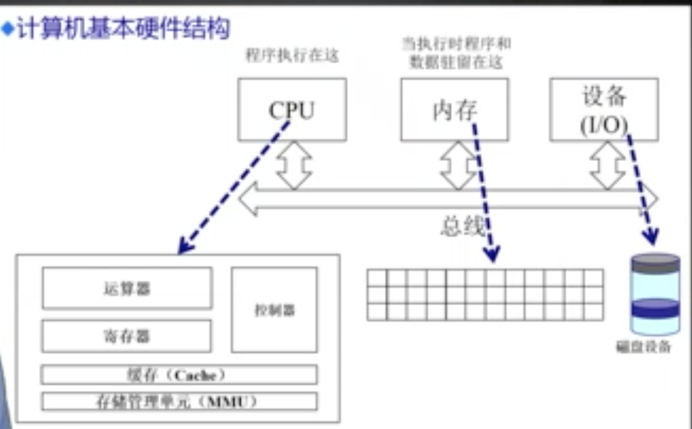

上图是一个简单的计算机组成模型，详细知识需要去计算机组成原理这门课中学习。

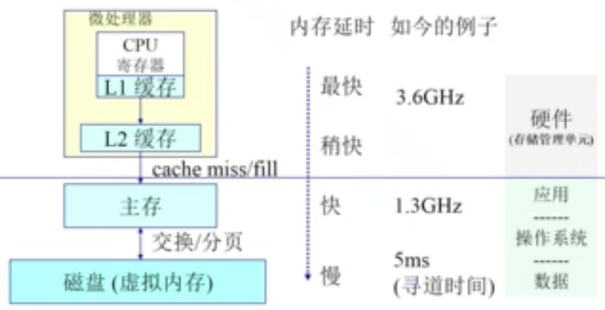

上图是计算机组成中的内存分层模型，具有存储功能的硬件有：寄存器，高速缓存，主存（物理内存），硬盘。之所以这样分层，和读取速度、制造成本、以及断电丢失性都有关系。详细知识也需要去计算机组成原理中学习。

以上都是硬件结构，而这些物理结构不可能直接暴露给一个一个的应用程序直接访问，那样不仅仅会让程序编写异常复杂，而且会导致各个程序的存储数据乱套。因此，os 就需要对这些硬件的物理的结构进行管理，具体的目标是：

- 抽象：不关心物理，抽象为逻辑空间
- 保护：每个进程独立地址空间，不相互破坏
- 共享：访问相同内存
- 虚拟化：虚拟的提供更多的内存空间，暂时不用的先放在硬盘上。如下图，图中 P1 P2 P3 P4 都是运行在 os 上的应用程序。其中 P1 正在运行中，P4 处于不运行状态，则把 P4 的内存数据暂时放在硬盘上。

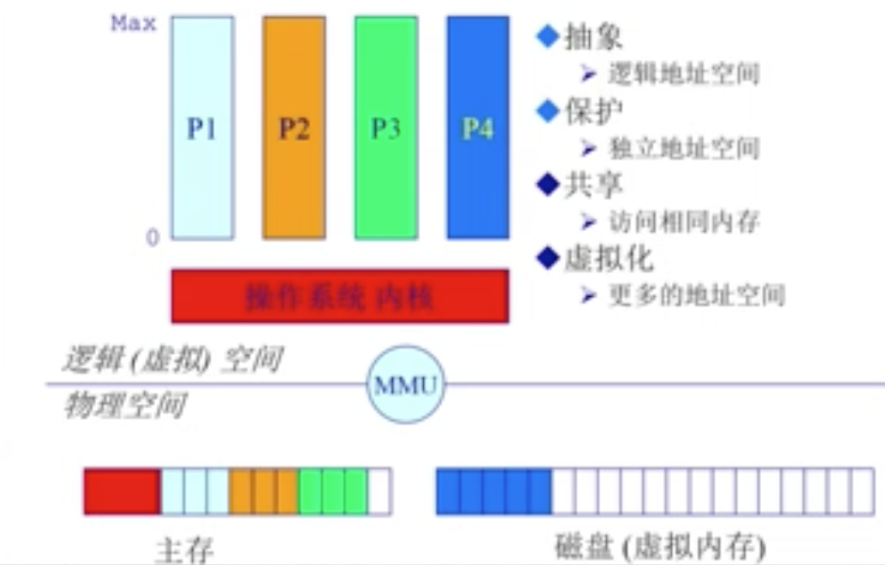

### 地址生成

物理内存是一个一个的硬件设备，os 要把内存抽象，就得到逻辑内存。逻辑内存就是一个线性的地址列表。

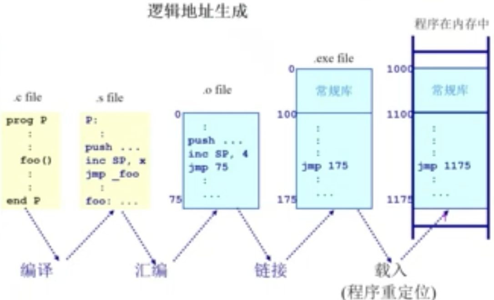

上图就演示了一个程序的逻辑地址的生成过程，简单解释一下图中各个步骤。

- 一段 C 语言，其中函数的位置、变量的名字，都要对应一个地址
- 编译出汇编语言，即 `.s` 文件，将代码转换为指令，但是跳转地址都不是具体的数字，而是代指 如 `jmp _foo`
- 汇编语言再通过汇编器，转换为机器语言，即 `.o` 文件 ，它的起始地址都是从 0 开始 ，并且其中各个地址都从 0 开始做偏移量的计算得到一个地址的值
- linker 即链接器将多个 `.o` 程序编程一个单一的执行程序 `.exe` 文件，它的起始地址也是从 0 开始。但是每个 `.o` 程序的起始地址就不可能都是从 0 开始，而是一个一个连接起来，因此各个 `.o` 程序内部的地址值都要做偏移
- loader 将 `.exe` 文件加载到内存中去执行，因为内存中会有其他的应用程序，因此 `.exe` 的起始地址也不可能从 0 开始，而是要根据实际情况做偏移

逻辑内存地址如何与物理内存地址一一对应起来呢？下文有介绍。

### 连续物理内存分配

每个应用程序在开始执行之前，os 要给它分配一块连续的内存空间，程序结束时要释放内存空间，因此就会产生一段一段的内存空闲区域，即“碎片”，即分配内存之后不能被使用的部分。可分两种：

- 外部碎片：各个程序内存之间的部分
- 内部碎片：分配单元内部未使用的部分

课程中继续介绍了几种连续内存分配的算法，如首次分配算法、最优分配算法、出差分配算法，但是这些都无法很好的解决内存碎片的问题。现代计算机也不再使用连续内存分配，而是使用下文介绍的非连续分配方式，就是为了解决碎片问题，提高物理内存使用率。

### 非连续物理内存分配

非连续只是的物理分配上，但逻辑内存一直都是连续的。所以这是 os 层面的抽象，应用程序不会感知到连续还是非连续。简单来说，就是逻辑内存是一个连续的线性表，但是每个逻辑内存块对应的物理内存空间不是连续的。其优点是：

- 物理内存利用率高
- 利于内存管理和分配
- 允许共享代码和数据，从物理级别就支持

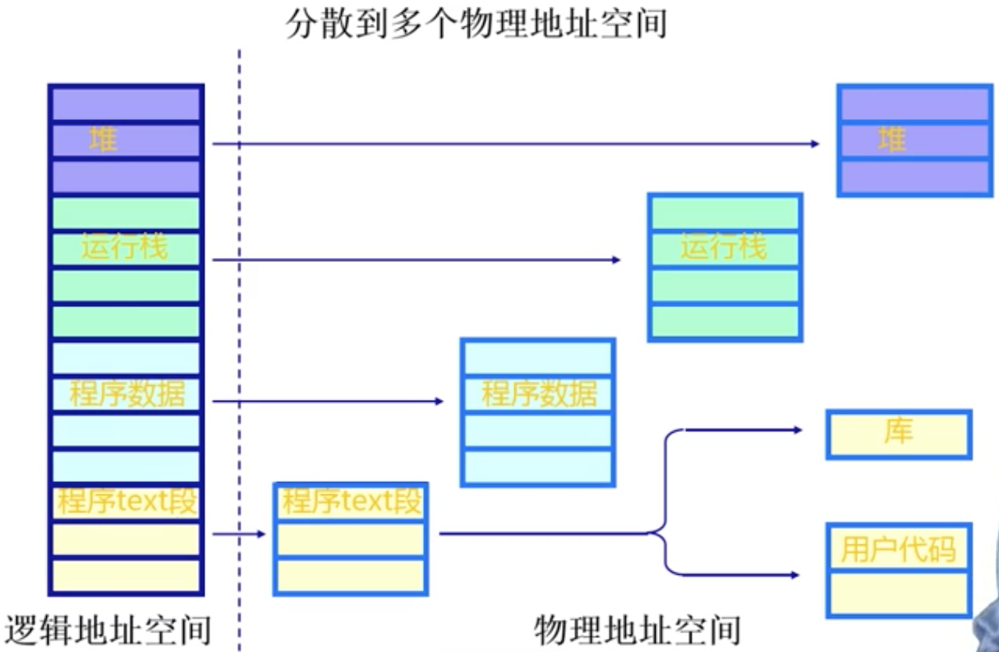

上图就解释了非连续物理内存的模型。左侧是逻辑内存，连续的的线性表，右侧是物理内存，非连续的。逻辑内存和物理内存之间存在一个映射关系。

### 分段

但上述映射关系如果通过软件来维护，开销会非常大，因为现代 64 位 CPU 的寻址范围非常大。因此，要通过结合一些硬件的能力来实现这个映射关系。

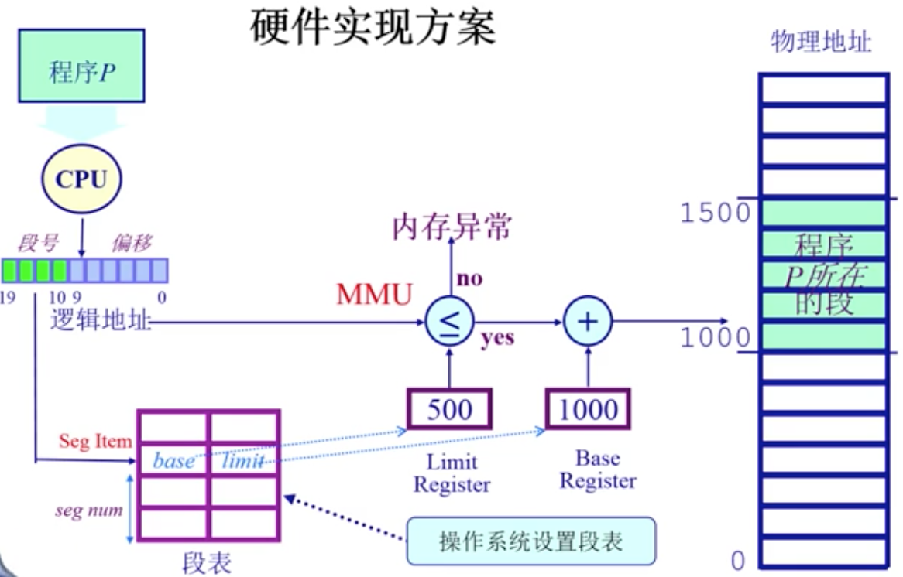

如上图，就是用分段的方式来实现非连续物理内存的分配。简单解释一下图中内容：

- 左侧 CPU 访问的是一个逻辑地址，最右侧是这个逻辑地址对应的物理地址
- 逻辑地址划分为两部分：段号和偏移量
- CPU 拿到段号去段表（os 创建的，硬件实现的，效率高）中查找物理地址的起始地址，然后加上偏移量，就是最终的物理地址
- 中间还有一个内存的检查，避免该进程访问自己无权的内存区域

注意，图中还有一部分是内存地址的校验，os 为一个进程分配一块独立的内存空间，如果某个进程想要跨越自己的空间去干预其他进程的内存数据，os 会报错。

### 分页

分段和分页有何区别，其实可以通过“断”和“页”两个词来表述。看纸质小说时，一段文字的长度是无法固定的，可能一两句话就是一段，也可能一段好几页纸才能承载下。而纸质小说的一页就是一页，能承载的文字基本就那么多。因此，分段的单位存储空间是不固定的，而分页的单位存储空间是固定的。固定的空间肯定更加易于管理，因此现代计算机往往采用分页的方式来进行非连续内存分配。

如上图，物理内存被分割为大小相等的帧（frame）。图中讲述的很明白，物理地址可以通过一个固定的公式被计算出来。即，这种划分方法把物理内存给标准化了，通过计算即可得出地址。

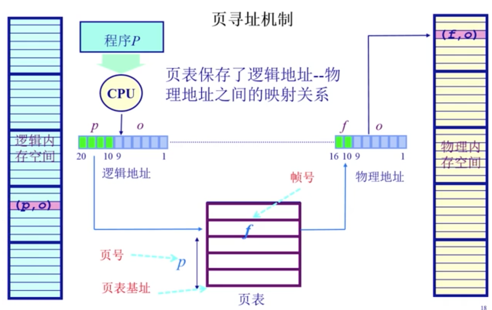

如上图，逻辑地址和物理地址类似，即可以通过一个逻辑地址的计算，得出物理地址。只不过逻辑地址中存储的是页号 p ，而物理地址中用的是帧号 f 。用一个 page table 去对应 p 和 f 。注意，这里逻辑内存也是连续的，而物理内存是非连续的。page table 是操作系统初始化的时候建立的。为何要将 p 和 f 分开，是因为逻辑地址要和物理地址分开管理，以及逻辑地址可能会比物理地址设置的更大，下文虚拟内存会有介绍。

页表可以理解为一个字典（p 对应 f），但要做的足够快，足够节省空间，这要结合硬件去具体实现。因为现代计算机都是 64 位 CPU ，寻址空间非常大，那么页表也就要占很大的空间（不做优化的话），占用空间大了，就需要放在访问速度慢的位置，访问效率也就低了。

解决方法就是在 CPU 中创建一个快表 TLB （因此访问速度非常快），将近期使用的页表项缓存在其中，如下图。这和内存分层的“高速缓存 -> 主存”非常像。快表失效之后从页表中查找补充该数据的逻辑：x86 中完全由硬件来实现，不需要 os 关心；MIPS 中却由 os 来实现。

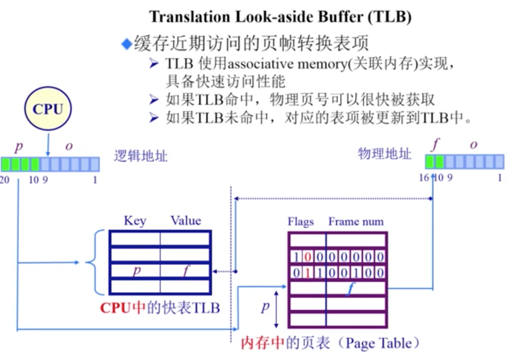

那么如何让快表访问的失效最小？写程序的就要注意变量或者函数的“局部性”，要把经常使用的地址局限在一块区域。关于程序的局部性，下文还有一个例子来做讨论。

解决了速度问题，再解决空间问题，解决方案是将页表分级，如下图。这样做，其实整体上反而会增加存储空间，但是拆分之后，首先 P1 占用空间会非常少，其次将 P2 中没有映射到 P1 的项，不存储在内存中。因此，会降低内存的开销。如果不分级，整个一个页表都需要存储在内存中，占用内存较多。二级页表进一步推广，可以有多级页表。例如 64 位操作系统可以有五级页表。

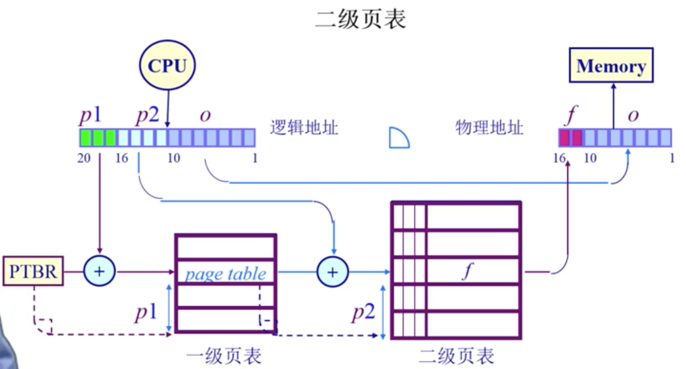

### 虚拟内存

物理内存技术的发展，总是远远落后于应用程序对内存的需求。例如现在大型的图像、视频处理软件，大型的游戏，一旦打开都会要求很大的内存。而且，一个 os 中同时运行很多的应用程序，就导致内存更加不够用。因此，就有了 os 的虚拟内存技术，即看似给每个应用程序那么多内存，其实并不会给它真正那么多的物理内存空间（想给也没有），具体实现思路：

- 给一个应用程序 2G 的虚拟内存空间，但是它可能根本用不了那么多，具体用多少就占多少物理内存，动态分配
- 一些不活跃、被挂起的进程，其内存会“偷偷”的被转移到硬盘上，腾出内存给其他进程使用，当这个程序被激活时，再从硬盘中把内存数据取出来重新放回内存

虚拟内存技术完全由 os 来实现，但是想要让你的程序最大程序的利用虚拟内存技术，必须让其代码具有“局部性”，如下图。一个二维数组的赋值运算。左侧程序是按照 `a[0][0] a[1][0] a[2][0] a[3][0] …` 即按列访问，右侧程序是按照 `a[0][0] a[0][1] a[0][2] a[0][3] …` 即按行访问。两者有何区别呢？

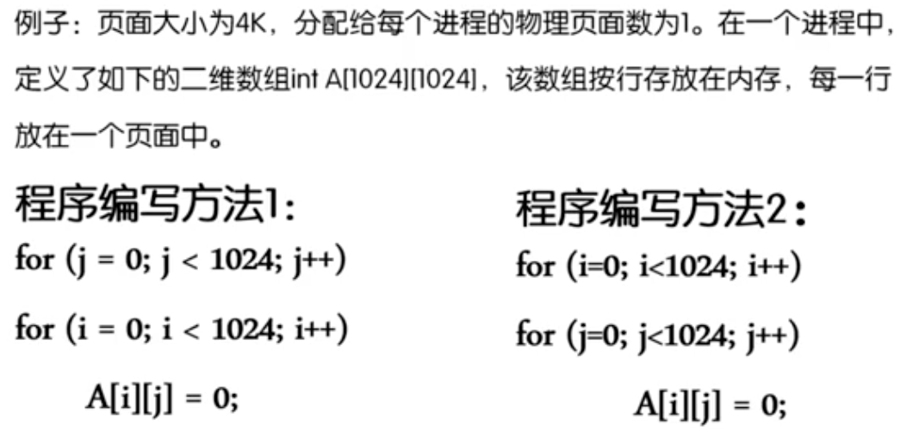

按照程序运行时候的内存模型，二维数组的存储在逻辑上是一个连续的内存空间，按照 `[ [第一行…] ,  [第二行…],  [第三行…] … ]` 这样来存储的。而且，CPU 从内存中读取数据是按照数据块读取的，即每次读取一段连续的数据，并不是单个数据。因此：

- 按列访问二维数组，就不符合局部性，每一行中的第 x 个元素（即第 x 列所有元素），在内存中的存储位置相隔较远
- 按行访问二维数组，就符合局部性，因为每一行中的所有元素，在内存中都是集中存储的

上文介绍了分页机制，其实虚拟内存实现物理内存和硬盘的数据交换，就是以页为单位的，如下图。图中 P4 进程的内存数据分多个页来存储，如果 P4 进程不活跃，即可将其中若干页的内存数据暂时放入硬盘。

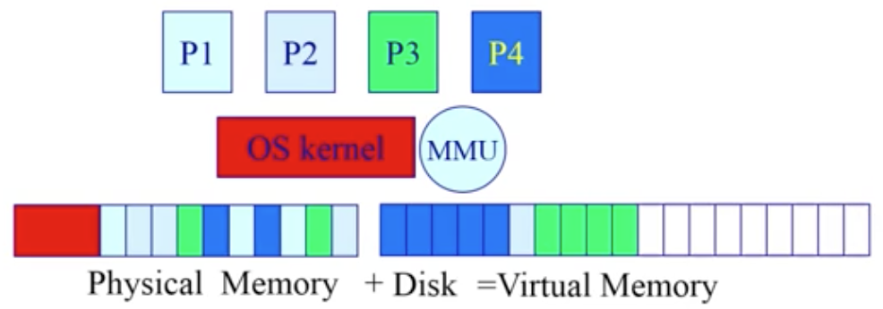

具体这些数据如何交换？什么实际交换？课程中花了很大的内容去讲解，不过我没有挨个详细看，方法有：

- 最优页面置换算法
- 先进先出算法
- 最近最久未使用算法
- 时钟页面置换算法
- ……

--------------------------

## 进程和线程

进程和线程是编码过程中经常遇到的两个词，而且它们都是 os 对 CPU 运算的抽象，是 os 中最核心的模块之一。

### 什么是进程

对进程的通俗理解，可以看自己电脑的任务管理器，如下图。即查看自己的电脑正在运行哪些程序，有些可能是系统启动的程序，有些可能是用户启动的程序。从这里可以看出 os 为何要有“进程”这个东西 —— 就是为了满足多个程序同时运行在计算机上，分开管理，互不冲突。注意，这并不是表示一个软件打开了就只产生一个进程，例如 chrome 打开多个网页，会为每个网页都生成一个进程。

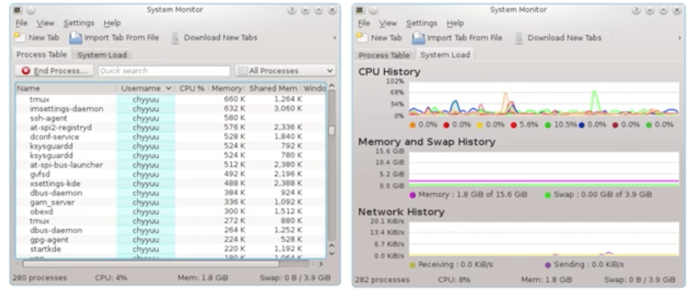

进程的明确定义如下图，即一个具有独立功能的程序在一个数据集合上动态执行的过程。一段代码编译出一个执行文件（在硬盘中），然后加载到内存中来执行，这个动态的执行过程就是进程。

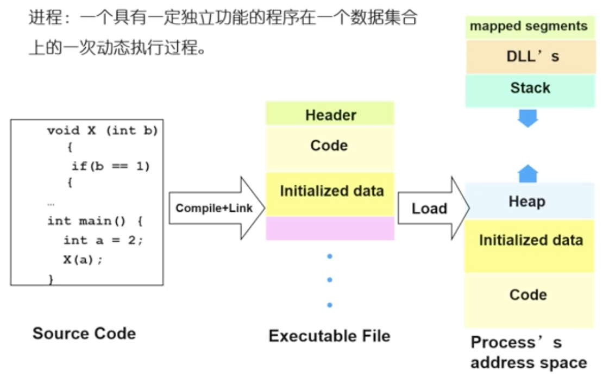

进程不等于程序。进程是动态的过程，而程序只是一个静态的代码或者执行文件。两者的具体区别是：

- 程序是产生进程的基础
- 程序的每一次运行，能构成不同的进程（数据不同，环境不同）
- 通过调用关系，一个进程也可能包含多个程序
- （两者，多对多的关系）

进程是 os 分配 CPU 内存的标准单位。即 os 会在特定的时间段分配 CPU 给一个进程，而且每个进程会独占一段连续的逻辑内存（如上图，右侧是内存数据模型），并且由 os 保证其内存数据不被其他进程所侵犯。

进程在 os 中存在的唯一标志叫做 PCB Process Control Block （进程控制块）。是 os 管理控制进程运行所用的信息合集，描述了进程的基本情况和进程变化情况。它包含：

- 进程标识信息。如进程标识 ，父进程标识，用户标识
- CPU 的状态信息。寄存器中的信息，通用寄存器，控制和状态寄存器，栈指针寄存器
- 进程的控制信息。如进程间通讯，进程所用资源等

另外，os 中有了进程的概念，就能管理多个并发的应用程序，似乎这是大大的好事儿一件。但是多进程这种模型，也带来了非常多的问题，例如如何调度执行、如何同步互斥、死锁问题等，下文会有介绍。

### 进程的状态控制

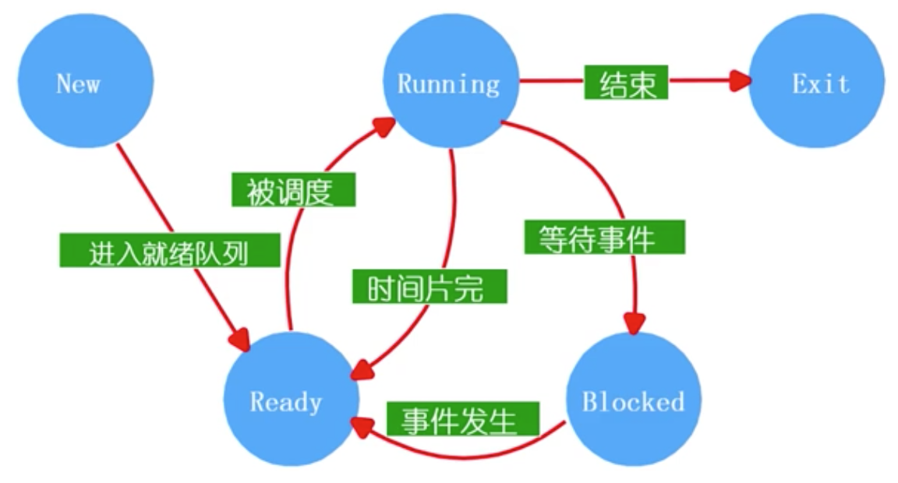

上图是一个进程的状态变化图，包括：

- 创建
    - os 初始化
    - 用户请求创建
    - 进程创建子进程
- 运行
    - ready 的进程很多，先执行哪个进程？ —— 这是调度算法的任务
- 等待（进程等待的发起，是由进程自身发起的，因为只有自己才能知道自己何时需要等待）
    - 例如等待读取文件
    - 和其他进程的协同工作，等待其他进程计算完成
- 唤醒（进程只能被别的进程或者 os 唤醒）
- 结束
    - 正常退出
    - 错误退出
    - 被其他进程强制杀死

解释一下图中的“时间片完”这个步骤。多个进程并发执行时，CPU 会再各个进程之间切换执行，即 CPU 为每个进程分配时间片段。当 CPU 在一个进程中的时间片段用完之后，就会将该进程切换为 ready 状态，然后 CPU 被分配给其他进程使用。

### 关于线程

课程中举了一个例子，要做一个简单的 mp3 播放器，核心流程是三个步骤：第一，读取一个 mp3 文件；第二，解压文件；第三，播放。如果我们使用这个软件，每次播放一个歌曲都要挨个去执行着三步，那么从打开到播放估计得等很久，这肯定是不行的。要让这三步并发执行，即一边读取、一边解压、一边播放，这才是我们需要的功能。

如果用进程去做这三步的并发执行，会带来一些问题，例如：

- 如何共享数据，因为不同进程的数据是独立的
- 维护进程的开销很大，PCB 包含了很多信息
- 进程切换，保存、恢复信息，开销也很大

但是用线程来做并发，就解决了这个问题。线程，就是进程当中的一条执行流程。一个进程中可以同时存在多个线程并发执行，而且共享这个进程的内存空间。

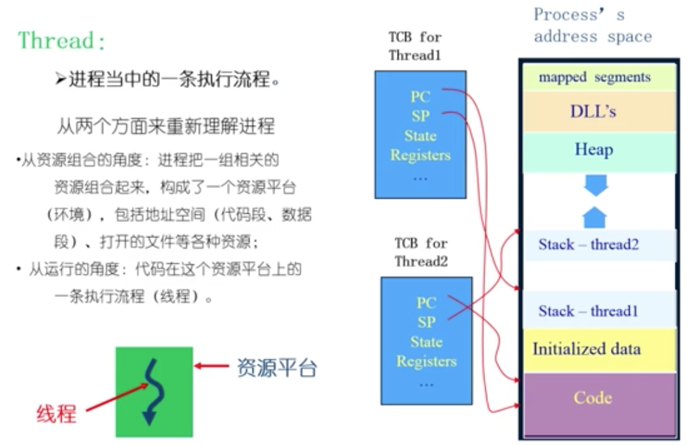

如上图，有了线程之后，重新理解一下进程，如上图。其中 TCB 就是线程数据块，和 PCB 概念类似。进程成为一个资源平台，而线程则是一条执行流程。

- 多个线程共同拥有内存空间（因此数据同步简单，不会受到 os 的干预）和代码
- 不同线程可以执行不同程序代码，有不同的堆、栈、寄存器，可并发执行
- 线程在进程内部，os 管理的是进程，却管不着线程，因此进程内部的线程要自己管理自己

不过线程也有不好的一面，因为多个线程共用一段内存空间，一旦一个线程崩溃出错，极有可能影响其他线程。这就是为何 Chrome 为每一个网页都创建一个进程、而不是线程，因为你不能信任一个网页的稳定性，一旦一个网页奔溃，其他网页别受影响。当然，这还是得基于现代计算机内存空间和 CPU 性能的支持。

### 调度算法

调度算法是 os 管理进程的核心算法，也是 os 是否强大的一个体现。课程中花了大量篇幅来讲解调度算法的细节，以及一些实例，不过我都没有详细看。这块现在仅仅还了解一点皮毛。

CPU 的计算能力是有限的，而 os 中同时运行的进程是不可估量的。调度算法要做的事情就是，在有限的计算资源下，如何最高效的满足所有的应用程序并发执行。具体有两点：

- 已经 ready 的进程有很多，CPU 如何确定接下来该优先执行哪一个？
- 在多个进程并发执行过程中，CPU 如何划分自己的时间片段给所有进程共享使用？即不能逮着一个进程执行到底，其他进程不管了。

通俗来说，衡量调度算法的优劣标准就是“越快越好”，详细拆开可分：

- 平衡 CPU 使用率（不能一会儿忙死一会儿闲死）
- 吞吐量，在单位时间内完成的进程数量
- 周转时间，单个进程从开始到结束的时间，即等待时间越少越好

常见的调度算法（通用性的）如下：

- 先来先服务算法：即多个进行形成一个队列，简单。但是如果前面的进程耗时过长，就会使整个周转时间变长。
- 短进程优先算法：将最短执行时间（或者最短剩余执行时间）的进程，优先执行。前提是先进行排序。该算法可能会导致长进程一直处于等待状态，另外每个进程的执行时间不好预估（但也有预估方法）。
- 最高响应比优先算法：综合考虑等待时间和执行时间，依据的是 `(等待时间 + 执行时间) / 执行时间` 这个公式，结果最大的进程优先执行，即不能让进程的等待时间过长
- 轮询算法：让各个进程轮流占用 CPU 去执行，即 CPU 分片（如早期 unix 设置时间片为 0.01s ，现代的 linux 设置时间片为 0.001s ）
- 多级反馈队列算法
- 公平共享调度

### 同步和互斥

多个进程有共享资源（可能是同一个文件、可能是同一个全局变量 等等）时，或者相互依赖时，就可能产生冲突。一个进程执行到一个阶段，可能会被 CPU 强制等待，切换到另外一个进程中去执行，这个过程中就可能出现问题。课程视频中买面包的例子，如下图 ，执行到 `(2)` 之后，切换到右侧进程去执行，结果还是会导致多买面包。而且，这种问题很难被复现，不确定性。

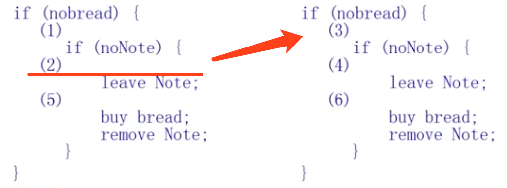

临界区，是指进程中的一段需要访问共享资源，并且当另一个进程处于相应代码区域时，便不会被执行的代码区域。即多个进程要互斥的访问一个资源，可以通过加锁的方式来实现互斥。这样就解决了上述的问题，如下图。其实视频中讲的很详细，我没仔细听，三言两语带过了。

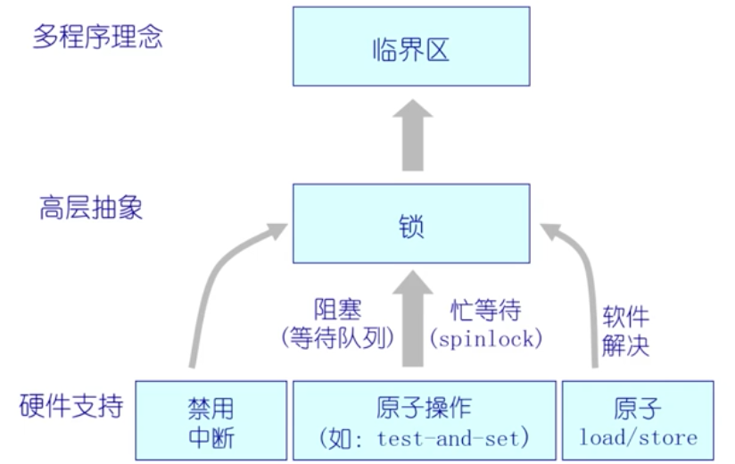

另外，课程中还讲到可以通过信号量的手段来做更加精细的控制，比加锁满足的场景更多。

### 死锁

简单理解就是，两个以上的进程，相互之间有依赖关系时，会出现相互等待。这部分内容课程讲的也挺详细，不过我没看，因此这部分记录就省了。

### 进程间相互通讯

课程中貌似没讲到这个问题（也可能是我没完全看完课程内容的原因），这部分知识再去其他地方查一查，回头补上……

--------------------------

## 文件系统

文件系统是 os 对硬盘的抽象，这是通俗的解释。在 linux 中所有的 I/O 操作都抽象为文件，这也使得 linux 更加简洁易维护。

课程中对这部分的讲解都是一些基本概念，感觉看着没啥意思，也觉得没收获多少。先不记录了，以后再说吧。

--------------------------

## 总结

总体感觉，操作系统内容太多，感觉还是得循序渐进的去了解。
