# 《数据结构与算法》学习笔记

课程由 清华大学 邓俊辉教授（人称邓公）讲，课程地址 https://www.bilibili.com/video/av22774520/?p=8 。

-------------------------------------------------------

## 前言

前前后后我也看过不少关于算法和数据结构的视频、书籍，但是还是感觉这门课是讲解的最好的，最好的不一定就是最难得、最全面的，而是讲解的最清楚的。课程内容有 37 个小时，但是慢慢的一点一点的看，一个星期就能看的差不多。

这门课其实还是以常用数据结构为主线，讲解这些数据结构中常用的算法。其实在我们的日常编程开发中，数据结构比算法更加重要，因为算法是依赖于数据结构的。某个系统、功能的开发，用对了数据结构就算没走错路。算法用错了修改成本相对较小，而数据结构用错了，修改成本会非常高。

-------------------------------------------------------

## 算法的铺垫

先说一些算法的基础知识，后面会被用到。

### 时间复杂度

算法时间效率的衡量用时间复杂度，`O` 表示，具体它是什么以及为何用它，这里就不解释了。常见的时间复杂度有：

- `O(1)` ，常数复杂度，顺序执行的程序，没有循环和递归
- `O(logN)` ，对数复杂度，二分算法，如二分查找
- `O(n^c)` ，多项式复杂度，例如嵌套循环。包含了 `O(n)` `O(n^2)` 等
- `O(2^n)` ，指数复杂度 —— 复杂度太高，可以理解为编程不可实现（即程序跑着跑着就卡死了）

其中 `O(n^c)` 的常见情况是 `O(n)` `O(n^2)` 。因此，常见的时间复杂度就是 `O(1)` `O(logN)` `O(n)` 和 `O(n^2)`。本想再往上找找这几个函数的曲线图，结果没找到合适的，读者自己去搜一下或者自己画一画吧。

看一个例子，一个常见的嵌套循环：

```js
for (let i = 0; i < n; i++) {
    for (let j = 0; j < n; i++) {
        //...
    }
}
```

以上代码的复杂度是 `O(n^2)` ，这一点无疑。但是如果把其中的 `j < n` 改为 `j < i` 呢？—— 复杂度还是 `O(n^2)` 。因为，后者虽然在执行次数上比前者少了一半儿，但仅仅是少了一半儿，没有数量级的减少，因此复杂度是一样的。`O` 统计的是数量级，少一半儿构不成数量级。同理，冒泡排序也是 `O(n^2)` 时间。

### 递归

一种需要遍历的算法，往往可以用循环和递归来实现，而对于复杂的遍历，递归会比循环写起来更加简单。但是这种简单也是有代价的，递归的效率往往不如循环。具体表现在如下两点：

- 用递归，每次执行函数都会产生新的函数栈，大量的递归可能会导致“爆栈”。虽然很多语言支持使用“尾递归”来解决这一问题，但是这也是编译器层面规避的，而且会导致报错的信息有丢失。
- 用递归，可能因此写法太简单而忽略了中间数据的暂存和积累，会导致重复的计算。而递归的时间复杂度不如循环好计算，因此可能会因为忽略这一点而带来性能问题。下文中有一个斐波那契数列数列的递归示例，就有这个问题。

因此，如果你现在还在考虑如何将循环转换为递归，那么接下来就要考虑如何将递归转换为循环。接下来先看下递归的时间复杂度如何计算。例如一个数组中有 n 个元素，求总和，可以用一个 for 循环来实现，时间复杂度是 `O(n)` 。也可以用递归实现。

```c
// 求 A 数组（n 个元素）内所有元素的和
int sum(int A[], n) {
    return (n < 1) ?
        0 : sum(A, n - 1) + A[n - 1]
}
```

课程中讲解了两种方法，比较高级的“递推方程”我没有看懂，下面就介绍一下比较简单的“递归跟踪方法”，步骤如下：

- 忽略掉递归调用的函数，即代码中的 `sum(A, n - 1)` （其实不忽略，这个函数的时间复杂度也是 `O(1)` ，从复杂度上可以略）
- 分析递归调用栈，就是 `sum(A, n), sum(A, n - 1), sum(A, n - 2) ... sum(A, 2), sum(A, 1), sum(A, 0)` ，一共 n 个
- 看函数内部是否还有其他循环（本代码没有）

经过如上分析，最后时间复杂度就是 `O(n)` ，和 for 循环一样。这种方法比较形象易懂，不想数学方法那样抽象。例如下文要将的树的遍历，如果非排序的树，其时间复杂度就是 `O(n)` ，因为遍历就是要将所有树节点都访问一遍。

### 算法思想

算法的基本思想 —— 分治、动态规划、贪心，其中后两者都是基于分治思想的。

分治是算法最基本的思想，就是将问题一分为二的处理，例如快速排序、二分查找都是最直接的体现。二叉树是树的一种特例，但是会被大量的研究和应用，也是因为其天生具有分治的结构。基于分支思想能通过 `O(logn)` 时间解决问题，而遍历所有得需要 `O(n)` 时间，两者差异非常大。一个算法，如果能在 `O(1)` 时间解决问题是最理想的（为之可能要付出一些其他的代价），如果能在 `O(logn)` 时间解决问题也是比较符合预期的，如果需要 `O(n)` 时间解决问题那将是在生产环境下不可接受的，特别是大数据情况。

动态规划也是基于分治思想的，在分而治之的基础上，先算是一部分结果，在从这个结果基础上做进一步计算，避免重复运算。例如看一个反例，用递归实现斐波那契数列。

```c
int fib(n) {
    return (2 > n) ? n : fib(n - 1) + fib(n - 2);
}
```

但是这段代码会运行的非常慢，如果 n > 40 的话，就会出现肉眼可见的延迟，而且越来越慢。因为这个算法的时间复杂度是 `O(2^n)` —— 非常恐怖！！！这种复杂度的算法被认定不可被执行！！！简单分析一下，要计算出第五个数，就需要第三和第四个数进行累加，而需要得到第四个数就需要计算第三个和第二个数 …… ，层层分裂计算，导致这个结果。原因就是计算的中间数没有被存储，导致了大量的重复计算。如果将已有结果进行存储，则只需要 `O(n)` 即可解决，而且不需要递归，一个循环即可搞定。

贪心也是基于分治思想的。所谓贪心算法是指，在对问题求解时，总是做出在当前看来最好的选择。也就是说，不从整体最优解出发来考虑，它所做出的仅是在某种意义上的局部最优解。课程中没有详细讲解贪心思想。

-------------------------------------------------------

## 数据结构的铺垫

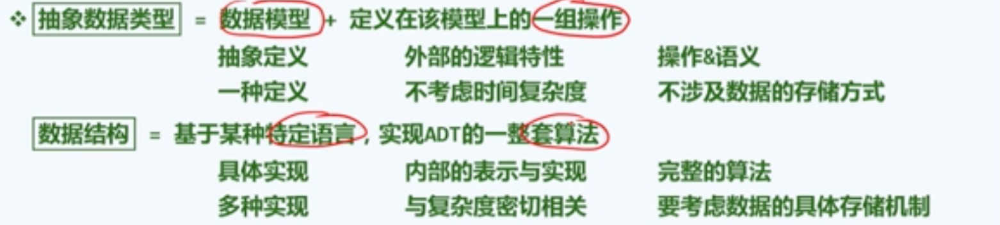

先来了解两个概念，下文在讲解数据结构的时候分为“抽象数据类型”和“数据结构”，具体定义和细节对比如上图。例如，下文中栈和队列就是抽象数据类型，使用数组、链表都可以实现，因此这俩是具体的数据结构。再例如，树就是一种抽象数据类型，它可以用结构体和指针来实现，甚至可以用数据来实现（完全二叉树），因此后两者也就是具体的数据类型。

之前看过很多资料，会把“栈” “队列” “链表”混合在一起讲，曾经也给我造成了一些困惑。根据上图的内容，这个问题就清楚了。

-------------------------------------------------------

## 向量

其实“向量”和“列表”这两张可以合并为“线性序列”，因为从逻辑上讲的都是一回事儿，只不过因为现代计算机内存模型，有两种不同的实现方式，就是向量和列表。

### 向量的实现

向量是一种抽象数据类型，其具体的数据结构完全可以对标 C 语言中的数组。其特点是：一段线性的连续的存储结构，而且初始化时长度是固定的，其中的元素与 index 一一对应。（JS 中的数组从语法上就不具备这样的特点，可以认为是一个“假数组”）

常见的 API 如下图，无他，就是数组的常见操作。

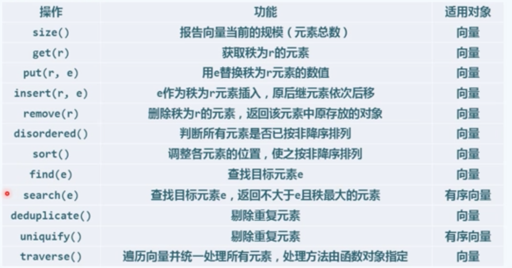

### 可扩充向量

按照现代计算机内存模型，向量（按 C 语言数字实现）就是从内存中申请一块连续的、固定长度的存储空间，但是如果初始化时申请的空间不够了，想要扩展空间就比较麻烦了。例如当前数组 A 空间不够用了，就申请一个更大容量的数组 B ，然后将原数据拷贝过来，再插入新的元素。这里有一个问题：B 相对于 A 增加多少空间呢？有两者方式：

- 递增，即 B 相对于 A 增加一个单位的空间
- 倍增，即 B 空间等于 A 的两倍

从时间方面，肯定是第二种效率高。这就像，从 1 数到 1000 ，是 `1 2 3 4 5 ...` 这样数快？还是 `1 2 4 8 16 ...` 这样快？ —— 这也是一种分治的思想。从空间方面，第二种比较浪费空间，不过也能将空间浪费控制在 50% 范围之内，没造成数量级级别的浪费。

### 有序向量

所有的数据结构默认都是无序的，排序是为了更快的查询。二分查找可以做到 `O(logn)` 的时间复杂度，视频中还讲到斐波那契查找，会比二分查找更快（虽然数量级上还是 `O(logn)`）。关于斐波那契查找，视频将的非常清楚，感情去的可以去看下。另外，除了查找更快，去重操作也会变的更快。

无序变成有序就需要一个排序的过程，最简单的就是冒泡排序，需要 `O(n^2)` 时间。视频中还讲解了归并排序，使用分治策略，可以达到 `O(nlogn)` 时间。如下图，先将集合递归拆分到最小，然后每个子集合各自排序，然后再递归合并。

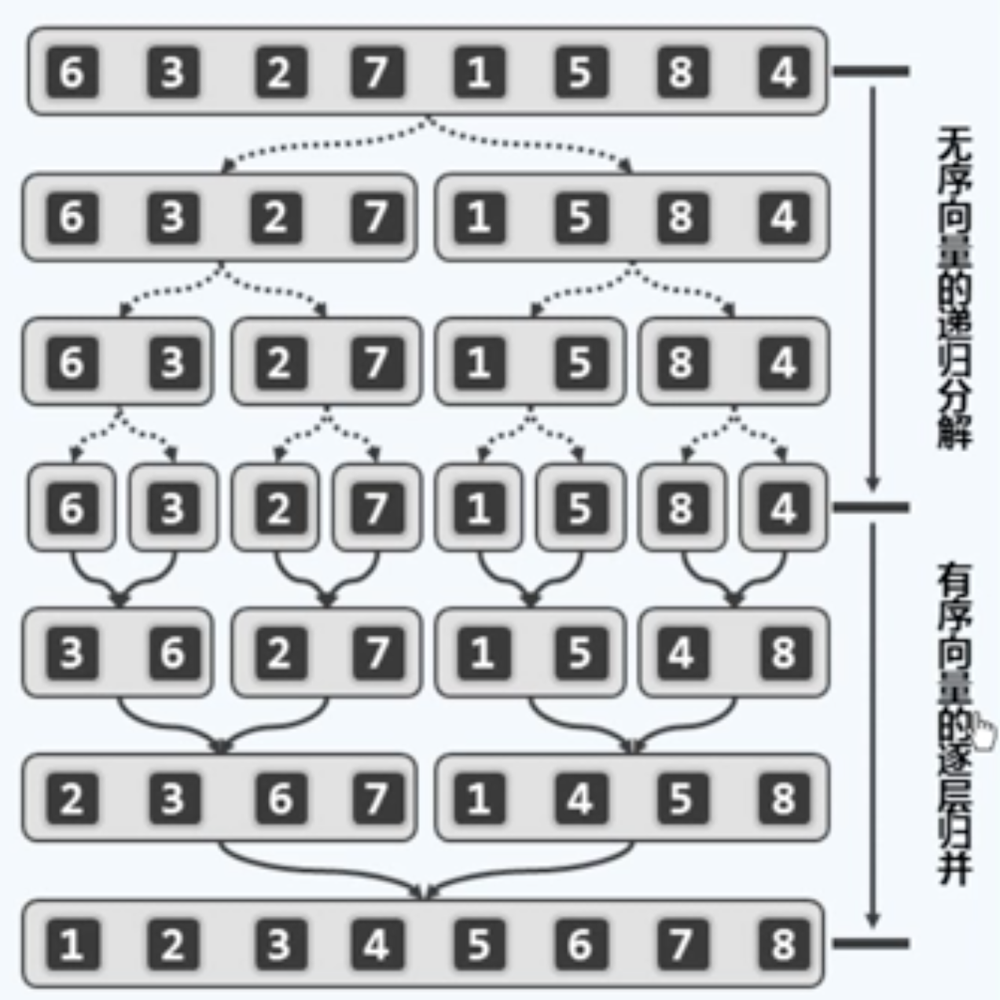

另外，快速排序也是 `O(nlogn)` 时间 ，都是二分的思想，外加一步遍历。总结一下两个时间复杂度的区别：

- 冒泡排序之所以需要 `O(n^2)` 时间，是因为它本质是一个嵌套循环，因为第一层循环需要遍历元素，第二层循环是拿一个元素和其他元素挨个比较。
- 归并排序和快速排序之所以是 `O(nlogn)` 时间，是因为它本质上将元素之间挨个比较简化为一个一个小集合的逻辑运算，而逻辑运算的复杂度是 `O(1)` 可以忽略。另外，使用二分方式进行化简需要 `O(logn)` ，而最后的小集合再拼接起来需要 `O(n)` 。

### 操作总结

- get(index) 操作，进需要 `O(1)` 时间，数组的特性。
- search 在有序条件可以达到 `O(logn)` 时间，但是排序还需要 `O(nlogn)` 时间。无序条件下是 `O(n)` 时间。
- insert 和 remove 都需要 `O(n)` 时间，因为要保证数据和存储空间是连续的。

-------------------------------------------------------

## 列表

向量是实现线性序列的一种方式，虽然其查询的时间复杂度是 `O(1)` ，但是插入和删除需要耗费 `O(n)` 时间，即向量适合静态数据，不适合动态数据。而列表正好相反，适合动态数据而不适合静态数据。

### 列表的实现

线性序列，逻辑上是连续的，但是物理上是分开的，这就做到了动态性。

可以通过链表来实现，一个元素就是一个 node ，node 里面有 prev 指针、next 指针和 data 数据域。常用的 API 如下图：

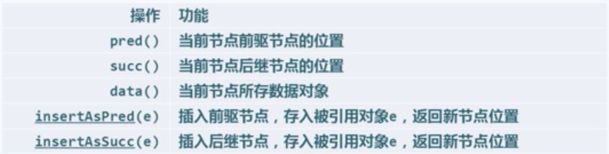

链表中，查找一个元素需要整体遍历，即需要 `O(n)` 时间，而插入和删除一个元素，仅仅需要 `O(1)` 时间。

### 有序列表

对列表的排序，视频中讲解了插入排序和选择排序，两者最坏都需要 `O(n^2)` 时间，这也是列表特性决定的。但是列表在通常情况下无需排序，这种特性也不适合做排序。

这里我提了一个问题，为何冒泡和归并是在向量中讲，而选择和插入是在队列中讲？自己总结了一下原因：无论是插入排序还是选择排序，都涉及到选择出一个值插入到固定位置，这个操作会导致集合中部分元素产生移动。向量中进行元素移动需要 `O(n)` 时间，而在列表中移动仅需要 `O(1)` 。如下图示例。

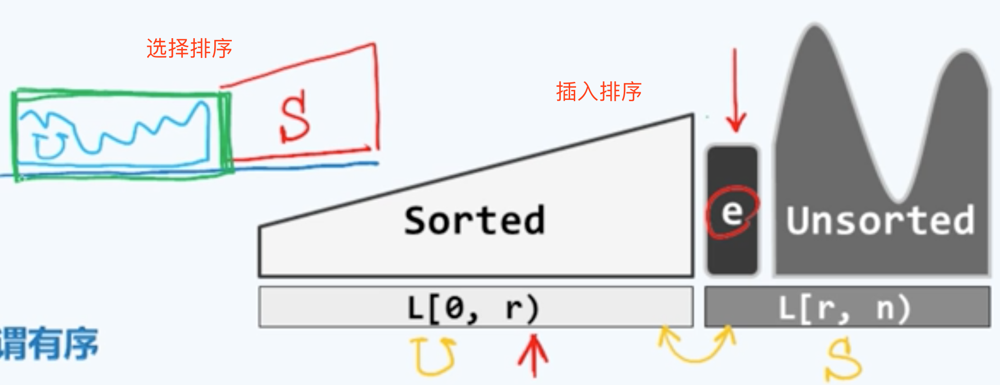

还有，列表是基于 position 的，而向量是基于 index 的，因此列表无法使用二分查找（即无法使用二分来优化已有排序内容的查找），因此选择排序和插入排序是列表中最好的排序选择，也是一种无奈的选择 —— 为了满足列表的动态性、物理存储非连续性。

### 和向量的对比

两者从数据结构上完全不一样，列表不支持通过 index 获取数据，因此就用不到二分查找。还有，向量是完全静态的存储结构，size 初始化时就知道，而列表是完全动态的，size 需要计算而且要花费 `O(n)` 的时间。

- 向量（数组）更适合存储静态数据，例如 get 只需要 `O(1)` 时间，search 在有序条件下需要 `O(logn)` 时间，但是动态操作（插入、删除）就需要 `O(n)` 时间（因为需要移动数据，至少一次遍历）。对向量的排序可以做到 `O(nlogn)` 。
- 列表（链表）更适合动态数据，有序和无序查找都需要 `O(n)` 时间，但插入和删除仅仅需要 `O(1)` 时间。对列表的排序最坏是 `O(n^2)` ，但是大部分情况下无序排序。

-------------------------------------------------------

## 栈和队列

是线性序列的两种特例，却在程序设计中扮演着非常重要的用途。

### 栈

一种先进后出的线性数据结构。可以用向量和列表来实现栈，但是栈内数据基本都是动态的，因此用列表更加合适。这样，压栈和出栈的时间复杂度都是 `O(1)` 。

栈的应用主要分为以下几种类型：

- 逆序输出：先进后出天生符合这种思路
- 递归嵌套：在下文二叉树的遍历算法中，将遍历改为循环，就是用的栈
- 延迟缓冲：先压栈等待，合适的时候再输出，如下文的表达式求值应用
- 栈式计算：参考《操作系统》那门课的栈式计算机

### 栈应用：进制转换

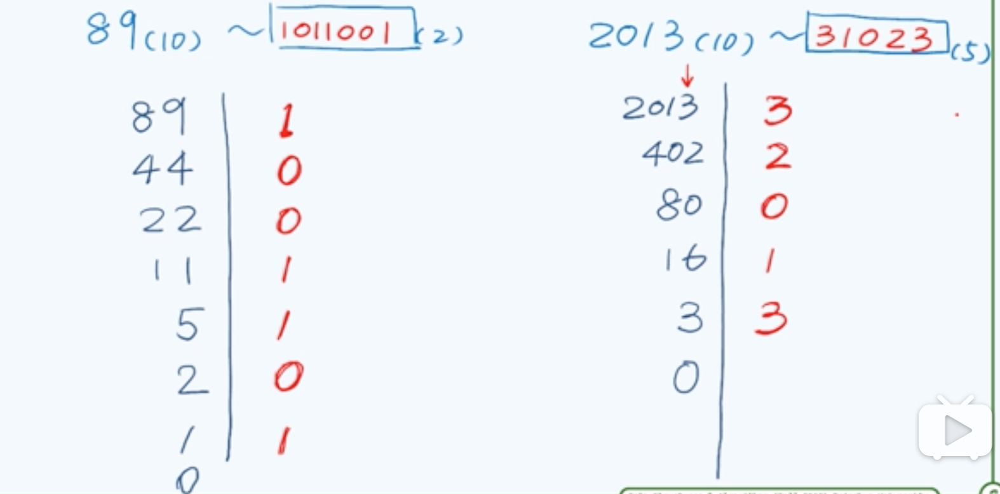

如上图，十进制的 89 转换为二进制如何计算？使用 89 连续除以 2 得到的余数放在右侧，最后把余数倒排，就得到二进制值。这个例子的计算顺序和最后输出结果是逆序的，这就可以使用栈的先进后出效果。每次除以二的计算输出压栈，最后统一出栈。

### 栈应用：括号匹配

例如看字符串 `(( ... )...)` 和 `((...)...(...))` 是否满足括号匹配。最简单的方式就是遍历各个字符，遇到 `(` 压栈，遇到 `)` 出栈，最后看栈是否为空。

而且，这种解决方案还可以用于 `{` `[` `"` 等其他匹配符号，以及 XML HTML 中的标签元素匹配。

### 栈应用：表达式求值

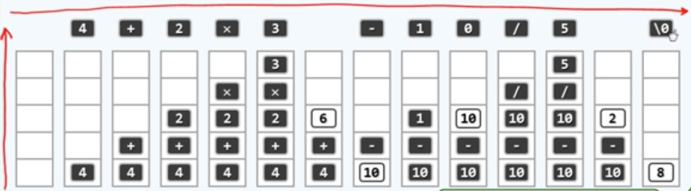

如上图，输入表达式 `4 + 2 * 3 - 10 / 5` 然后求其值，具体的实现思路是，遍历各个字符，然后

- 4 入栈
- `+` 入栈
- 2 入栈，此时不能判断是否进行 4+2 ，不知道后面什么情况
- `*` 入栈
- `3` 入栈，此时也不能判断是否执行 2*3
- 遇到 `-`，此时即可判断要执行 2*3 因为 `-` 优先级低于 `*` ，所以将 3 * 2 出栈，计算得到 6 ，入栈
- `-` 入栈
- 1 入栈，此时不能判断是否执行，不知道后面什么情况
- 遇到 0 ，则将 1 出栈，拼接为 10 再入栈
- 后面一次执行即可，知道运算符结束

### 队列

和栈类似，只不过规定出入的逻辑是先进先出。API 有两个， enqueue 和 dequeue ，用列表实现它们的时间复杂度都是 `O(1)` 。

-------------------------------------------------------

## 二叉树

向量和列表是线性结构，图是非线性结构，而树是一种半线性结构。

二叉树极其变种是现代计算机程序设计中最重要的数据结构之一。向量和列表各自有其优缺点，而二叉树能将其两者的优点集中起来，下文会慢慢介绍。

另外，二叉树虽然是树的一个特例，但是它的结构简单，而且天生支持“分治”这种算法的核心思路，因此会跟更加广泛的应用。这就是你看过大量关于二叉树的内容，且没有三叉树、四叉树的原因。

### 树

树，就是一种特殊的图 —— 无环（没有回路）连通（通过一个节点都能彷达另一个节点）图。它的节点数量 n 或者边的数量 e ，都是同阶的，且 `e == n - 1`。因此，接下来树相关算法的时间复杂度，都是以节点数量 n 为基础的，即 n 代表了树的规模。

树的基本 API 如下图：

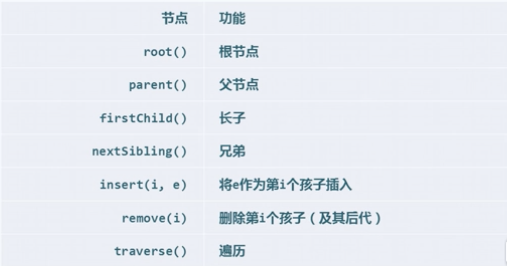

### 树的表示

树的物理表示方法有很多，视频中讲了很多种，只有一种达到了时间和空间上的最优，叫做“长子兄弟法”，如下图。

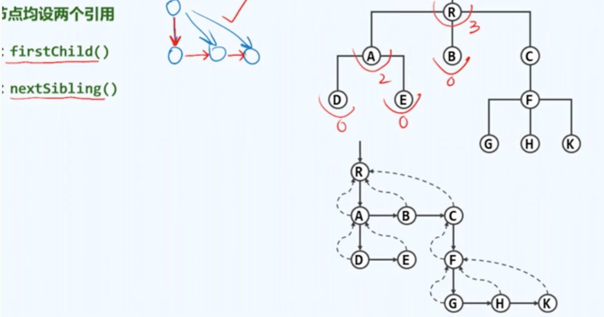

具体表示方式是，每个节点存储的信息是 `id` `data` `parentId` `firstChildId` `nextSiblingId` ，这样可以在时间和空间上获取最优。注意这里和普通记录方法最大的区别就是：每个节点不需要存储所有的子节点 id ，而是仅仅需要存储“长子”和“兄弟”这两个即可。

- 存储空间会变的最小，每个节点需要静态空间即可存储，无需动态空间
- 计算效率也最高，如上文树常用 API 图中前四个查找 API ，都只需要 `O(1)` 时间

这种思想非常重要，二叉树也是这种思想的体现。

### 二叉树概述

二叉树，binTree ，每个节点最多有两个子节点（即可以有一个、两个、0 个），是树的一种特例。

二叉树有一个很重要的特点，如果是满二叉树、完全二叉树或者是广义上的平衡二叉树，其树的高度接近于 `logn` 。例如，针对一个平衡的二叉树，如果有一个算法是从顶节点顺着一个分支访问到叶子节点，那么这个算法的时间复杂度就是 `O(logn)` 。

另外，凡是有根且有序的树，都可以使用二叉树来表示。结合上文的“长子兄弟法”，将每个节点的“长子”和“兄弟”变为该节点的两个子节点，就成为了二叉树。如下图。

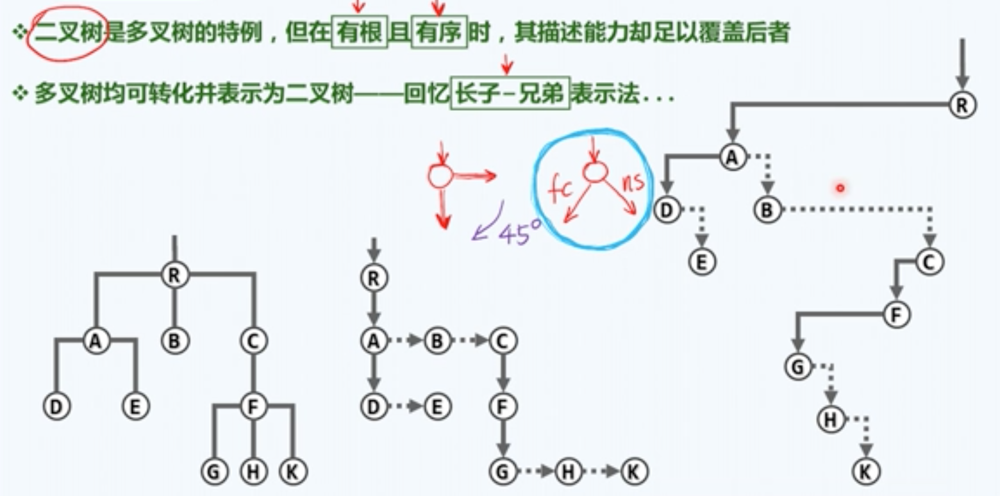

外加上文提到的二叉树结构简单，天生就是分治的结构，因此它的到了广泛的应用也研究。数据结构中提到“树”，绝大部分情况都是指二叉树，而不是三叉树、四叉树或者其他普通的树。

### 二叉树实现

二叉树实现比较简单，每个节点需要存储的基本信息是 `data` `parent` `lchild` `rchild` ，另外对于其他的二叉树需要其他属性，例如 `height` `npl`（用于堆） `color`（用于红黑树）等。

常用 API 有：

- `insertAsLeftChild` 需要 `O(1)` 时间
- `insertAsRightChild` 需要 `O(1)` 时间
- `size` 需要 `O(n)` 时间，因为要遍历
- `updateHeightAbove` 对该节点以及祖先节点更新高度，需要 `O(logn)` 时间

### 前序遍历

所谓前序遍历，就是“根”在前，规则是：先根，再左，再右。用递归调用很好实现，需要 `O(n)` 时间，但是递归调用效率不高，需要改成循环调用。

视频中讲到了两种方法，都需要用到栈。上文讲过，栈的其中一个应用场景就是递归嵌套。第一种方法比较好理解，先将根节点压栈，然后循环的访问栈，处于 pop 出来的每一个节点都是：执行访问之后，再将右子节点压栈、左子节点压栈（注意顺序）。如下图：

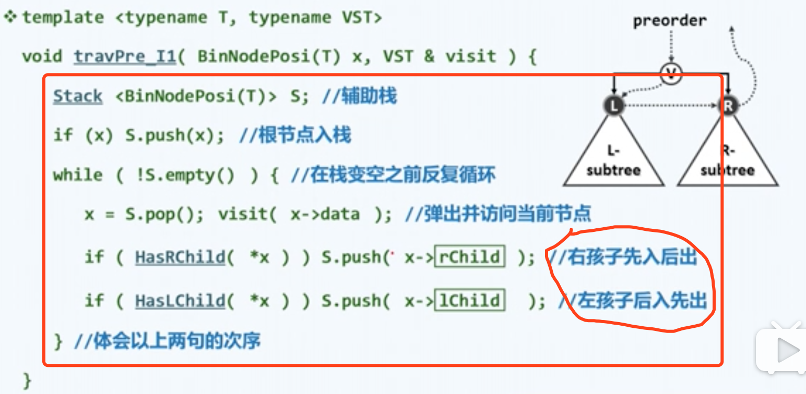

上面的方法思路比较简单，但是为了往中序和后序遍历进行推广，课程讲解了第二种方法。对一个节点，先访问左节点，然后将右节点压栈。到左侧无可访问时，再依次出栈，继续进行左侧访问逻辑的操作。如下图。

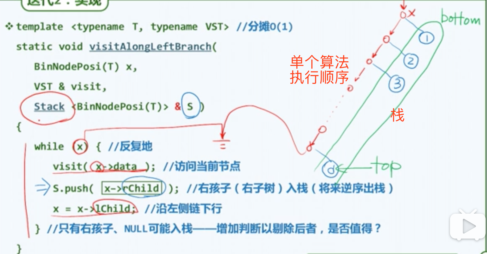

PS：为何说树是“半线性” ？—— 通过遍历，可以将一个二叉树转换为线性结构，用栈或者队列的形式来表示

### 中序遍历

中序遍历就先左，再根，再右，用递归比较好实现。但是这个递归改为迭代会比较麻烦，因为访问右侧是尾递归，而访问左侧却不是尾递归，如下图。即：尾递归改造迭代是比较简单的。

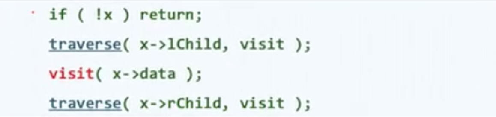

简单来说，算法是对于一个节点，先将它的所有左侧子节点遍历压栈，然后出栈，访问该节点，再将控制权交给它的右侧子树。如下图。

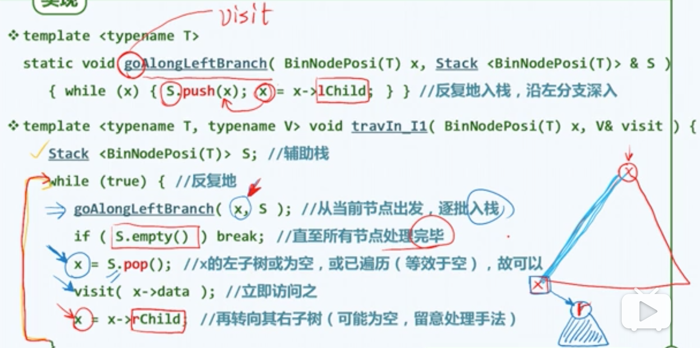

分析以上算法的时间复杂度，按照规定来计算是 `O(n^2)` ，因为有一个 while 循环，里面还嵌套了另一个 while 循环（ goAlongLeftBranch 函数中的）。但是实际分析，后一个 while 循环执行的总量加起来正好是 `n` ，即最多会把所有的节点都压栈，因此还够不成数量级的影响。因此，虽然计算出来的时间复杂度是 `O(n^2)` ，但实际上只有 `O(n)` 的量级。

思考：递归调用算法转换为迭代调用之后，算法复杂度应该不会变。即便是按规定计算出来不一样，也不会差太多。

### 后序遍历

视频中没讲。不过感觉这个和前序遍历不一样，在递归实现中，访问左右节点的函数调用都不是尾递归，会更加复杂一些。

### 层次遍历

前序、中序、后序遍历，都无法体现树的层次，都有一种逆序的操作，因此要借助栈。

而层次遍历完全体现树的层次结构，没有逆序操作，因此可以使用队列。先初始化一个队列，加入队列的顺序分别是根、左、右，因此出队列的顺序也是这样，就保证了层次性。如下图。

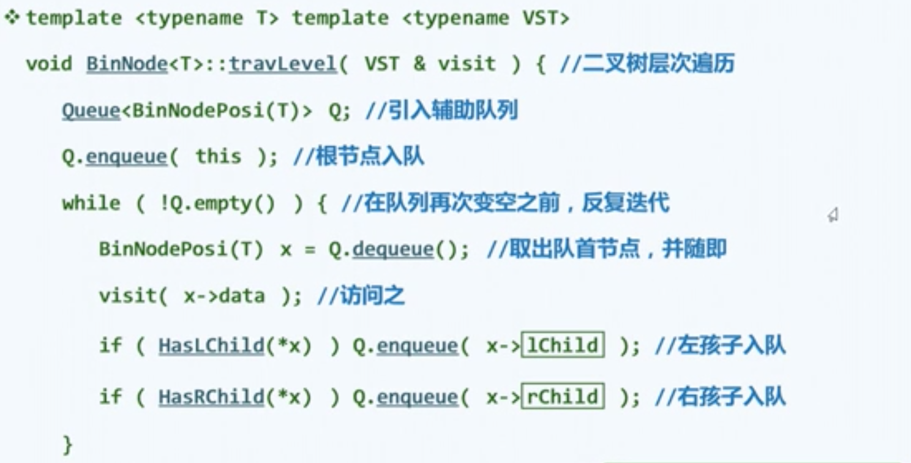

-------------------------------------------------------

## 二叉搜索树 BST

上文提到的二叉树仅仅是一个开始，二叉树还有很多的变种。例如，上文提到二叉树可以集中向量和列表的优点，本章内容就是答案。列表可以实现高效的动态操作，而无法快速查找，就是因为它没有二分查找的特性。而二叉搜索树 BST 就是要将这种二分查找的特性集成进来。

### BST 概述

BST 必须满足两个特点：

- 第一，必须是二叉树；
- 第二，左节点（包括其后代）必须 `<=` 根节点，右节点（包括其后代）必须 `>=` 根节点 —— 这个局部性特征，即可推广到整棵树的全局性特征

如下图。右侧的树，右节点中 `2` 小于根节点，因此不满足 BST 。

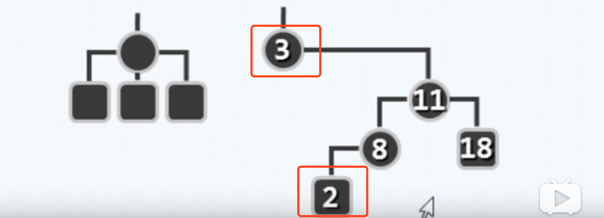

中序遍历即可得到一个排序的线性序列，如下图。扩展：反推一下，凡是一个线性序列，都可以用一个 BST 来表示。

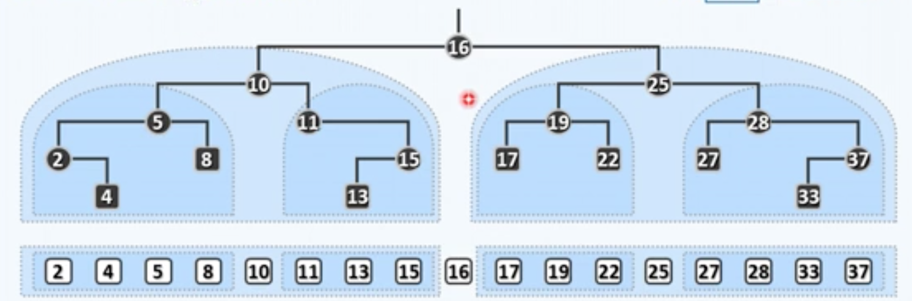

### 算法和实现

算法和数据结构上可以沿用上文的二叉树的实现，只不过要多几个 API ：`search` `insert` `remove` 。因为要保证 BST 的顺序性，这几个 API 会相当重要。PS：下面即将讲解着几个 API 的实现和时间复杂度，事先约定一下 BST 的高度用 `h` 表示。

查找算法 search ，如下图，在这棵树中查找 `22`

- 22 比根节点 16 大，因此转向右子树 25 ，可直接忽略其左子树
- 22 比右子树 25 更小，就转向其左子树 19 ，可直接忽略其右子树
- 依次进行 ……

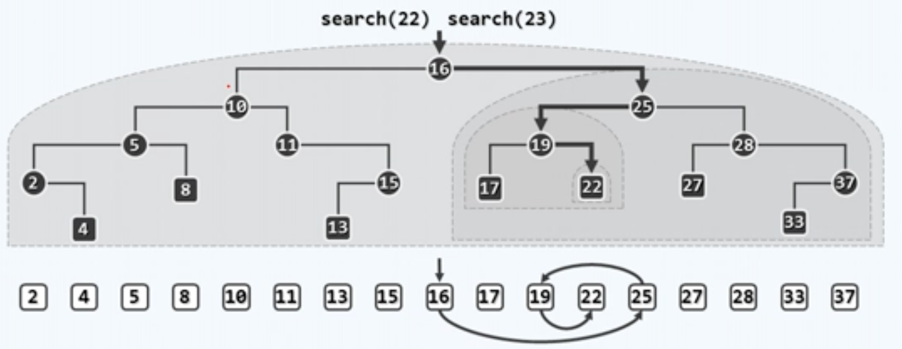

很容易就能看出这是二分查找的思路。从线性序列（将 BST 中序遍历可得到）看，需要 `O(logn)` 时间。但从二叉树看，每次查找就会深入一层，因此需要 `O(h)` 时间。注意这里的 `h` 不一定等于 `logn` ，因为 BST 不一定是满二叉树或者完全二叉树。

插入算法 insert ，如下图，先执行查找，再最后查找失败的地方执行插入。插入操作需要 `O(1)` 时间，因此最终算法的时间和查找的时间一样就是 `O(h)` ，即还是树的高度。

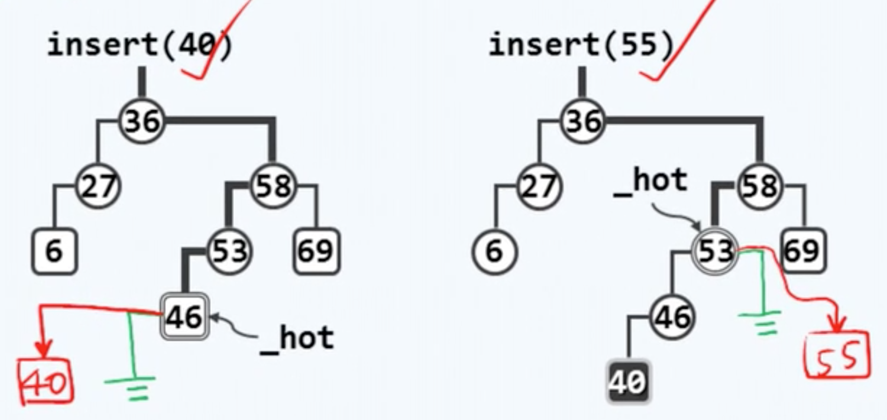

删除算法 remove ，和插入相同，先进行查找，找到之后删除，需要 `O(h)` 时间。但是在删除操作时要分两种情况：

- 如果将被删除的节点没有子节点，则直接删除
- 如果将被删除的节点只有一个子节点，则用子节点代替当前节点，并删除该节点
- 如果将被删除的节点有两个子节点，情况较复杂。如下图，如果要删除节点 36
    - 第一步，找到 36 节点的（中序遍历结果中的）直接后继节点 40，查找方法是：进入 36 的右子树，然后向左一路查找到底（因此 40 节点不可能有左节点，重要！），即可得到
    - 第二步，将 36 和 40 互相对换（此时暂时会失去 BST 的特性，不过这是临时的）
    - 第三部，用 40 的子节点 46 替换掉 36 节点（又恢复了 BST 的特性），并将 36 节点删除掉。这里不会再出现有两个子节点的情况，因为原来这里的 40 节点不可能有左节点（第一步说过）。

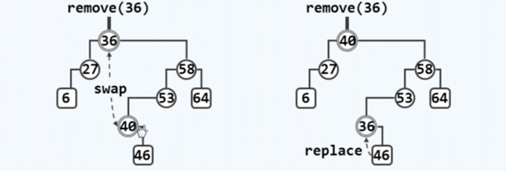

到此为止，能体会到上文所说的“二叉树集成了向量的静态查找和列表的动态操作”这个意思。

### 平衡与等价

接下来就面临 `h` 到底多大的问题了，可分两种极端极端情况考虑：

- 如果 BST 中每个节点都只有一个子节点，那么这个 BST 就成了一个列表，那么 `h == n` 。即上文提到的三个 API 都需要 `O(n)` 时间，完全不符合预期。
- 如果 BST 是满二叉树或者完全二叉树，那么 `h == logn` ，即上文提到的三个 API 都需要 `O(logn)` 时间，符合预期。

下面要做的，就是如何让 `h == logn` ，只有满二叉树和完全二叉树才能满足，如下图，但是实际应用中却不能奢望全部符合这种要求。应该考虑放低标准来满足这种要求 —— 即保持**适度平衡**即可。因此，能够保持适度平衡的二叉树，叫做平衡二叉搜索树 BBST 。

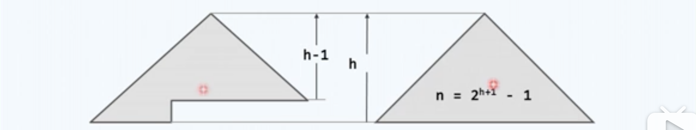

定义了一个 BBST ，适度平衡了，但是很可能经过某些操作就会导致其丧失了 BBST 的特性，此时要进行等价转换，把它在转换为 BBST 。要进行等价转换，基本原则是“上下可变 & 左右不乱” ，接下来要考虑如何让这种等价转换更加高效，至少不超过 `O(logn)` 。如下图，左侧的树等价转换为右侧的树，会更加平衡，但是对应的线性序列不变。

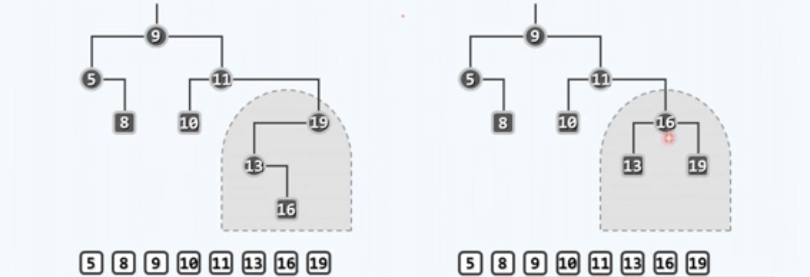

### AVL 树

AVL 树，即左右子树的高度只差不大于 1 ， 通过一个“平衡因子”实现（没仔细看其实现逻辑），如下图。AVL 树并不一定是完全二叉树甚至满二叉树，但是这种特性，就使得 AVL 树无论是整体还是局部，都不可能出现左侧较长，而右侧很短的情况，即两侧高度都相差不大。因此 AVL 树是适度平衡的，一个规模为 `n` 的 AVL 树，其高度在渐进意义下不超过 `logn` 。可以理解为约等于  `logn` ，不会差的太太多。

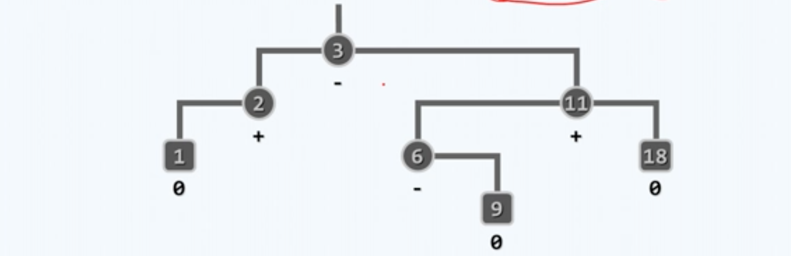

插入和删除操作可能会导致 AVL 树的失衡，如下图。但是注意：所有失衡的节点，仅有可能是被操作节点的父节点或者祖先节点（高度都发生了变化），其他节点不会失衡。即，这些失衡节点的数量，最多就是一棵树的高度，即最大是 `logn` 。

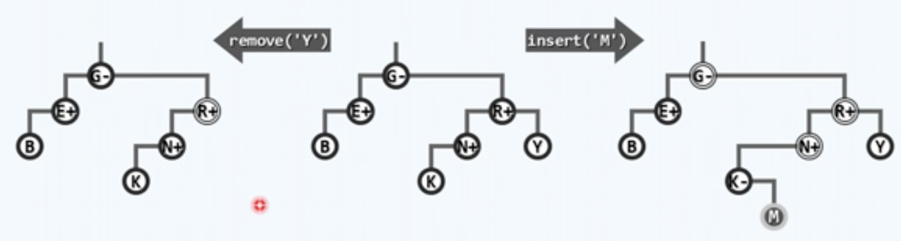

插入操作之后导致失衡，可以通过“旋转”来等价变化找回平衡，如下图。调整之后，整棵树的高度也恢复了，即全树都保持了平衡。旋转操作不同场景下操作都不一样，比较复杂，没详细看，不过时间复杂度都不会超过 `O(logn)` 。

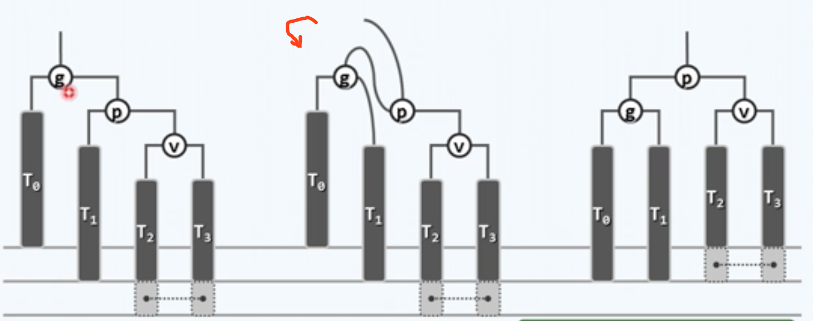

总结优缺点：

- 优点：高度渐进等于 `logn` ，因此使得插入、删除、查找的时间不会超过 `O(logn)` ，效率上符合预期
- 缺点：人工引入“平衡因子”而导致需要改造元素，实现起来复杂度较高。而且插入操作和删除操作之后恢复平衡的算法，最坏要 `O(logn)` ，不能满足要求。

-------------------------------------------------------

## 高级搜索树

AVL 树复杂度和实现成本都过高，下面再顺着“平衡”的目的，讲解其他几种 BBST 。

### 伸展树

介绍伸展树之前，先聊聊程序的“局部性”：程序运行具有局部性特征，我们写程序时也要尽量去满足这种局部性。第一，局部性能充分利用 CPU 高速缓存；第二，尽量从算法上做到局部性，即能从算法上更快的找到（虽然表面上时间复杂度一样）。如下图，针对一个列表，刚刚被访问过的元素把它拿到前面面，下次再被访问就更快了（接近起点的元素访问效率高）。而且经过长时间积累，经常被一起访问的几个元素，总是会离得很近，这样就整体提高了效率。

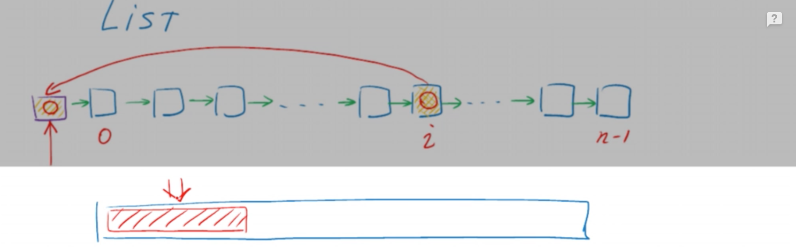

BST 也是这个道理，越接近根节点的元素访问效率越高，能否把经常访问到的元素放在头部 ？

一个方法就是，一旦节点 v 被访问，就讲其移动到根节点。如下图，根据 v 是左边还是右边，对齐父节点 p 进行不同方向的旋转（即等价变化），递归这个步骤，即可让 v 到达根节点。需要 `O(h)` 时间。

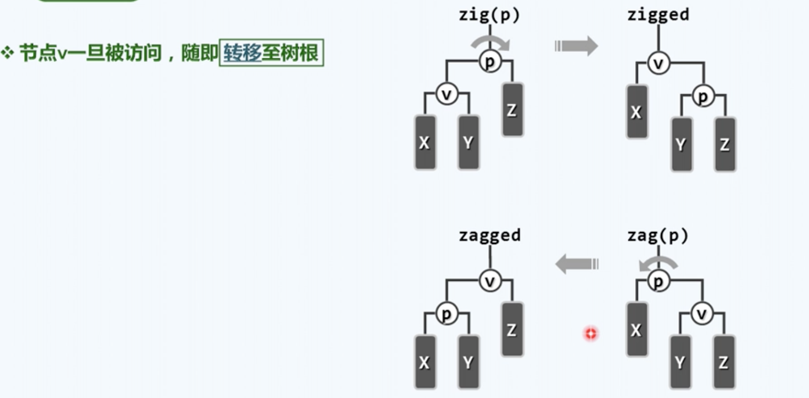

但是，这种一步一步旋转爬升的效率太低了，需要 `O(h)` 时间，如果 BST 规划不当，最坏情况能达到 `O(n)` ，不能接受。视频中讲到了另一种方法，即每次不是根据父节点做旋转，而是根据祖父节点做旋转。这样会得到一个非常意外的效果，就是转换后树的整体高度减少了（最好情况能减少一半儿），而且越往后进行访问高度会越趋近平衡，如下图。小小的改动带来了巨大的收益 ！！！


究其原因，就是因为通过祖父节点做旋转，会让原本的线性结构变为二叉树结构。如下图，对比一下上图一开始的 `1` `2` `3` 节点和这里的 `1` `2` `3` 节点，就知道了。

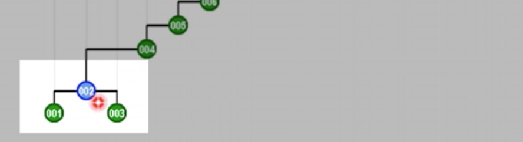

因此，通过这种旋转策略，就使得 BST 有“智能”的修复功能。即便一开始是最坏情况，但经过多次访问后，BST 就接近平衡状态，就达到了我们的目的。这里也就说明出了“伸展树”名字的意义，就是将树一步一步的展开，直至接近平衡。

总结：

- 相比 AVL 树，没有“平衡因子”的概念，实现起来相对简单
- 时间复杂度也满足 `O(logn)`，而且没有任何先决条件，即便一开始不满足，变着变着也就满足了
- 而且，满足“局部性”的特征，也会使得缓存命中率极高，大大提高物理的性能。而且，越用就越高性能 —— 具有智能型。
- 缺点：在树得到优化之前，某个单次操作可能会非常耗费性能（某些敏感场合不能满足）

### 红黑树

是一种自动平衡二叉搜索树，而且节点有颜色（红色和黑色），通过颜色来维持树的平衡。红黑树和 AVL 树类似，都是在进行插入和删除操作时通过特定操作保持二叉查找树的平衡，从而获得较高的查找性能。

红黑树的存在意义是：AVL 树插入和删除节点时，可能会破坏平衡结构，因此为了保持平衡性要做等价转换（即旋转），而最坏时间复杂度有 `O(logn)`。而红黑树则可以把这个转换做到 `O(1)` ，这一点非常难得。

红黑树的规则，如下图。

- 统一增设外部节点 `NULL` （假想的，并不存在，图中也没有，自行脑补），使其成为“真二叉树”
- 节点是红色或者黑色
- 根节点是黑色
- 每个叶节点（包括假想的 `NULL` 节点）是黑色的
- 每个红色节点的两个子节点都是黑色（从每个叶子到根的所有路径上不能有两个连续的红色节点）—— 通过这个来做平衡
- 从任一节点到其每个叶子的所有路径都包含相同数目的黑色节点

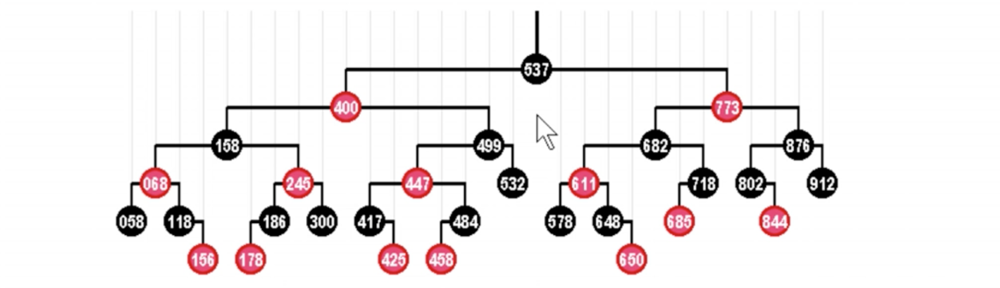

具体实现和细节没有看，用到时再来看视频。

### B 树

B tree 物理上一个节点可能包含多个子节点，但是逻辑上还是符合 BST ，其存在的意义是实现高效的 I/O ，了解到常用的关系型数据库就是使用 B tree 来组织数据。

根据摩尔定律，计算机硬件的性能一直在翻倍增加（价格不变的情况下），但是实际应用场景中对于性能的需求却增加的更快。例如现在大型游戏所占的内存，以及大数据所占的硬盘空间。要满足这种需求，就需要利用计算机的两个特点：

- 第一，不同容量的存储器，访问速度差异非常大。从快到慢一次是：寄存器、告诉缓存、内存、硬盘。
- 第二，从磁盘中读取 `1B` 和读取 `1KB` 成本几乎一样（ CPU 是按页来读写数据的） —— 即尽量批量式的访问

B tree 的设计就是基于以上两个特点，一个节点可能有多个子节点（成为“超级节点”），视觉上更宽更矮，即高度更低，如下图。

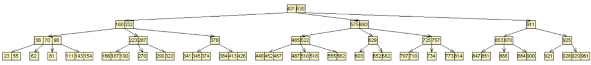

举一个例子，如果要查找 1G 的数据，和 AVL 树进行一下对比。

- 用 AVL 树组织数据结构，深度大约是 30 ，即访问一个节点需要 30 次 IO 。
- 用 B tree 组织数据结构，超级节点设置为常见的 256 个，深度不会超过 4 ，即访问一个节点不会超过 4 次 IO 。
- *（虽然 4 和 30 都是常数级别的时间复杂度，但是放在 IO 操作上，是天壤之别）*

另外，B tree 在逻辑上就是一个二叉树的转换，经过适当合并得到“超级节点”，二叉树就成了 B tree ，如下图。

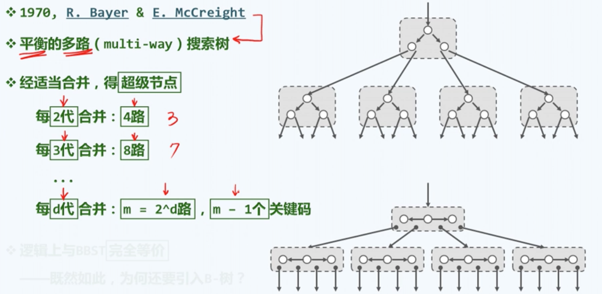

其他 B tree 的细节知识没详细看，后补吧。

-------------------------------------------------------

## 优先级队列

逻辑上是队列，但不是先进先出，而是按照优先级来访问。例如 CPU 的进程调度算法，不能完全按照先进先出原则，这就是优先级队列。按理说讲完队列就继续将优先级队列，但是奈何本章要用到二叉树的知识，因此不得不延后介绍。

用向量和列表都不好高效实现，时间复杂度都在 `O(n)` 级别，接下来要将目标设定到 `O(logn)` 时间。可以猜测到，这里肯定会使用二分法，又用到二叉树，那肯定是一个 BBST 。

### 完全二叉堆

优先级队列相对于 BBST 的功能非常简单，因此没必要用完整的 BBST 结构，否则就大材小用了。就像视频中说的“以向量为型，以树为神”，即看似是一个数组，其实它表述的是一棵树。这就是完全二叉树，最底层左侧填满，如下图。

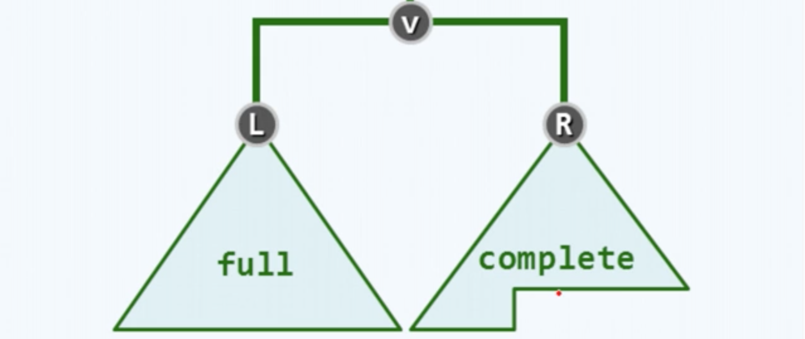

完全二叉树这种结构，使得它可有用向量表示，而且具有以下特征:

- 向量中的一个节点，其父节点就是 `(index-1)/2` 取整
- 向量中的一个节点，其左子节点就是 `2*index + 1`
- 向量中的一个节点，其右子节点就是 `(index+1)*2`

这种数据结构又成为完全二叉堆。**PS：将二叉树改用向量进行存储，能最大限度的压榨空间，在空间要求极致的场景（如内存管理和分配）非常适用**。

另外，完全二叉堆的排序约定 —— **任何一个节点，必须 <= 父节点 ，即父节点最大** 。这一点规定，又是 BST 规定的一个子集，而不是完全遵从 BST 的 “左子树 <= 父节点 <= 右子树” 的规定 —— 这样会使得插入、删除更加简单、更快，下文会讲解。

但，这会使得查询效率变低，有得就有失这很正常。但是，堆的应用场景中并不会有太多直接查询的操作，高级语言中存储在堆内存中的数据，都是通过地址进行查找的，不会从整个堆中查找一个节点。而地址是从栈中查找的。

插入元素，如下图，步骤是：

- 第一步，将传入的节点 e 插入向量的末尾
- 第二步，如果 e 比父节点大，则互换位置。再往上递归判断、替换
- 只需要 `O(logn)` 时间，即树的高度

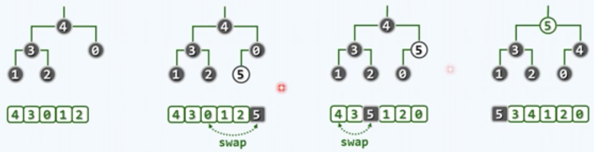

删除元素，如下图，步骤是：

- 第一步，将末尾元素 t 与待删除元素进行替换
- 第二步，将 t 与其子节点中较大的节点进行替换。再往下递归判断、替换
- 只需要 `O(logn)` 时间，即树的高度

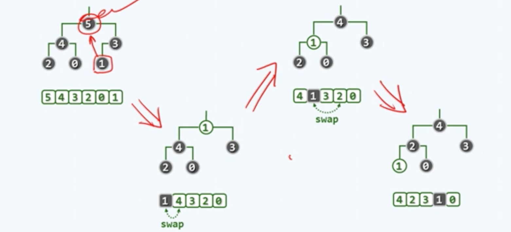

而且，插入和删除操作之后，还会是一个完全二叉树，不需要通过等价转换保证其平衡。

-------------------------------------------------------

## 词典

词典 key-value 的存储结构，在各个编程语言和工具中都很常见。但是按照现代计算机的内存模型，貌似没法去存储这种 key-value 的结构，而且还要保证其查询、插入、删除的高效率。散列表即可解决这个问题。

### 散列表

散列，即 hash 。不仅仅是一种技术，更是一种思想。即将任何一种数据结构，转换为一个整数，而且尽量保证结果不会重复。

举一个例子，一个小学有很多个班级，每个班级都有若干个学生（数量不定，但不超过 99 个）。学号分别是 201801 201802 ... 201810 这样，现在维护一个数据结构，通过学号查找学生姓名，而且要限定 `O(1)` 时间。最简单粗暴的方式就是实现一个 201899 长度的数组，每个数组元素就是学生姓名，这就满足了 `O(1)` 时间，但是空间利用率极低。

按照散列的思想，只需要维护长度为 99 的数组，每个数组元素都是学生姓名。拿到一个学好之后，经过 `number % 2018` 计算得到一个值，再拿这个值作为 index 去访问数组。这样既满足了 `O(1)` 时间，而且空间利用率非常高。

这里的数组就是散列表，`number % 2018` 计算就是散列函数。散列表是基于数组的，即静态空间，必须之前确定其长度，否则扩展起来会很麻烦。再者，即便是数组需要扩展空间，上文讲向量那一章，也讲过一种特别高效的扩充方式。

**散列表的本质，就是将一个范围很大的 R ，通过散列函数的计算，映射到一个相对较小的范围 M** 。以上例子中，R 就对应 201899 个数，而 M 就对应 99 个数，差异巨大。

再举一个编程中的例子，如 JS 中的对象 `{ a: 100, ab: 200, abc: 300 }` 这种数据类型。要用散列表进行存储，而且不借助于散列函数的话，要想把 key 的所有范围都遍历出来，那空间占用将不可估量。而我们实际开发中一个对象的属性基本也就几个、十几个、几十个。也可以看出 R 和 M 之间的巨大差异。

### 散列函数

散列表之所以应用广泛，就是因为散列函数是不固定的，可以随自己需求而写。

散列函数的一个根本问题就是冲突，即两个传入的 key ，经过散列函数的计算，既有可能得到相同的结果。而且理论上来说，这种冲突无法 100% 避免。针对这种情况，只能尽可能的避免冲突，以及万一发生冲突要有预备的排解方案。常用的散列函数如下。目的是为了最大限度避免重复，大体意思是：越是随机，也是没有规律，越好。

- 取余
- 平方取中，即先平方，再去中间的 3 位数字
- 折叠汇总
- 随机数（各个平台计算随机数规则不一，移植性差）
- 如果输入的是字符串，先将字符串转换为数字，然后再进行散列函数的运算。多项式法：对每个字符转换为整数，然后累计计算。

### 排序冲突

即如果散列函数计算结果发生冲突之后的处理方案，这里没详细看。

-------------------------------------------------------

## 图

图是一种最最基础的数据结构，列表、树都可以看做是图的一种特例，即变的线性或者半线性。而图是非线性的，能表达的数据也更加复杂，同时接口和实现上也更加复杂。

### 图的概念

`G = (v; E)` 一个图包含节点的集合和边的集合，以 `v` 表示单个节点，`e` 表示单个边。因此，列表和树是图的两种特例。节点和节点之间有关系，叫做邻接关系。一个节点到另一个节点要经过几个边，叫做路径。从一个节点回到该节点，叫做环路。

### 邻接矩阵

如下图，邻接矩阵即一个 `n*n` 的矩阵（n 是图的节点，可用二维向量表示），交叉点可以表示两个节点之间是否有关联，如 1 表示有关联，0 表示无关联。还可以记录边的权重信息。这种二维数组的存储方式，使得空间占用太多，空间复杂度是 `O(n^2)` 。

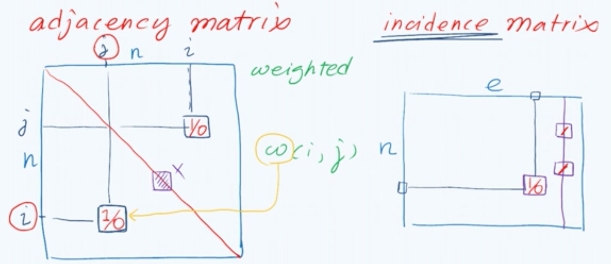

图的基本 API 有：

- 获取一个节点的邻居节点 `O(n)` ，需要一次遍历
- 判断一个节点和另一个节点是否有关系 `O(1)`
- 获取一个节点和另一个节点的边 `O(1)`
- 为一个节点和另一个节点插入、删除边 `O(1)`
- 插入一个新的节点，首先要扩展二维数组的行列 `O(n)`，然后插入一个边 `O(1)` ，整体来说是 `O(n)`
- 删除一个节点，还要考虑删除之后二维数字行列的移动，复杂度为 `O(n^2)`

### 广度优先搜索 BFS

整体思路：从非线性结构（图），转换为半线性结构（二叉树），再转换为线性结构（队列、栈）。算法过程如下图，其中圆圈是节点，连线（黑色和灰色）都是边。具体步骤是：

- 访问顶点 s
- 依次访问 s 所有**未被访问过**的邻接顶点
- 再一次访问它们（上一步的结果）的**未被访问过**的邻接顶点
- 如此反复 ……
- 直至没有未被访问过的顶点

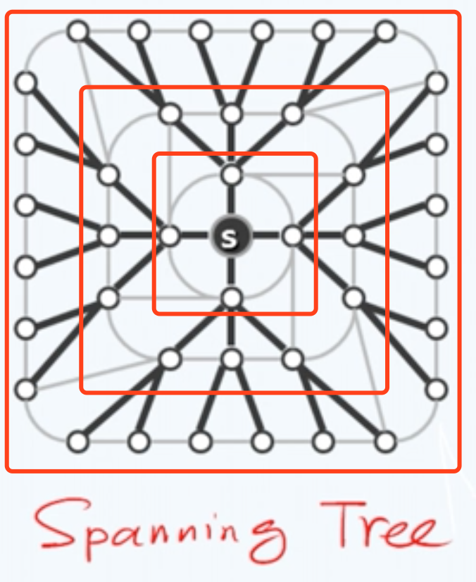

图中黑色的边记录了算法的访问路径，灰色的边是被访问忽略的边（因为有“未被访问过的”这个条件），红框记录了访问的层次，由内到外。图中黑色的边和顶点，就构成了一棵树，而这个广度优先的搜索方式正好对应树的层次遍历，而层次遍历又可以通过队列来实现。正好表示了：**非线性结构 -> 半线性结构 -> 线程结构**。算法的时间复杂度是 `O(n)` ，已经非常理想了，毕竟图是非线性的复杂数据结构。

### 深度优先搜索 DFS

本节视频暂时没看，以及带权重图如何获取最短路径。

-------------------------------------------------------

## 总结

虽然只看了一部分，但感觉数据结构和算法的重点内容算是都涉及到了。另外，字符串匹配那一章没看，其中有一个比较重要的 KMP 算法，它能将字符串匹配从传统的 `O(m*n)` 时间优化为 `O(m+n)` ，非常出名的算法。
