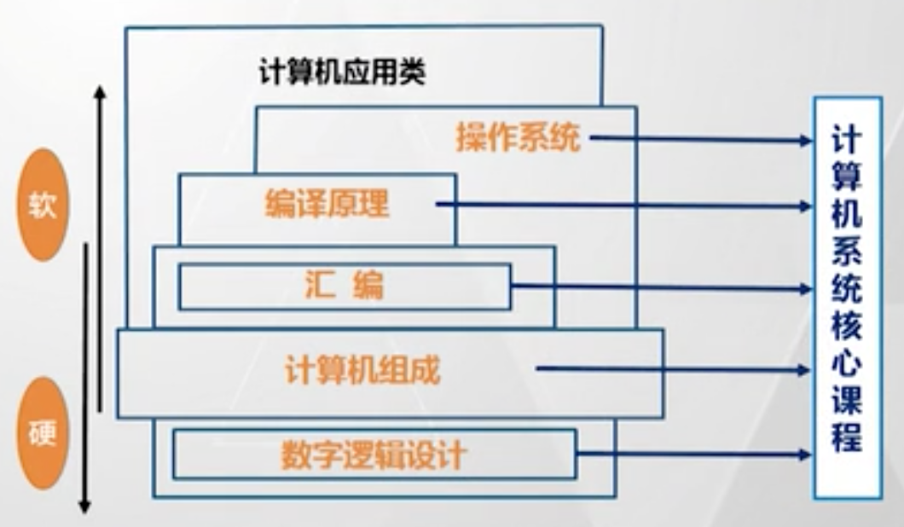
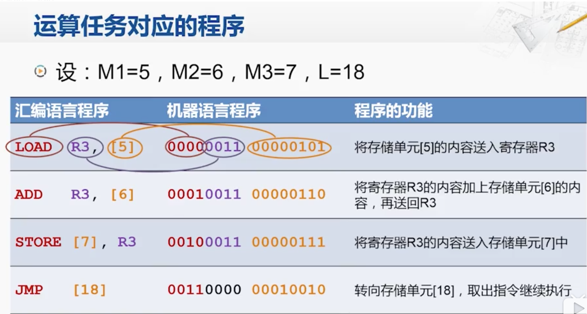
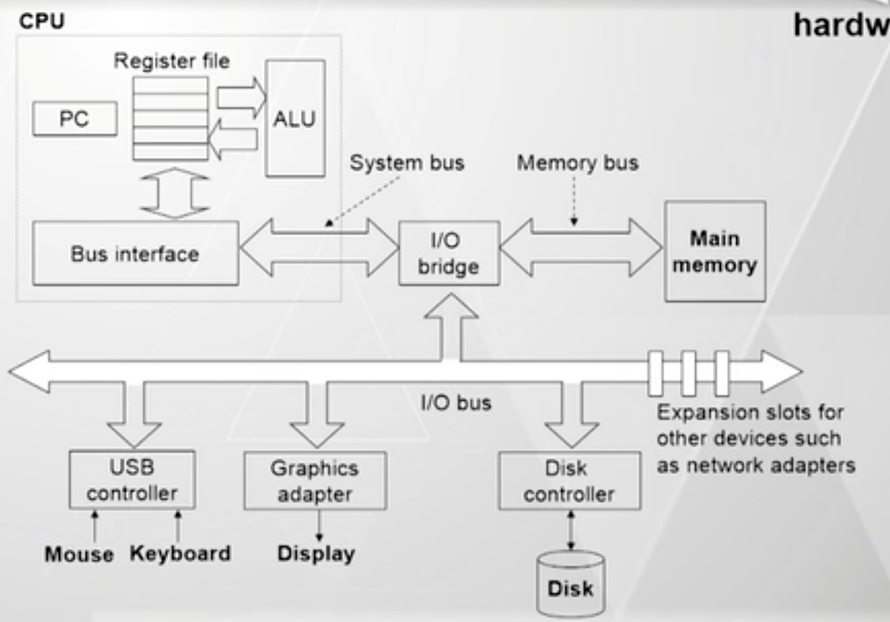
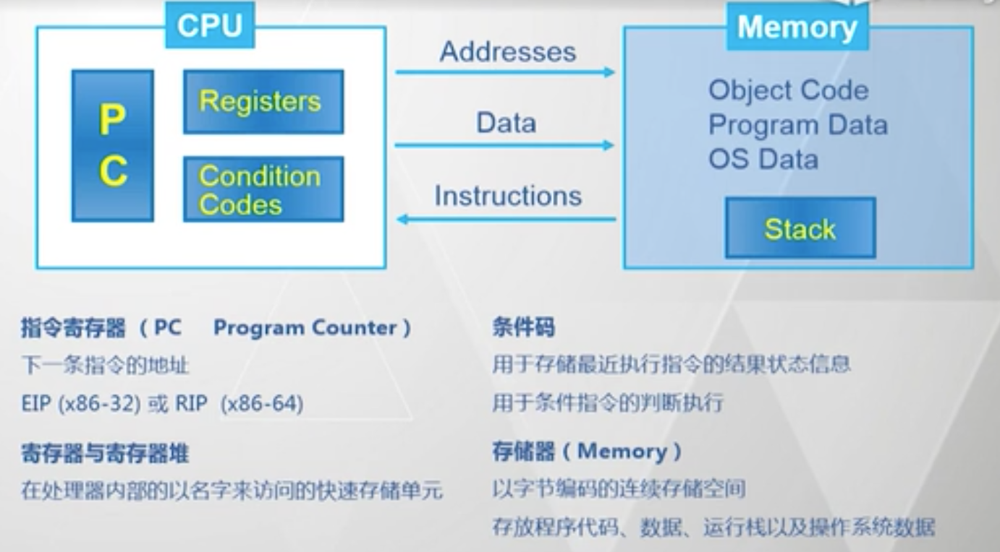
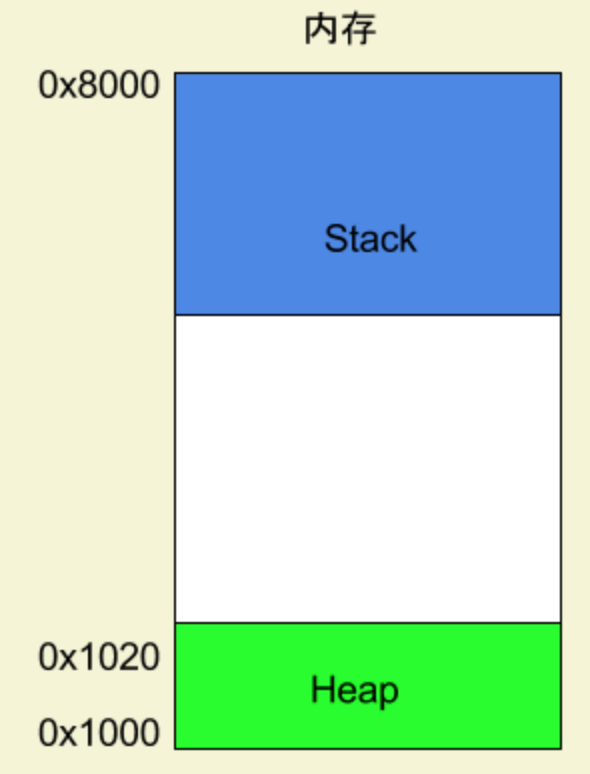
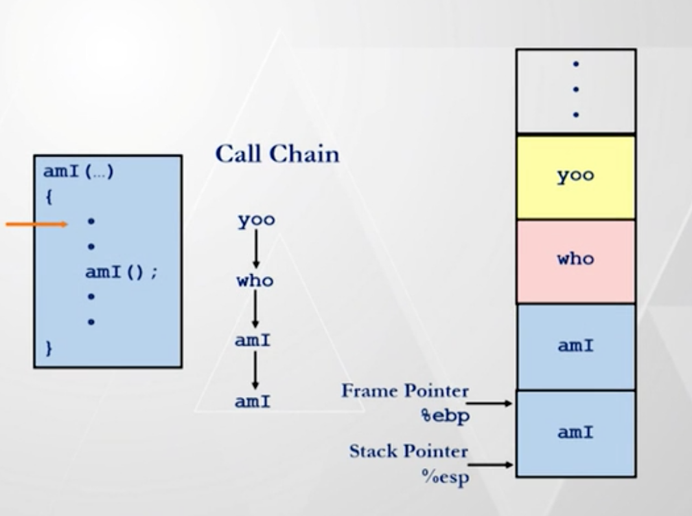
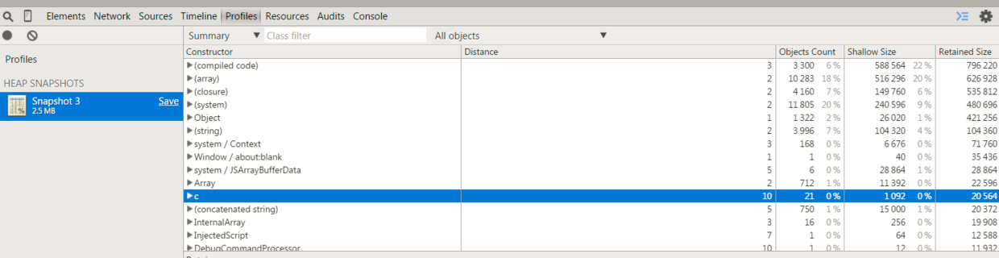

# 《汇编语言》学习笔记

by 张悠慧教授（清华大学），课程链接 https://www.bilibili.com/video/av27895807/?p=1 ，大概有十几个小时的视频。看完课程之后我又回看了阮一峰老师的《汇编语言入门》博客 http://www.ruanyifeng.com/blog/2018/01/assembly-language-primer.html 。因此本笔记就依据这两份资料来总结编写。

另外，我觉得学习汇编语言之前最好先了解 [计算机组成](./计算机组成.md) 的相关知识，否则遇到一些 `CPU 寄存器 内存寻址` 等相关概念时，可能会听着有点懵。

## 前言

学完 [计算机组成原理](./计算机组成.md) 之后接下来再学什么？通过本课程一开始的图，就知道要紧接着学习汇编语言（再往下是编译原理、操作系统）。



本课程内容太多我没有看完，大概看了 2/3 吧，但这并不影响我来做这个总结记录，因为我不是专业搞汇编的,就来了解一下。

- 本课程主要讲解 x86 架构的汇编，最后又讲 MIPS 汇编，而 MIPS 汇编部分我没有看
- 课程中一些演示、讲解汇编代码的细节部分我没有详细看，即没有深入汇编语言的具体指令和参数

PS：虽然本课程十几个小时，看着不长，但是老师语速非常快，1x 速度听都感觉讲话挺快的，因此不敢 1.5x 看。

## 学到了什么

这个问题其实可以拆解成两个问题：第一，汇编语言是什么？第二，高级语言程序猿学习汇编有何用？分开解答。

### 汇编语言是什么

简答来说，汇编语言就是机器语言（二进制代码）的助记符，每条汇编语言都能直接翻译成机器语言，如下图。计算机就是一台各种电子设备组成的机器，它只能识别机器代码，即一堆二进制数字。但是二进制不易于人类阅读，而且在计算机发展初期还没有高级语言和编译器，因此出现了汇编语言。仅仅这样一个微创新，就大大提升了开发效率。



汇编语言常见的语法是 `指令 参数1, 参数2` ，指令不同参数也不同。指令即 `add` `mov` `jmp` 等常见的算数、逻辑运算和跳转等功能，参数可以是立即数、内存地址、寄存器。因此，汇编语言编程能深入到计算机编程的最底层，通常说汇编语言是一种“面向机器的语言 / 编程”。正是因为这个特点，**使得汇编语言能提供所有编程语言中最大的时间和空间的效率，因此至今依然活跃在某些计算机领域**。

汇编语言都是针对特定的计算机体系结构的，例如 x86 汇编（本课重点内容）、MIPS 汇编、ARM 汇编，因此没有让所有计算机都通用的汇编语言。

### 高级语言的开发者，学习汇编有何用

一句话总结就是：了解程序是在计算机中是如何被执行的，即透过现象（高级语言）看本质 —— 这是所有领域的技术人员都应该追求的东西。那些能随意在 php java js C++ 等语言中随意切换的程序猿大牛，我想他肯定熟知这个本质。

无论你日常编写的语言多么高级，肯定最终经过转换（编译原理的内容）然后生成汇编语言这种最底层的语言，再被计算机执行。而“执行”的本质，就可以通过汇编语言的一行一行代码看出：使用了哪个指令、获取了哪个内存地址、操作了哪个内存片段或者寄存器……

另外一个重要的部分就是程序执行的时候的内存模型。一段程序拿过来，哪些变量将被放在栈 stack ，哪些变量将被放在堆 heap ？以及这些内存空间如何被释放？甚至是你日常遇到的爆栈、内存泄露等问题，了解了内存模型，这些都会变的非常具象，不再懵。

## 指令集分类

所谓“指令集”，我理解就是一套操作 CPU 的指令体系集合，以及体系规范。指令集是一种上层定义，汇编就是其具体的体现和实现。指令集分两类：

- CISC 复杂指令集，以 x86 为代表（x86 在 PC 服务器领域具有统治地位）
- RISC 精简指令集，以 ARM MIPS 为代表（ARM 统治了手机和平板领域，MIPS 常用语手机、电脑之外的其他电子设备）

### CISC

最初的计算机编程很麻烦，例如用纸带打孔输入，因此计算机的设计者就考虑将 CPU 做的复杂一点，以简化这种本来就很麻烦的编程。因此有了 CISC 复杂指令集。x86 就是其中的典型代表，x86 的特点是：

- 指令向下兼容（这是其商业成功的重要因素之一！！！），缺点就是会让指令集越来越大、越来越复杂，功耗也更大（因此不适用于低功耗设备）
- 变长指令（MIPS 是等长的，只有 32 位），优点是节省空间、扩展性好，缺点是译码复杂
- 多种寻址方式
- 通用寄存器个数有限，x86-32 只有 8 个通用寄存器，x86-64 也只有 16 个寄存器
- 指令中，最多能有一个操作数在内存中，其他的操作数必须是立即数或者寄存器

### RISC

历史原因，RISC 是 80 年代初发明的，那时整个计算机生态系统已经形成，编译器能力增强，就不需要 CPU 对外暴露过度复杂的指令集，因此有了 RISC 精简指令集。MIPS ARM 是 RISC 的代表，RISC 指令集特点是：

- 只关注一些简单常用的指令，因此简单轻量、高性能、功耗低
- 那些不常用的复杂指令，就依赖于编译器（即用软件来实现，而不是依赖于硬件的复杂指令），那时编译器已经比较强大

MIPS 特点：

- 以寄存器为中心。一出手就是 32 位（即寄存器是 32 位的），而且有 32 个通用寄存器
- 只有 `load` 和 `store` 指令可以访问内存，其他指令只能操作寄存器和立即数（以寄存器为中心嘛）
- 指令格式规范，长度一致（32 位），导致空间利用率不高，但是译码效率高
- 寻址方式非常简单

ARM 指令集特点：

- 大多数指令支持“条件执行”模式，能使得代码比较精简
- 具有 16 位压缩指令集，低功耗、低存储场景下很适用（ARM 在移动领域取得很大的成功，如 iphone 上的 A 系列处理器）

### 两者对比。

现代计算机中，像 x86 结构虽然也是 CISC ，但那时对外的，内部实现还是类似 RISC 实现的。因此，随着历史发展 CISC 和 RISC 的界限也越来越模糊。如果非要区分两者，可以看是不是只允许 `load` 和 `store` 操作主存。

## 数字的二进制表示

数字用二进制表示终归是一个数学问题，而常用的文本（中文、英文等）如何用二进制表示，这就是“编码”领域的问题。

### 普通整数

例如十进制 3 的二进制表示是 11 这没问题，但是在计算机中表示也是 11 吗？—— 不对，得分情况。例如在 C 语言中：

- `int` 类型占 4 bytes ，即 4 * 8 = 32 bits 。那么 3 在计算机中表示就是 `00000000 00000000 00000000 00000011` ，即前面要补充上若干个 0 。
- `short` `long` 等长度不一样，表示方式也不一样。**因此各类语言中才会有类型转换**。
- 不同系统，或者 32 位、64 位中，表示也不一样。PS：C 语言指针类型在 32 位系统是 4 bytes ，在 64 位系统是 8 bytes ，因为需要更大的寻址空间（支持更大的内存空间）。

### 负数

#### 补码

二进制负数是通过补码来表示的，补码算法是：**按位取反、末尾加 1** 。为何要用补码呢？建议读者看下阮一峰老师的《关于2的补码》 http://www.ruanyifeng.com/blog/2009/08/twos_complement.html ，里面讲的比我这里详细。下面简单通过一个例子来说明：

- 12345 是一个十进制数，其二进制是 `00110000 00111001`（这里暂且假设一个整数占 2 bytes ，这样简单）
- 如果二进制想要表示 -12345 这个负数，那就用其补码（即按位取反、末尾加一）得出 `11001111 11000111`
- 如果再想将 -12345 变为正数，那么再进行补码运算（即按位取反、末尾加一）即可，还会得到之前的 `00110000 00111001` —— 这里体会到了补码运算的奥秘了，可以来回“捣腾”，完全符合数学中对正数负数的运算逻辑
- 如果要计算 `12345 + (-12345)` 的话，只需要将这两个二进制相加，得到 `1 00000000 00000000` ，但是这里一个整数只有 2 bytes ，因此第一位的 `1` 会被移除，得到的正好是 `00000000 00000000` ，和数学运算一样 —— 又一次感受到补码运算的奥秘！！！
- 而且，计算机只有加法器没有减法器，如果计算 `a - b`，就会转换为 `a + (-b)` ，其中采用补码计算 `-b` ，然后直接做加法运算。这样也从硬件上节省了资源

#### 有符号数和无符号数

计算机肯定是看不懂正数、负数的，它只能识别二进制数字。那么计算机如何知道一个数是正数还是负数呢？要看两点：

- 这个变量的类型是有符号还是无符号，C 语言中有相关的语法
- 如果是无符号数，则正常解析。如果是有符号数，则判断第一位：第一位是 0 则是正数，第一位是 1 则是负数 —— 这仅仅是软件逻辑上的一个约定。
- 因此，有符号数的可用存储空间，比无符号数要少一个 bit ，因为第一个 bit 要表示符号

因此 C 语言中的数字类型就有很多种，适用于不同长度。**而每种数字类型，又分有符号性和无符号型。即便是是`0`也可以有符号或者无符号两种表示**，因为两者对二进制代码的解析方法不一样。

PS：日常开发中，尽量别用无符号数，会带来运算问题。C 语言中，有符号数和无符号数一起进行算数运算是，会将有符号数转换为无符号数（负数第一 bit 的 `1` 就不再代表负数了）再进行运算，很危险！！！除非特殊场景，例如摸运算或者按位运算。

#### 其他

除法计算比较复杂，如果遇到以 2 为底数的除法，尽量使用位运算。例如 js 中的 `>>` 。`64 >> 2 === 16` ，即将 64 转换为 2 进制，然后整体右移 2 位。这种运算效率会非常快 —— 但是估计现代编译器会捕捉到这一特点，将除法自动编译为位运算。

### 浮点数

浮点数的二进制表示比较复杂，细节部分可以忽略

#### 十进制小数如何转换为二进制小数

规则是：整体规则是“乘 2 取整，顺序排列”，例如：

- 十进制 0.5 二进制就是 0.1
    - 0.5 * 2 = 1，取整数 1
- 十进制 0.25 二进制就是 0.01
    - 0.25 * 2 = 0.5 ，取整数 0
    - 0.5 * 2 = 1 ，取整数 1
- 十进制的 0.2 二进制就是 0.00110011001100110011…… 无限循环
    - 0.2 * 2 = 0.4 ，取整数 0
    - 0.4 * 2 = 0.8 ，取整数 0
    - 0.8 * 2 = 1.6 ，取整数 1
    - 0.6 * 2 = 1.2 ，取整数 1
    - 0.2 * 2 = 0.4 ，取整数 0
    - …… 无限循环了（只能到某个精度为止）

因此，二进制能精确表示的小数，只能是若干次 `*2` 能得到整数的值。其他情况如 0.2 就无法精确表示，只能精确到某个度，因此 C 语言才有单精度 float 和双精度 double 浮点数。

#### 浮点数的二进制存储

IEEE （美国电器与电子工程师协会）的浮点数标准参考一下 http://www.ruanyifeng.com/blog/2010/06/ieee_floating-point_representation.html ，即将一个存储空间分成三段：

- 符号位 S ，都占 1 bit ，0 表示非负数，1 表述负数
- 指数 E
- 有效数字 M

通过以上几个区域能计算出它存储的浮点数的数值，按公式 `V = (-1)^S * M * 2^E` 。不同精度的浮点数，这几个区间的大小不一致：

- 32 位浮点数 float 中：S 占 1 bit , E 占 8 bit ，**M 占 23 bit** ，总共 32 bit
- 64 位浮点数 double 中：S 占 1 bit , E 占 11 bit ，**M 占 52 bit** ，总共 32 bit

#### 整数和浮点数的转换

- 浮点数转换为 int ，直接舍弃小数部分
- int 转换为 double ，能精确转换。因为 double 的存储部分 M 比 int 的 32 位要大
- int 转换为 float ，不会溢出但可能会被舍入 。因为 float 存储部分 M 只有 23 位，没有 int 的 32 位大

## x86 计算机系统结构

我感觉这部分算是对计算机组成原理的一个简单介绍，但我更加推荐大家去专门的计算机组成原理的课程去详细学习。

### 计算机系统结构模型



主要结构分为：

- CPU ，内存，输入输出设备
- 它们之间通过系统总线连接

### x86 的保护模式

8086 是 intel 在 1978 年发布的 16 位处理器，80386 是 1985 年 intel 发布的 32 位处理器（寄存器 32 位）。80386 有三种工作模式：

- 实模式：相当于一个可进行 32 未运算的 8086
- **保护模式：（最重要！！！）通过对程序使用的存储区进行分段、分页的存储管理机制，达到分级使用、互不干扰的目的。通俗来说，即多个程序同时运行时互不干扰，为每个任务提供一台虚拟处理器，使每个任务单独运行、互不干扰。**
- 虚拟 8086 模式：保护模式下同时模拟多个 8086 处理器

有了保护模式，编程人员才可以在一个私有的空间内为所欲为。

### 和汇编程序相关的结构



就好像程序猿占有了一个（虚拟的） CPU 和一段内存地址

- CPU 中包括 PC 寄存器，表示小一条指令的地址
- CPU 中包括寄存器和寄存器堆，以名字来访问的快速存储单元
- CPU 中有条件码，用于存储最近执行指令的结果状体信息，用于条件指令的判断执行
- 内存即以字节编码的连续存储空间，存放代码、数据、运行栈、以及操作系统数据

这部分内容中，寄存器的知识对于汇编语言是很重要的，阮一峰老师的博客中也介绍了寄存器，大家可以去参考。

## 程序执行时的内存模型

汇编语言是面向机器的最基础编程，既然是编程就涉及到内存的使用和分配，于是就有了内存模型。这部分的知识，我感觉阮一峰老师的博客中已经写的很详细了，我也会参考他的文章来进行下文的总结。

### 分配内存空间

某个程序开始运行之前，操作系统会给它分配一段内存空间，用于存储改程序时使用的、产出的数据。具体这块内存区域的大小和起止指针先不用关心。

### 栈 Stack

栈这个数据结构的特点是“先进后出”。像 C 语言这种“过程调用过程”后者“函数调用函数”的执行方式，最先调用的过程或者函数，会是最后一个结束。这一特点和栈的特点基本一致。

**需要强调一点，在整个这段内存空间中，栈是自上（高地址）而下（低地址）进行累积的，即栈顶的内存地址比栈底的内存地址要小**。这一点和堆正好相反，如下图：



#### 压栈 push

当一个过程或者函数被执行时，会有一些数据（参数、局部变量、返回地址）需要临时存储起来。而且在“函数调用函数”的整个过程中，会有很多这样的操作。那么就在每个函数执行时，将这些数据压栈。如下图，注意调用链和压栈的关系（其中两个 `amI` 是发生了递归调用）。



当前正在执行的函数对应的栈，叫做“栈帧”，`%ebp` 和 `%esp` 两个寄存器分别存储了该栈帧两端的地址。

PS：**递归和循环虽然都可以满足某些计算场景，但是在构建内存模型上是完全不一样的，递归复杂度更高**。

#### 出栈 pop

栈中的数据是有声明周期的，每个函数执行完 return 之后，其对应的数据就要被 pop ，并释放这段内存空间。因此栈的内存空间是由系统分配、系统自动释放，不需要人为干预。人只管好好写自己的程序就 OK 了。

可以拿上图中的调用链和栈写一个详细的调用过程：

- 尚未开始调用，栈可以视作是空的
- `yoo` 函数被调用，`yoo` 的数据被压栈
- `yoo` 函数中又调用了 `who` 函数，`who` 的数据被压栈
- `who` 函数中又调用了 `amI` 函数，`amI` 的数据被压栈
- `amI` 函数中又递归调用了 `amI` 函数，`amI` 的数据被压栈
- 这里注意：压栈其实是**自上而下**的累计
- `amI` 函数 return ，出栈
- `amI` 函数 return ，出栈
- `who` 函数 return ，出栈
- `yoo` 函数 return ，出栈
- 最终，栈又回到之前的空状态
- 无论是压栈还是出栈，`%ebp` 和 `%esp` 寄存器一直随着栈帧的变化而变化

#### 其他

有一个程序猿知名网站叫 stackoverflow ，意思就是“栈溢出”。按照上述模型的理解，就是程序执行时栈内存累计过多，导致溢出了整个分配的内存空间了。常见的导致这种问题的方式是大量的递归调用，可以用“尾递归”来解决这一问题，感兴趣的可以去具体查一查。

### 堆 heap

在整个程序被分配的内存空间里，栈是系统自己使用和分配，自上而下的累积。其中还有一部分内存空间是给程序猿使用的，即你可以通过程序动态占有一部分内存（如 C 语言的 `malloc` ，C++ 的 `new` ，其他高级语言的引用类型），这部分内存叫“堆”。它和栈不一样：

- 堆是 **自下（内存低地址）而上（内存高地址）** 的累积的
- 堆没有“先进后出”这种规则，它就是简单粗暴的占有和释放
- **堆中被占用的内存不会自动释放，需要手动释放，或者通过虚拟机定期 GC** （如常见的引用计数方法、标记清除方法等）

常说的内存泄露就是在堆中占有的内存没有被及时的清理或者 GC ，导致长时间积累之后内存崩溃。对于 JS 开发者，应该知道 Chrome devtools 中有一个 heap Snapshot ，用来记录当前时刻 JS 堆内存，如下图：



### 常见数据结构的存储方式

以 C 语言中的数组和结构体为例。

C 语言中，数组需要一个**连续**的存储空间，每个数组需要一个 `L * sizeOf(T)` 字节的空间。例如 10 个 int 元素的数组，其空间就需要 10 * 4 = 40 bytes 的空间。通过这个存储格式，就可以很容易的遍历、访问到数据的每个元素。用 `%edx` 寄存器存储起始地址，用 `%eax` 表示 index ，那么 `(%edx, %eax, 4)` 就是这个当前元素的内存地址（4 即取出 4 bytes 长度的内容，int 类型占 4 bytes）。二维数组也是同样的道理。

PS：**数组和链表有时候看着用途一样，但是数据结构上是有明显区别的**，链表不需要一个连续的存储空间。

C 语言结构体也需要一个**连续**的存储空间，结构提内部通过名字访问，每个元素都可以有不同的类型。

```c
struct rec {
    int i;
    init a[3];
    int *p;  // *p 表示一个内存地址，&p 可以获取该地址的值
}
```

以上代码将会被分配这样一个连续的内存地址：`0 - 4` 存放 i（4 bytes），接着 `5 - 16` 存放数组（3 个 int），接着 `16 - 20` 存放指针（32 位指针）。

## 简单的汇编指令

虽然本课是主讲汇编语言，课程中也花了大量的时间讲解了常用的指令、示例以及 C 语言和汇编语言的如何对应。不过对于我这种以了解汇编、学习基础知识为目的的高级语言的开发者，并没有去认真听每个指令的具体意义。不知道这是不是常说的“不求甚解”。

### 简单指令

课程中几个比较简单的汇编指令如下：（阮一峰老师的博客中也讲了一些常用指令，讲的更加详细，可以去学习）

- `addl 参数1, 参数2` 加法
- `movl Source, Dest` 赋值
- `leal Source, Dest` 计算出地址赋值给 Dest
- `cmpl Src2, Src1 ` 比较，类似于计算 `Src2 - Src1`

上述两个指令，`add` 和 `mov` 等表示指令类型，后面的 `l` 是一个后缀，表示一次性操作 2 bytes 。这样的后缀还有很多，例如 `b` `w` ，都有不同的含义，不过不用去管它。

参数中，`%edx` 表示某个寄存器，`(%edx)` 表示将这个寄存器的值作为内存地址，`$` 开头的是一个立即数。`8(%edx)` 找到某个内存地址并连续读取 8 bits 内容（如 int 类型就占 8 bits）。

### 条件码和分支

上文中【和汇编程序相关的结构】图中可以看到，CPU 中有“条件码”。例如，x86 中常用的四个条件码（其实我也不知道怎么用……）

- CF，Carry（进位） Flag
- SF，Sing Flag
- ZF，Zero Flag
- OF，OverFlow Flag

（每个条件码只占 1 bit 空间，可见它是一个 boolean 型的存在）

在指令运行过程中，硬件会根据指令运行的状态实时的修改这些条件码的值，然后用 `set` 指令，从条件码中读出来，放入通用寄存器中，然后就可以用于分支跳转了。细节没具体看。

### 跳转

以 `j` 开头的一系列指令，满足不同的条件即可跳转到某个程序块。例如 `jmp` 是无条件跳转，`je` 是 ZF 条件码为 0 时才跳转，`jne` 是 ZF 条件码不是 0 时才跳转。跳转的语法类似于 C 语言的 `goto` 语句，但在 C 语言中不推荐使用 `goto` 语句。

### 执行逻辑验证

高级编程语言中有三种基本的执行逻辑：第一，顺序执行，这个对应汇编语言没啥问题；第二，分支执行（即 if else）；第三，循环执行。后两种，通过判断条件码和跳转也都可以实现。

关于递归，课程中也讲了很多内容，不过我没看懂（没有那么那么认真的看，看不懂就算了……）。

## 程序示例

如果想简单看一下汇编语言是什么样子的，可以通过 gcc 编译一段简单的 C 语言来看下。首先，新建一个 `hello.c` 的文件然后写上如下内容并保存。

```c
#include <stdlib.h>
#include <stdio.h>

int main() {
    printf("hello word\n");
    exit(0);

    return 0;
}
```

在该文件目录中运行 ` gcc -S -O2 -m32 hello.c` ，然后即可看到生成了一个 `hello.s` 的文件，内容如下：

```
	.section	__TEXT,__text,regular,pure_instructions
	.macosx_version_min 10, 12
	.globl	_main
	.p2align	4, 0x90
_main:                                  ## @main
## BB#0:
	pushl	%ebp
	movl	%esp, %ebp
	subl	$8, %esp
	calll	L0$pb
L0$pb:
	popl	%eax
	leal	L_str-L0$pb(%eax), %eax
	movl	%eax, (%esp)
	calll	_puts
	movl	$0, (%esp)
	calll	_exit
	subl	$4, %esp

	.section	__TEXT,__cstring,cstring_literals
L_str:                                  ## @str
	.asciz	"hello word"


.subsections_via_symbols
```

这就是 C 语言编译出来的汇编语言。具体的示例，可以去看阮一峰老师那篇博客最后的内容，他在博客中对一段汇编语言做了详细的解释。我这里就省略了。

## 最后

仅仅是一个学习笔记，发现错误欢迎指正。
