# 《编译原理》学习笔记

《编译原理》由 中科大 华保健老师 讲。视频地址 https://mooc.study.163.com/course/1000002001 （B 站也有相关资源）

---------------------------------------

## 前言

看完了 [计算机组成](./计算机组成.md) 和 [汇编语言](./汇编语言.md) 就来看编译原理，接下来看会再去看操作系统，这四部分算是计算机学科的基础知识体系。其实一开始看汇编语言找到的是 [哈工大的一门课](https://www.bilibili.com/video/av17649289?from=search&seid=3383969367865956125) ，从一开始就看不懂，但是也不能轻易放弃啊，就坚持看了 1/3 左右。看弹幕上评论，感觉这门课是跟考研有关的，怪不得全都是一些理论知识，因此推荐考研的同学可以去尝试看一下。但是一直看不懂，那就是方法有问题，于是就切换频道，找到了中科大华保健老师的这门课。刚看了大约一个小时，就感觉老师讲的太好了，真的是深入浅出，想学编译原理的同学一定要看这门课。

---------------------------------------

## 为什么要学习编译原理？

简单来说，编译就是将高级语言转换为计算机所能识别的低级语言的过程，下文会详细介绍这个过程的细节。那么作为高级语言的使用者，为何要学习编译原理呢？其实就是那句老话 —— **知其然，知其所以然**。

例如前端开发人员，在使用 jQuery 之后就像看看 jQuery 的实现逻辑，使用 vue React 之后也想看看其中的内幕。但是针对 JS 这门语言，其背后的逻辑和内幕又是怎样的？它到底在 V8 引擎中是如何运行的？—— 本节不会解答这个问题，但是这个问题要从本节所说的编译原理开始。

有读者可能会怀疑，这里的“知其然，知其所以然”，即背后的原理，真的重要吗？这里引用《三体》中的一段话。

> 成吉思汗的骑兵，攻击速度与二十世纪的装甲部队相当;北宋的床弩，射程达一千五百米，与二十世纪的狙击步枪差不多;但这些仍不过是古代的骑兵与弓弩而已，不可能与现代力量抗衡。**基础理论决定一切**，未来史学派清楚地看到了这一点。而你们，却被回光返照的低级技术蒙住了眼睛。

---------------------------------------

## 什么是编译器

所谓编译原理，也就是编译器的工作原理，因此先要明白什么是编译器。编译器的基本定义是：将一门语言转换为另一门语言，一般指将高级语言转换为机器语言，但仅仅是转换并不执行。编译器最基本的底线，就是保证源代码和目标代码的语义相同。

### 在程序运行中的地位

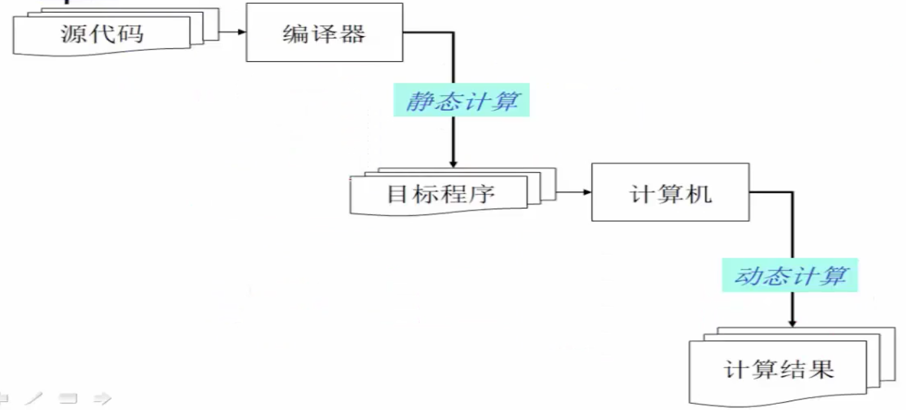

如上图。编译器就是将源代码转换（即翻译）为目标程序，然后再交给机器去执行，这个应该很好理解。之所以要转换，是因为计算机本质上只能识别机器代码，不能识别高级语言，不了解的同学还得再去学学 [计算机组成](./计算机组成.md) 和 [汇编语言](./汇编语言.md) 。简单解释一下这张图的各个部分。

- “源代码”是 C java 等高级语言，每种程序对应的编译器可能都不一样
- “静态计算”是指编译器只根据程序文本静态的分析（如做报错分析、优化分析），而不是真的拿 CPU 去执行
- 生成的“目标程序”可能是 x86 汇编（如对应 C 语言），也可能是 bytecode 字节码（如对应 java）
- “计算机”可能是一个 x86 的物理器（如对应 C 语言），也可能是 JVM java 虚拟机（如对应 java）。即不一定是一个真实的机器，可能是虚拟机，但这里都统称为“计算机”

另外再解释一下编译器和另外一个常见的叫做“解释器”的对比。两者有很多共同点，但是有以下区别：

- 编译器：输入源代码，输出的一个可执行程序，但不去执行（存放在磁盘上等待被加载到内存中执行）
- 解释器：输入源代码，直接输出执行结果。其实 JVM 就是一个解释器，而不是一个单纯的编译器。输入 java 字节码 bytecode ，然后直接输出执行结果，而不是输出汇编代码。

### 内部结构

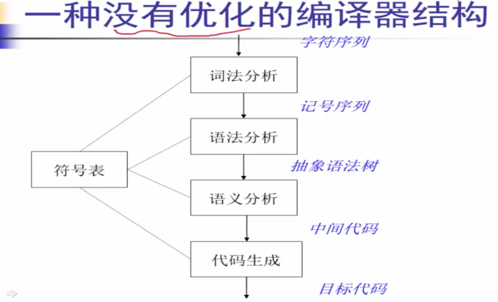

如上图，就是一个编译器最简单的内部结构（没有考虑代码优化过程）。

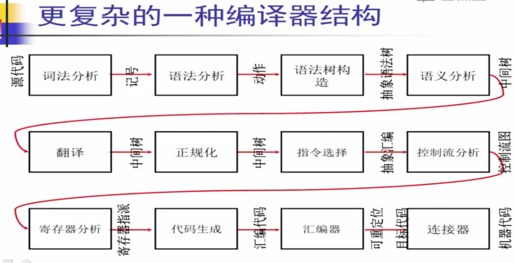

如上图，这是一个更加复杂的编译器，各个过程都比较完备。其实拆开来看，编译器是一个“流水线”，由一个一个的小程序分流水线执行。因为编译器规模庞大复杂（看完本文相信你会有所体会），拆分模块容易实现和维护。

编译器通常会被划分为两个部分（如下图）：

- 前端：源代码生成中间代码，和源代码有关
- 后端：中间代码生成目标代码并优化，和目标代码有关
- 两者以抽象语法树 AST 作为连接数据

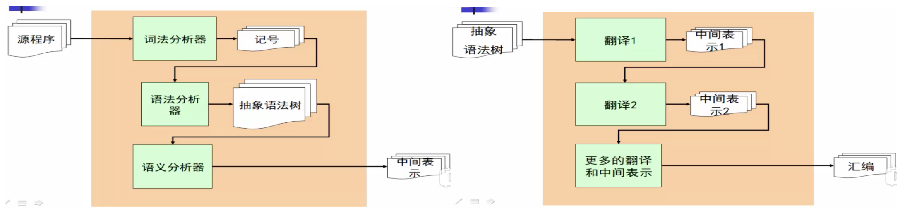

### 一个简单的例子

这个例子，建议读者去看一下 [原视频](https://www.bilibili.com/video/av17404276/?p=3) ，只需要花 10 分钟即可，1.5x 速度看。老师举的这个例子非常好，从源代码到目标机器的机器指令码，虽然简短，但是讲的非常明白。我这里就简单的总结一下，可能不会那么详细。

背景一，现在我们设计一个叫做 Sum 的语言，特别简单，仅仅支持两种语法。第一是整形数字 `n` ，第二是加法表达式 `e1 + e2` 。举几个例子：

- `3`
- `5 + 6`
- `7 + 8 + 9` （加法要满足左结合性，即先计算 `7 + 8`）
- `7 + (8 + 9)`
- 但不支持 `7 + 8 * 9` Sum 语言中没有乘法

背景二，有一个栈试计算机 Stack （后面会再次讲到），其中有一个操作数栈，然后只支持两条指令 `push n` 和 `add` 。之所以选择栈式计算机，第一是因为简单，第二是因为 JVM 就是采用了这种形式。其指令的详情是：

- `push 3` 将 3 压栈
- `push 4` 将 4 压栈
- `add` 将 3 和 4 出栈，然后做加法得到 7 ，再将 7 压栈。即将栈顶的两个元素都出栈，做加分，将结果再压栈

有了上述两个背景之后，接下来的任务是：编译程序 `1 + 2 + 3` 到栈式计算机 Stack 。

第一个阶段进行词法分析，先不管其中的原理是什么，总之词法分析会将 `1 + 2 + 3` 拆分为 `1` `+` `2` `+` `3` 这 5 个部分。
第二阶段是语法分析，就是将词法分析拆分出来的内容，分析是否满足 Sum 语言的语法要求，即 `e1 + e2` 这种语法。
第三个阶段是语法树构造，经过某些计算之后，得到的抽象语法树如下图。

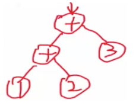

第四个阶段，根据抽象语法树做代码生成。首先，要满足加法的左结合性，对树进行遍历的时候就要优先遍历左子树，即**后序遍历**。在遍历树节点的过程中，如果遇到整数 `n` 就生成一条 `push n` 指令，如果遇到 `+` 就生成一条 `add` 指令。接下来详细看一下这棵树的遍历过程：

- 第一步要访问的节点是 `1` ，生成 `push 1` ，将 1 压栈
- 第二步要访问的节点是 `2` ，生成 `push 2` ，将 2 压栈
- 第三步要访问的节点是 `+` ，生成 `add` ，将 1 2 出栈，计算加法得到 3 ，将 3 压栈 （这里即体现了加法的左结合性）
- 第四步要访问的节点是 `3` ，生成 `push 3` ，将 3 压栈
- 第五步要访问的节点是 `+` ，生成 `add` ，将 3 3 出栈，计算加法得到 6 ，将 6 压栈，完成

对栈的 push 和 pop 的操作我仅仅是用语言描述，看不明白的可以去看视频，老师详细画出了压栈、出栈的过程图。

---------------------------------------

## 词法分析

从编译器内部结构得知，执行编译的第一个阶段就是词法分析。**输入是源程序代码，输出一个记号（即 token）流或者单词流**。通俗来说，就是将源代码进行最细粒度的拆解，例如上面的例子将 `1 + 2 + 3` 拆分为 `1` `+` `2` `+` `3` 一样。

### 一个例子

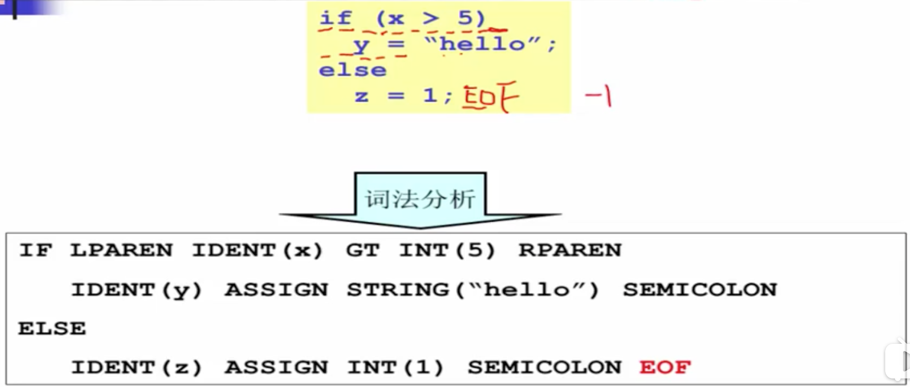

如上图。从源代码到记号流（或单词流），记号就是 token 。词法分析器会将源程序根据关键字、标识符（变量）、括号、引号、运算符、值（整数、字符串）等这些要素，将其从左到右拆分为若干个记号（或者单词），其中会忽略空格和换行等。上图中：

- `IF` 关键字
- `LPAREN` `RPAREN` 左右括号
- `INDENT(x)` 即标识符（变量），有一个属性 `x` ，表示变量名
- `GR` 即 `>`
- `INT(t)` 即 `int` 类型值，属性是 `5`
- 其他同理……
- 最后红色的 `EOF` 是结束符

根据上面的例子，可以总结出 token 其实有固定的形式，就可以定义其数据结构，如下图（本文中高级语言的示例，默认情况下都是 C 语言）

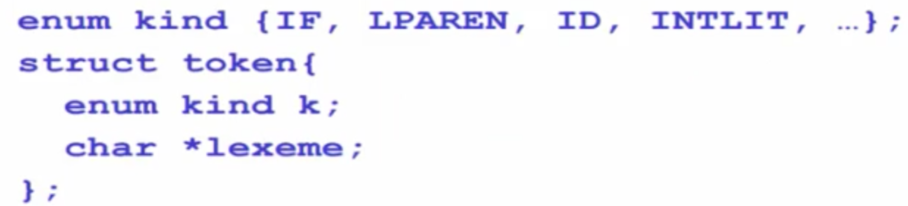

理解了例子，定义了数据，接下来就要去探寻词法分析的实现算法，第一，手工构造；第二，自动生成 。

### 词法分析的手工构造法

手工构造即手写一个词法分析器，例如 GCC LLVM ，优点是利于掌控和优化细节，缺点是工作量大、易出错。手工构造法主要用到“转移图”这种数据结构，下面举两个例子说明。

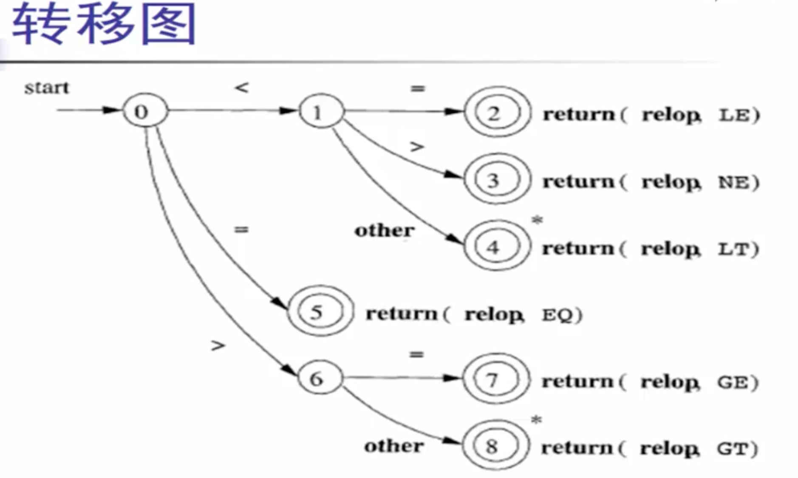

上图的转移图模型，即可识别逻辑运算符，如 `<=` `<` `<>` `>=` `>` 。识别到第一个字符，就继续往下做分支判断，直到返回一个确定的运算符。图中的 `*` 即一次回溯，即将当前的这个字符再返回到词法分析器重新进行分析。例如 `>1` ，读到了 `1` 这个字符时，此时已经确定了运算符是 `>` ，而当前的 `1` 并不是运算符的一部分，因此将 `1` 再重新返回到词法分析器中重新进行分析。

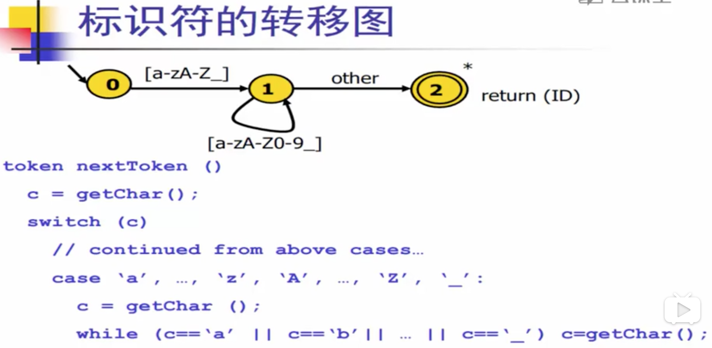

上图是标识符（变量）的转移图模型，以及伪代码。其中 `*` 即一次回溯，跟上面一样。

关键字（如 `class` `if` `for` 等）是一种特殊的标识符，也满足标识符的规则。要识别关键字，有两种解决方案：

- 继续扩展转移图的分支，识别到关键字走不通的分支逻辑，最后识别出关键字。
- 先识别所有的合法标识符，然后从已经识别出来的标识符中查找关键字。此时需要为该语言所有的关键字维护一个哈希表，如果数据结构合理（完美哈希），查询可以在 `O(1)` 复杂度内完成。

### 词法分析的自动生成技术

所谓自动生成技术，就是有这样现成的工具（如 lex flex jlex），输入一些声明式的规范，即可自动生成一个词法分析器。有点当然是简单快速，缺点就是无法控制细节。而这里的“声明式规范”，就是我们常见的正则表达式。下文的内容，就是如何用程序去解析正则表达式，如果你之前看过关于“正则表达式 原理”这类的文章，可能早就有了解了。

先说一下自动生成技术的几个阶段，专业术语后面都有解释：

- 正则表达式 -> NFA
- NFA -> DFA
- DFA -> 词法分析代码，即完成自动生成

#### 正则表达式

不要以为用过正则表达式就觉得它很简单了，如果你是通过看“30 分钟入门正则表达式”这类文章开始接触的，还是建议你仔细阅读这里关于正则表达式的解释。笔者也是看了这门课才对正则表达式有了新的认识。

正则表达式是一种数学上的概念，首先它要有一个完整的字符集 `Σ = {...}` 要能涵盖程序所有的关键字、变量名、数字、运算符、括号、引号、特殊符号等

- 如 C 语言的这个字符集就是 ASC 编码，即 256 个字符
- 如 java 的字符集就是 unicode 编码，可能几万甚至十几万个字符集（因为 java 的变量名称并不仅限于英文、中文也可以作为变量）

然后只有以下几个基本的逻辑：

- 空串是正则表达式
- 单个字符是正则表达式
- `a|b` 是正则表达式，两者取并集
- `ab` 是正则表达式，两者相连
- `a*` 成为“闭包”（和程序的闭包不一样），即可以有 0 或者若干个 `a`
- 以上随机组合，都是正则表达式，例如 `a|(bc*)`

这就是正则表达式的定义，而现代正则表达式这么多的语法，例如 `[a-b]` `?` `+` 等，都是后来扩展出的语法糖，即对基本规则的一种简写方式。

#### 有限状态自动机 FA

也称“有穷自动机”，是一种数学模型。简单理解，就是输入一个字符串，输出这个字符串是否满足某个规则（true / false）。例如有 `a + b` 这样一个规则，输入`“1 + 2 ”` 就满足，输 `“abc”` 这就不满足。其实现原理，就是先设定几个状态，然后根据输入的字符做状态转移，看最后能否转移到最终的状态。如下图，输入 `abbaabb` ，初始状态是 `0` ，然后分别输入一个一个的字符，看最后能否将状态转移到 `3` 。

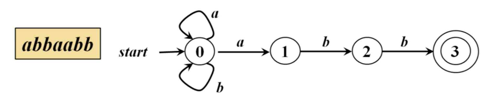

有限状态自动机 FA 又分为两种：

- 确定的有限状态自动机 DFA 。针对一个状态，输入一个字符，只能有一个出口。
- 非确定的有限状态自动机 NFA 。针对一个状态，输入一个字符，可能会有多个出口。如上图中的 `0` 状态，输入 `a` 时有两个出口，所以它是 NFA 。

看过“正则表达式 原理”类似文章的应该知道，其实每一个正则表达式，都能对应一个 FA ，因此接下来看一下正则表达式如何生成 FA 。

#### 从正则表达式 RE 到有限状态自动机 FA

先将正则表达式生成 NFA ，再将 NFA 生成 DFA 。这是因为：第一，RE 生成 NFA 比直接生成 DFA 更加简单；第二， NFA 做分析算法比较复杂，多个出口导致复杂度变高。因此，往往是将 NFA 转换为等价的 DFA ，然后再拿来做运算。

从 RE 生成 NFA 课程中讲解了 Thompson 算法（Ken Thompson，unix 和 C 语言之父，1984 年图领奖）。具体内容我大体看明白了，不过太细节的也没必要记录了。其基本的逻辑是：

- 对基本的 RE（空串、单个字符） 直接构造
- 对复杂的 RE （或、连接、闭包）递归构造

从 NFA 转换 DFA ，子集构造算法。所谓“子集”就是原来 NFA 的若干状态的集合，通过构造子集，来实现 DFA 。也就是说，此时构造出来的 DFA 就不单单是一个一个的状态节点了，而是一个一个的状态子集。想要了解细节的读者去看视频吧，这块我没有仔细记录。

另外，转换到了 DFA 之后，还要对 DFA 进行最小化的优化，课程中讲了 Hopcroft 算法。基本逻辑是，将生成的 DFA 的子集再进行合并，减少节点数量。状态节点越少，占用的空间复杂度越少，提高运算效率。

#### 根据 DFA 生成词法分析代码

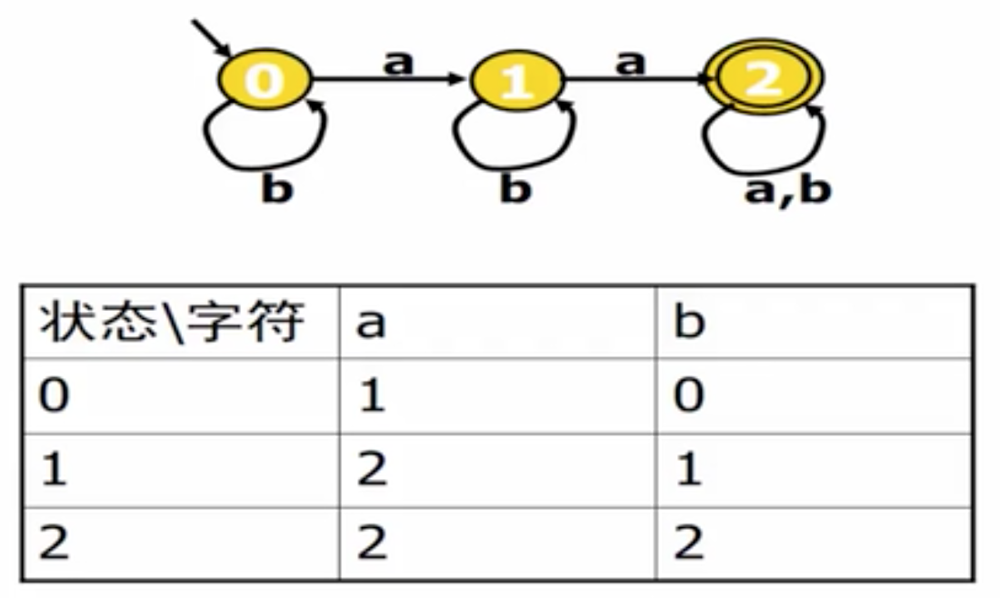

DFA 实质上是带有边和节点的有向图，如上图。图中第一列是状态，第一行是字符，例如：

- 在状态 `0` 时，输入字符 `a` ，行列交叉点是 `1` ，表示可以转向状态 `1`
- 在状态 `1` 时，输入字符 `a` ，行列交叉点是 `2` ，表示可以转向状态 `2`
- 在状态 `1` 时，输入字符 `b` ，行列交叉点是 `1` ，表示可以转向状态 `1`

有了以上所有的逻辑，就可以判断一个字符串是否符合一个 RE 的规定，即可将字符串拆分为一个一个的 token 。这个方法叫做“转移表法”，课程中还讲了“哈希表”和“跳转表”，没有详细记录。

---------------------------------------

## 语法分析

词法分析之后，输出了记号流，然后传递给语法分析，这里主要有两部分工作：

- 输入一个程序语法的表示，判断是否符合程序的语法
- 如果符合，就根据输入的符号集，生成抽象语法树 AST

### 上下文无关文法 CFG

上文所说的“程序语法的表示”，就是上下文无关文法 CFG ，是一个描述语言语法规则的标准的数学工具。

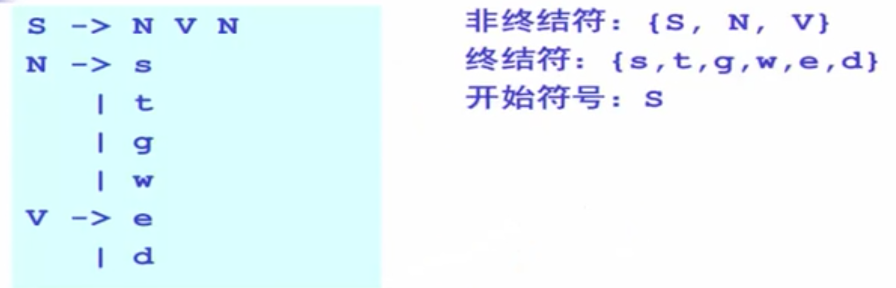

上图的左侧就是一个 CFG 的简单示例，其中每一条叫做“产生式”，图中的 `|` 即“或”的意思。简单解释一下这个 CFG 的意思：

- “S -> N V N” 就是一个句子，其实 S 是开始符号
- N 和 V 都是非终结符，即它可以继续再往下扩展拆分，就像 “S -> N V N” 那样拆分
- t g e 等这些都是终结符，即已经表述一个具体的事情了，没法再往下拆分了

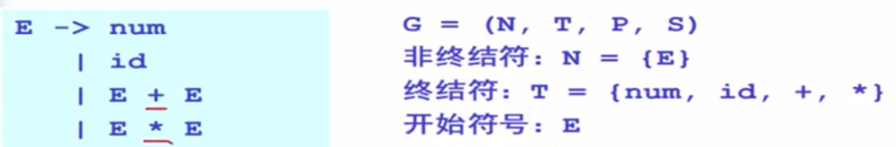

上图就用 CFG 描述了一个 `*` 和 `+` 表达式，其中 `num` 表示一个具体的数字， `id` 表示标识符（变量），这俩都是终结符，`E` 是非终结符。

从上面的例子来看，可以根据一个 CFG 推导出若干个句子，例如上图的 CFG 可以推导出 `id + num` 或者 `id * num` 或者 `(id + num) * num` 或者 ……

**语法分析就是：给定一个文法 G 和句子 s ，要确定：是否能在 G 的推导结果中，找到 s ？（即，是否存在对句子的推导）** 如果能推导出来，说明句子 s 符合文法 G 的语法，否则不符合。如下图：

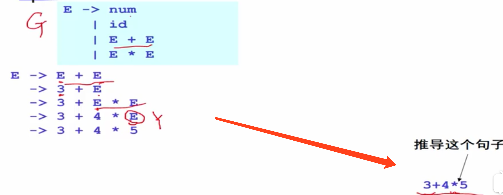

推导方式一般有两种：

- 最左推导：每次推导过程当中总是选择最左侧的符号进行替换
- 最右推导：同理，选择最右侧

### 分析树和二义性

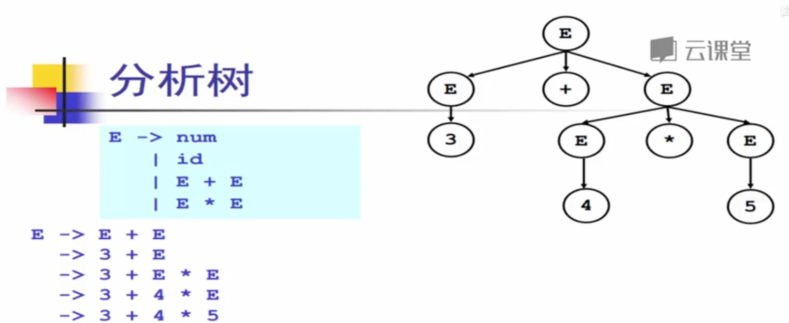

如上图，在文法的推导过程中，可以用树的形式来表示，即分析树。其中， 内部节点都是非终结符，叶子节点都是终结符，**中序遍历**即可得到最终的句子。PS：到这里，貌似已经看到了最终输出的抽象语法树 AST 的雏形了，其本质就是来源于 CFG 的格式。

所谓“二义性”就是指文法的书写会产生一些歧义，例如上图中 `*` 和 `+` 表达式的文法，采用最左推导和最右推导得出的结果是不一样的，可能分别得出 `(3+4)*5` 和 `3+(4*5)` ，显然计算结果不同。为了避免文法的二义性，只能是重写文法，将文法表述的更加详细一些，此处不做详解。

### 自顶向下分析算法

上文已经明确了语法分析的定义，即看一个文法 G 是否存在对句子 s 的推导。自顶向下分析就是其中一个比较典型的算法，其基本逻辑是：

- 即通过文法 G 随意推导出一个句子 t ，然后拿 t 和目标句子 s 进行对比
- 如果 t == s ，则成功
- 如果 t != s ，则回溯，从新计算一个 t1 ，再比较

但是，上述过程比较笨重，因为一个 G 能推导出来的句子可能有非常多种，都拿来跟 s 做比较，会发生很多回溯，非常耗时。可以用以下方式进行优化：

- 从左到右的推导顺序，可以最先得到句子 t 的左侧
- 拿 t 最先得到的左侧，和 s 左侧进行对比
- 对比成功，则继续从左到右推导（接下来的推导，也都是没推导出左侧就和 s 对应的左侧部分进行对比，看是否成功）
- 对比不成功，则回溯重来

但是，上述优化后的算法，还是可能会有回溯发生，这远远达不到编译器的性能要求。编译器要处理的程序动辄几十万行，必须要求线性时间复杂度的算法，一旦有回溯就会严重影响性能。

### 递归下降分析算法

也称预测分析算法，其基本思路是：

- 每个非终结符构造一个分析函数（即将整个文法匹配整个句子的方式，拆解开，用单个非终结符去匹配句子中的字符，即算法的分治思想），因为非终结符是可以层层定义的，因此是“递归”，如下图。
- 用“前看符号”（即不知道匹配哪一个，就去目标句子 s 中看一眼，给一个提示）指导当前产生式规则的选择。

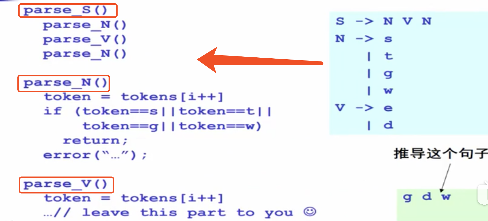

递归下降分析算法的特点是

- 线性时间复杂度，运行高效
- 容易实现，适合手工编码。错误定位准确。使用者有 GCC LLVM

### LL(1) 分析算法

递归下降分析算法适合于手工编码，而 LL(1) 分析算法适用于语法分析的自动生成。所谓“LL(1)”，是指：从左（L）向右读入程序，最左（L）推导，采用 1 个前看符号。分析高效，也是线性时间复杂度。

其基本思想是 —— 表驱动的算法，如下图。第一列都是非终结符，第一行都是终结符，行列交叉点表示对应的产生式序号。

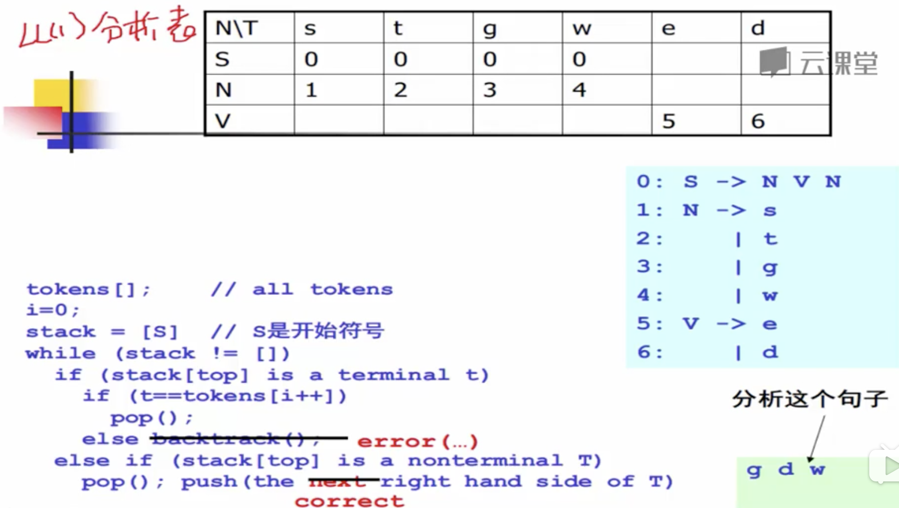

回顾之前讲过的自顶向下分析算法，最大的问题就在于去盲目推导，盲目匹配出句子，然后再去和目标句子 s 做对比，对比出错就要回溯，时间复杂度非常高。因此，就需要在推导过程中就需要做分析预测，就可以从参考这个分析表。从分析表中，通过预测输入能得到产生式的序号，就知道接下来要匹配哪个产生式了，就不需要回溯了。

### LR 分析算法

上文主要将自顶向下的分析算法，而 LR 分析算法是自底向上的思路，但是输入、输出都是一样的。我没有看这部分，想详细了解的可以自己去看视频。

### 抽象语法树 AST

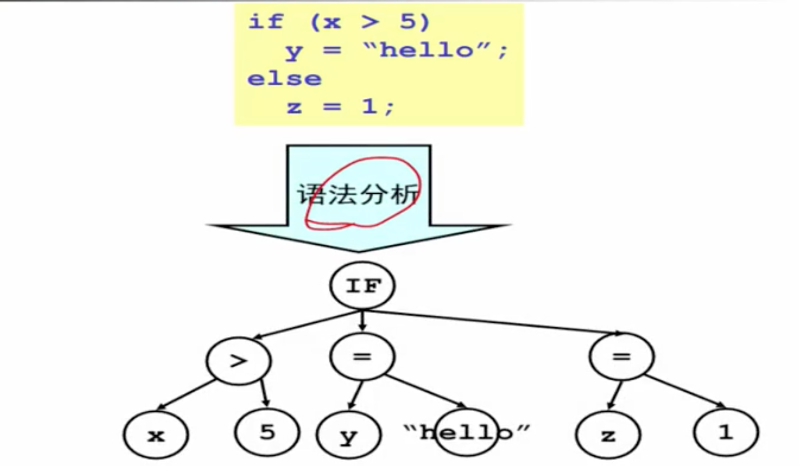

如上图，先看下抽象语法树 AST 和高级语言如何对应，根据代码对比一下，应该不难理解。其中，if 的最左侧节点是判断条件，中间节点是成功分支，右侧节点是 else 分支。

再来回顾一下上文讲的 CFG 的分析树（上文有示意图），它详细编码了句子的推导过程，并且包含了很多无关信息（非终结符），会占用很多存储空间，会增加算法的空间和时间复杂度。如果能把这些“无关信息”给去掉，只留下运算符，数字，标识符等和程序相关的信息，就构成了抽象语法树 AST ，如下图。

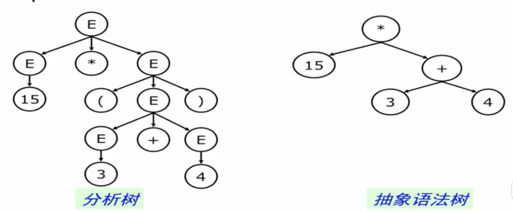

既然是一棵树，那么就是一个标准的数据结构，各个类型的节点的数据结构，也就可以固定了。如下图

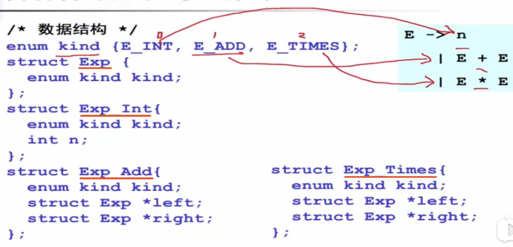

AST 是编译器中非常重要的数据结构，因为它是编译器前端和后端的接口形式。后续的过程仅仅依赖于 AST ，不会再依赖于前面的源码或者字符集。因此，一旦生成了 AST ，前面的源码就会被丢弃。因此，AST 中要有很详细的信息，不仅仅是本课程中讲的这个简单的树。例如，AST 要存储当前程序的文件、行、列，这样在语法报错时才能准确的给出具体的错误位置。

---------------------------------------

## 语义分析

语法分析输出 AST ，然后对 AST 进行语义分析（有些教材也会叫做 “类型检查” 或者 “上下文相关分析” 等名字）。注意，程序如果能通过了语义分析这个阶段，那再往后就不应该出现任何语法错误，除非是编译器自己的 bug 。

### 主要任务

上文中的语法分析用到的是 CFG 即上下文无关的语法，即不依赖于上下文。例如 C 语言中 `printf(n);` 不符合语法，而 `print("%d", n);` 就符合语法，但是其中的 `n` 变量是否在上文已经定义了，语法分析是不知道的。

因此，语义分析是在 AST 基础上，结合上下文来分析：

- 变量在使用前先进行声明
- 每个表达式都有合适的类型
- 函数调用和函数定义一致
- 等等 ……（每种语言的要求不一样）

### 语义规则和实现

例如表达式的类型检查，定义一个类型检查函数，传入 AST 的某个表达式的节点，然后判断最后返回的类型。如果类型检查错误，就报错。如下图。

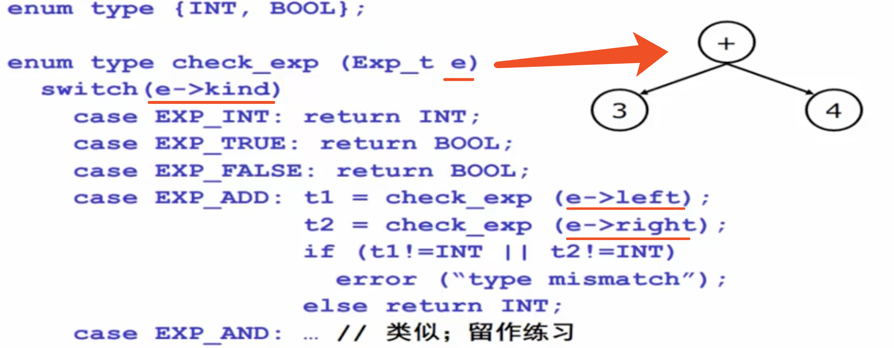

### 符号表

上下文相关分析，就涉及到上下文信息的记录和读取，这些信息就被记录到符号表中，一个非常核心的数据结构。符号表用来存储程序中的变量相关信息（表的信息要足够丰富）：

- 类型
- 作用域
- 访问控制信息（例如 `privte` `protected` 等）
- ……

其数据结构最简单的可以使用一个 `key-val` 的字典来实现，例如 `{ key1: {…}, key2: {…}, key3: {…} }` 。但是编译器要处理的程序规模可能非常庞大，因此这个数据结构必须要合理规划。在实际工程中，高效的查询方式可以有一下选择：

- 选择一：为了高效，使用哈希表来实现符号表，查找是 `O(1)` 的时间复杂度
- 选择二：为了节约空间，可以使用红黑树等平衡树，查找是 `O(logN)` 的时间复杂度

变量都有“作用域”的概念，不同作用域可以有相同的变量名。符号表处理作用域的方式：

- 第一，进入作用域时插入元素，退出作用域时删除元素
- 第二，采用栈：进入作用域时插入新的符号表（push），退出作用域时删除栈顶符号表（pop），如下图。 （栈的实现方式很很多种，例如链表）

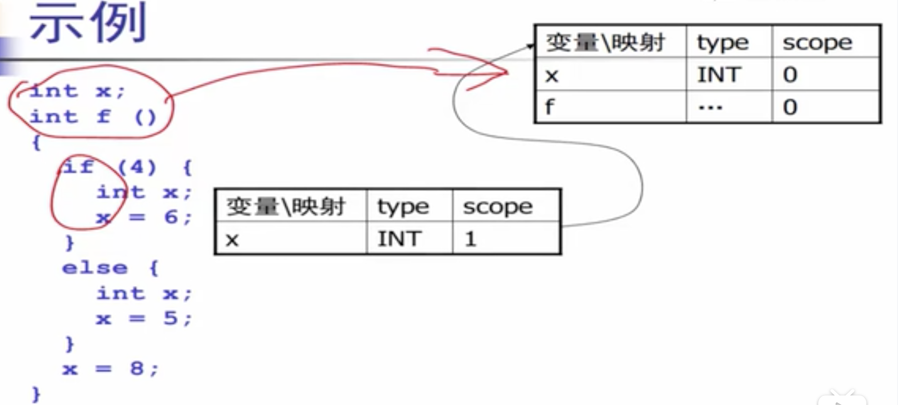

---------------------------------------

## 代码生成

经过语义分析的 AST ，即可用来做代码生成，即生成最终的机器（物理机或者虚拟机）代码。注意，这里直接从 AST 到目标代码，是一种最简单的编译器模型，暂时忽略了优化的部分。优化过程下文会详细解说。

### 主要工作

代码生成是把源程序翻译成“目标机器”（可能是真实的机器，也可能是虚拟机）上的代码，而且要保证和源程序的“等价性”（重要！！！）。主要的任务是：

- 给源程序的数据（全局变量，局部变量等）分配计算资源（寄存器、数据区、代码区、栈区、堆区）
- 给源程序的代码（运算 语句 函数）选择指令（算数运算 逻辑运算 跳转 函数调用等）
- （而且要考虑空间和时间的效率，在满足等价性的前提下）

接下来通过两个示例来看代码生成的过程：

- 栈计算机 Stack —— 代表了虚拟机，例如 JVM
- 寄存器计算机 Reg —— 代表了 RISC 精简指令集，如 ARM 芯片

### Stack 栈计算机代码生成技术

70 年代有栈计算机的物理机，但是今天已经退出了历史舞台，因为执行效率太低。但是这里还要研究 Stack ，一来是因为在 Stack 上代码生成比较简单，二来是很多虚拟机是这样设计的，例如 JVM 。

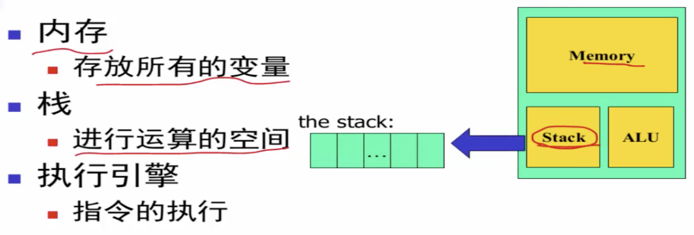

上图就是一个 Stack 的原型图，简单解释一下图中各个部分。

- 内存，存放程序变量
    - 给变量 `x` 分配内存空间的伪指令：`.int x` （伪指令，不会被 ALU 执行）
- stack ，进行计算的空间（计算的输入、计算的中间结果和最终结果）
- ALU ，计算单元 。指令集是：
    - `push NUM` ，把一个立即数压栈
    - `load x` ，得到内存中的变量 `x` 的值，并压栈
    - `store x` ，把栈顶元素弹出，并赋值给 `x`
    - `add` ，加法，pop 赋值给 `x` ，再 pop 赋值给 `y` ，然后 push `x+y`
    - `sub` ，减法，同上
    - `times` ，乘法，同上
    - `div` ，除法，同上

PS：以上这几条指令，就是 java 字节码的一个子集。真实的 java 字节码有 200+ 个。

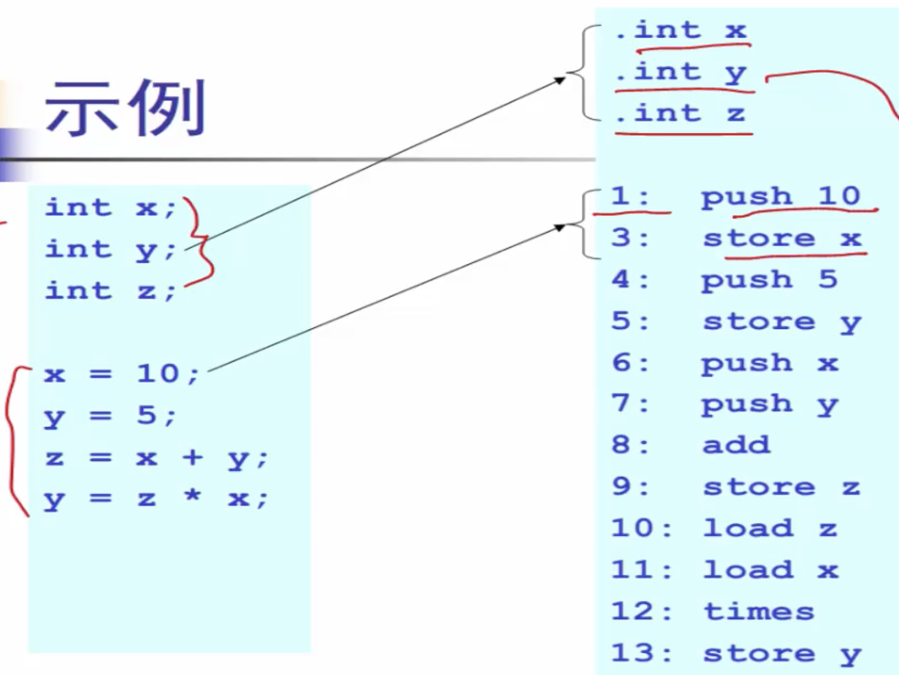

上图就是高级语言到最终的 Stack 计算机机器语言的对应，展示了最终的输入和输出。至于代码生成如何实现，在文章一开始的“Sum 语言 + Stack”的例子中这部分已经写的比较详细，就不再赘述了，翻看上文吧。

### REG 寄存器计算机的代码生成技术

这种机器类型是基于寄存器架构，所有操作都在寄存器完成，执行效率非常高（因为寄存器访问速度是内存访问速度的百倍），访存都通过 `load` 或 `store` 指令（RISC 指令集特点）。

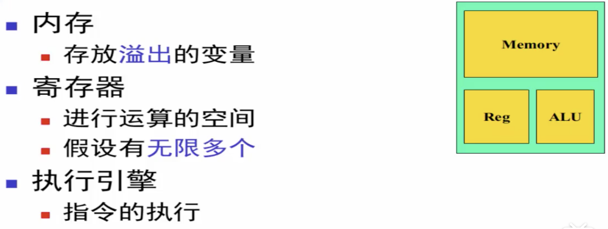

上图就是寄存器计算机的原型图，解释一下图中各个部分。

- 内存：存放“溢出”的变量（寄存器中放不开的变量，如果假设寄存器有无限多个的话，就不用考虑“溢出”了）
- 寄存器：进行计算的空间，有 r1 r2 ... rn 无限个寄存器（假定无限个，实际上寄存器个数是有限的）
    - 给变量 `x` 分配寄存器的伪指令 `.int x` （伪指令不会被 ALU 执行）
- ALU 计算单元。指令集：
    - `movn n, r1` 把立即数 n 存入寄存器 r1
    - `mov r1, r2` 把 r1 的值赋值给 r2
    - `load [x], r1` 将 x 地址的值取出，放在 r1 。其中 x 是指针，[x] 即取出指针对应内存的值。
    - `store r1, [x]` 将 r1 的值赋值给 x 内存地址
    - `add r1, r2, r3` 加法，表示 r3 = r1 + r2
    - `sub r1, r2, r3` 减法，同理
    - `times r1, r2, r3` 乘法，同理
    - `div r1, r2, r3` 除法，同理

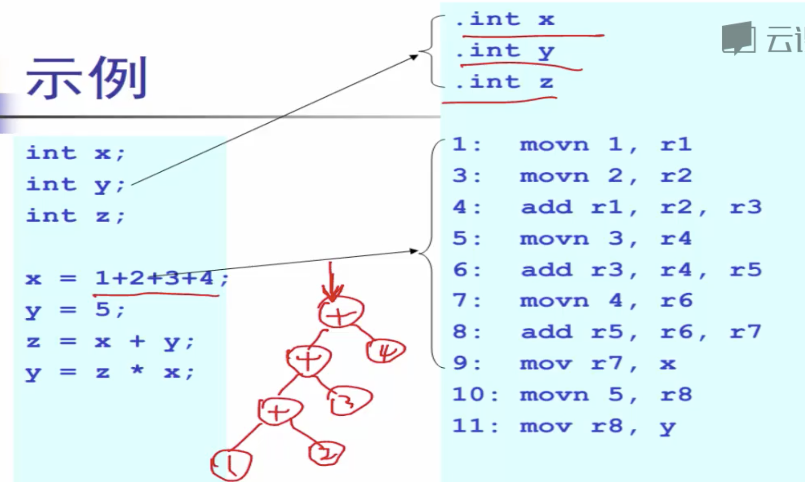

上图就是高级语言和目标代码的对应关系。图中有对应的 AST ，对这棵树进行后续遍历（先左、再右、最后根），每遍历一个节点都会对应到右侧的一行指令。

- “1” 节点会对应第一行指令
- “2” 节点会对应第二行指令
- “+” 节点会对应第三行指令
- “3” 节点会对应第四行指令
- ……

最后，实际的物理机器上不可能有无限多的寄存器，因此要确定哪些变量被用于寄存器？哪些变量被“溢出”放在内存？—— 这个问题是另外一个编译器的重要部分：编译器分配。如何进行编译器分配，这个问题会在下文介绍。

---------------------------------------

## 中间表示

中间表示是一个统称，有很多种表示形式，AST 就是其中之一。上文提到，从 AST 直接生成目标代码是比较原始的编译技术，现代编译器中往往会在编译器的“后端”进行各种各样的代码优化，不同的优化形式就需要不同的表示形式。

常见的中间代码形式：

- 树和有向无环图：高层表示，适用于程序源代码
- 三地址码：低层表示，靠近目标机器
- 控制流图：更精细的三地址码，程序的图状表示
- 静态单赋值形式 SSA ：更精细的控制流图
- 连续传递风格：更一般的 SSA （函数式语言中用的比较多）
- 还有很多。。。

### 三地址码

所谓“三地址码”，即一个指令有一个运算符，最多有三个操作数。这样就使得每一条指令都比较简单，易于和机器语言对应。

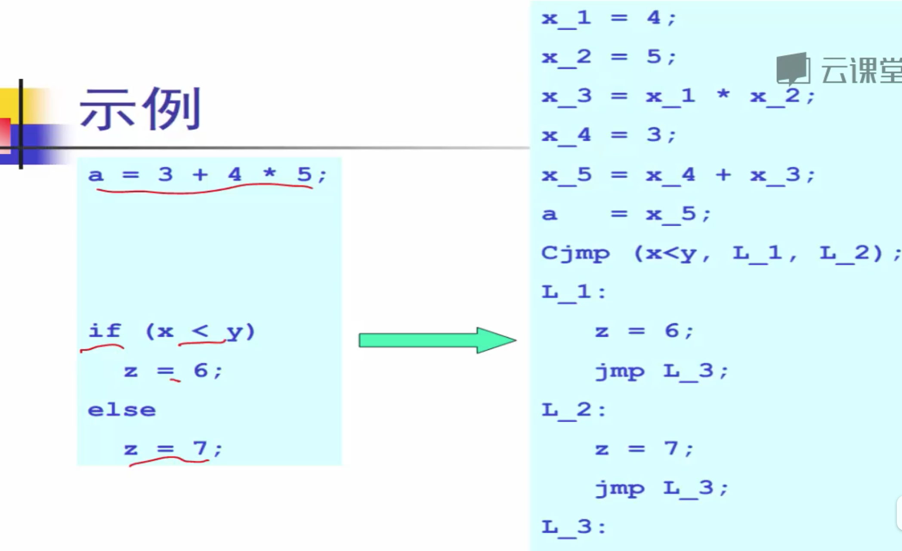

上图就是一个高级语言和三地址码的对应关系（虽然三地址码是通过 AST 生成的，已经和源代码没有关系）。从图中可以看出三地址码的特点：

- 给每个中间变量和计算结果命名，即没有符合表达式。例如将 `a = 3 + 4 * 5` 拆解成一个一个的中间变量
- 只有最基本的控制流，即没有各种控制结构，只有 `goto` 和 `call` 。例如将 `if else` 改为 `Cjmp`（条件跳转指令）

### 控制流图

三地址码是一种线性的表示方式，这就没法通过它来分析和确定流程。例如上图中，哪些指令会跳转到 `L_1` 和 `L_2` ？并不好确定。控制流图是一种更加精细的三地址码（本质上还是三地址码），将程序中的各个控制流块都表示了出来，如下图。

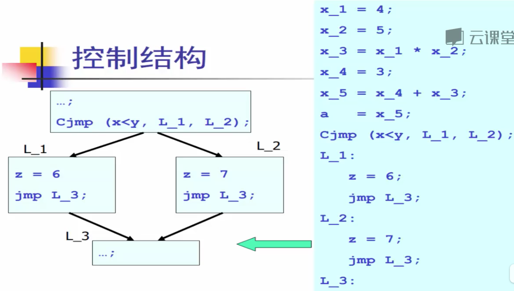

控制流图就是一个有向图 `G = (V, E)` ，其中节点 `V` 表示程序的基本块，边 `E` 表示基本块之间的跳转关系。生成控制流图的目的有很多，但都是为了做代码优化，例如：

- 做控制流分析，例如程序中有没有循环？
- 做数据流分析，例如程序中某行的变量 `x` 可能的值是什么？

### 数据流分析

所谓“数据流分析”，就是通过静态的观察程序（并不执行）来判断其中的变量和数据的一些变化，例如某程序第五行的 x 变量的值会有几种可能？

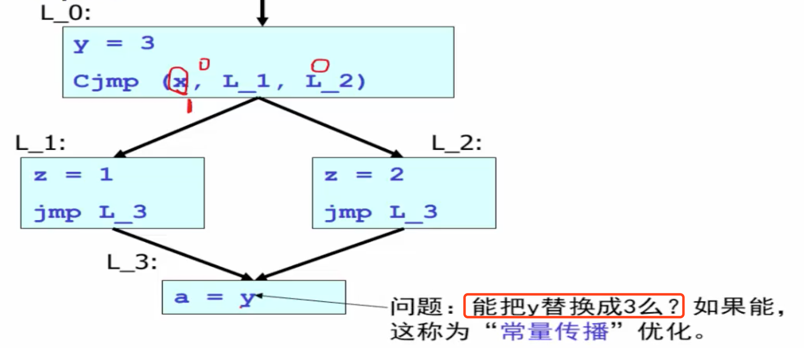

如上图，通过控制流图，既可以判断一个变量 `y` 的赋值可能性。如果 `y` 能编译器识别为一个固定的值，直接 `a = 3` 并且把一开始的 `y = 3` 删掉。这就是一个优化过程。

但是这仅仅是静态的分析，程序并未执行，因此如果 `y` 在一个逻辑分支中出现，就不好预估其准确结果，但是至少能预估一个结果集（称为“保守信息”）。如果能将这个结果集做到最小，和执行的结果越接近，就越好优化。这仍然是编译器现在的一个热门话题。

类似数据流分析的还有“到达定义分析”，即分析一个变量是如何一步一步的被定义和使用的，原理和目的基本一致，这里不再赘述。

### 活性分析

上文中提到 REG 机器假设有无限个寄存器，但实际情况不是。因此需要寄存器分配 —— 即用到活性分析。所谓“活性分析”，即分析变量的活跃区间（可以理解为声明周期）然后来做寄存器的分配。

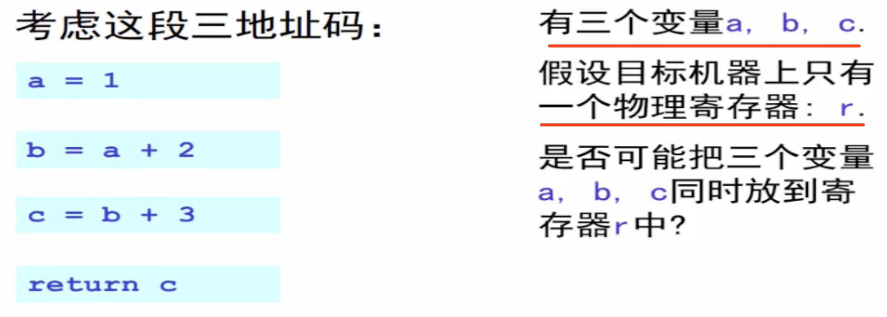

如上图，三个变量，只有一个寄存器，该如何分配？答案是：计算出每个变量的活跃区间，即可共享寄存器。寄存器分配，就依赖于变量的活动区间数据。如下图：

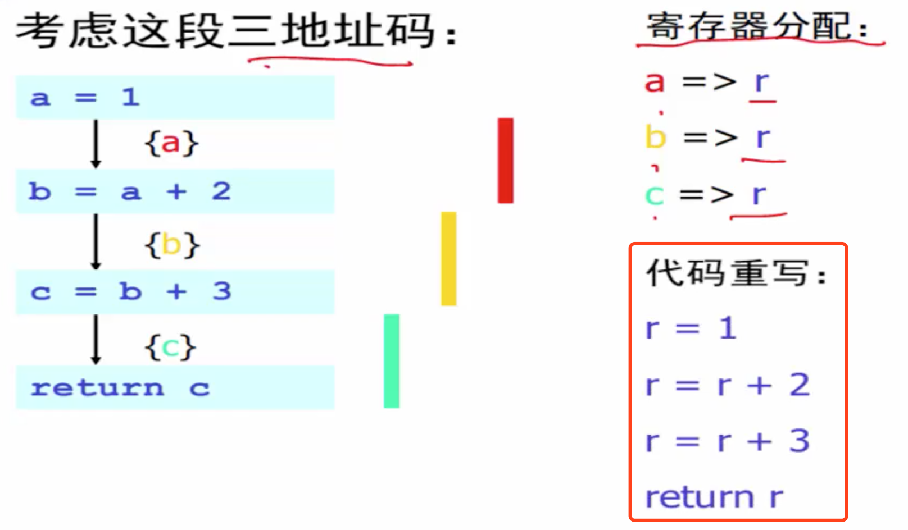

---------------------------------------

## 代码优化

现代生产环境下的编译器，代码优化是其重要工作之一，而且一直在不断的持续优化中。

### 几点说明

代码优化的目的是让目标程序更精简、更快速、更节省空间、更节能（所谓的多快好省），当然在不改变语义的前提下 —— 这些应该都比较好理解。但是还有几点关于优化的需要重点说明一下。

- 没有完美的优化，即“没有最好只有更好”。因为编译器本来就是一个庞大复杂的工程，优化过程复杂度很高，不确定性很大。
- 优化必须要在语义分析完成之后再进行，即确保源程序没有任何语法和语义的问题。因为优化可能会删改代码，如果优化之后再报错，错误信息就不准确了。
- 优化并不是一个单独的阶段（如词法分析、语法分析等），而是在各个阶段都可能进行。可以对 AST 进行优化，也可以对各种中间表示进行优化，还可以对目标代码再继续优化，每一步的优化针对想都不一样。
- 一般针对一个数据优化之后不会产生新的格式（但会产生新的数据，即函数式编程的思维），优化不是翻译过程。

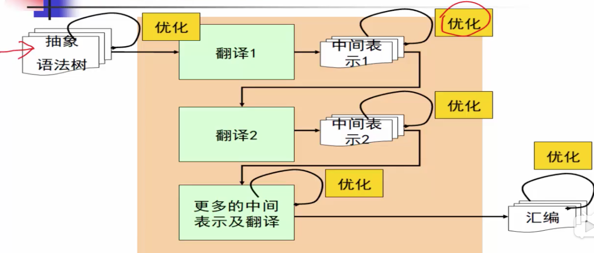

### 前端优化

即对 AST 进行优化，下面列举几个例子来说明。

第一，常量折叠。静态计算，可以在数字类型和 bool 类型进行优化，例如：

- `a = 3 + 5` 变为 `a = 8` （少了一步 `+` 计算，就相当于帮 AST 节省了一个分支）
- `if (true && false)` 变为 `if (false)` 。而且，`if (else)` 还可以进行“不可达代码”优化（见下文）

第二，代数化简。利用代数的恒等式，进行优化，例如：

- `a = 0 + b` 变为 `a = b` （少一个运算符，简化 AST）
- `a = 1 * b` 变为 `a = b` （少一个运算符，简化 AST）
- `2 * a` 变为 `a + a` （因为乘法运算复杂度高）
- `2 * a` 变为 `a << 1` （位运算效率最高）

第三，死代码（不可达）代码优化，例如

- `if (false)` 不会被执行，测试环境的 debug 代码，到了线上环境就会是死代码
- 函数的 `return` 之后的语句，不会被执行

### 中间表示上的优化

如常量传播、拷贝传播，在上文讲数据流分析的时候已经写过，不再赘述。

---------------------------------------

## 总结

编译器真的是一个非常非常非常复杂的工具，其中涉及到的知识点包括数学理论、计算机组成原理、算法和数据结构。如果真的想要深入了解一门语言，那就到它的编译器中去看看吧。
